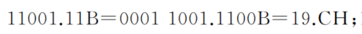
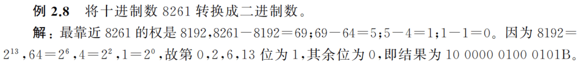
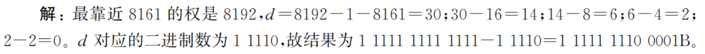
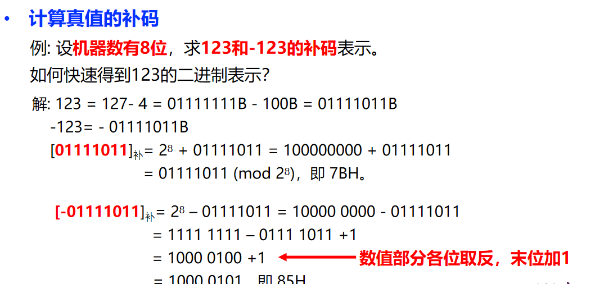
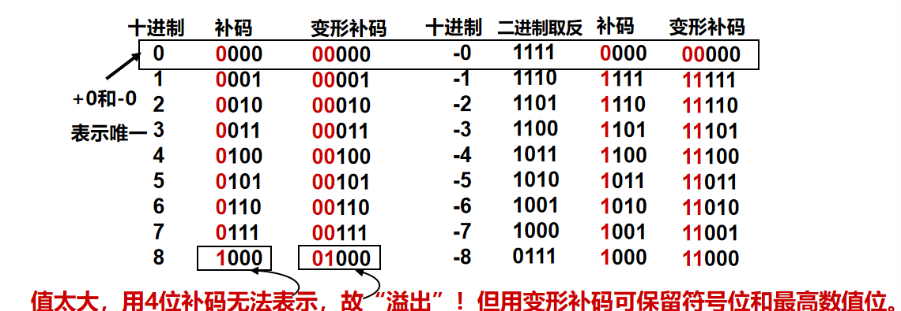
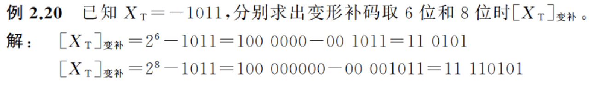
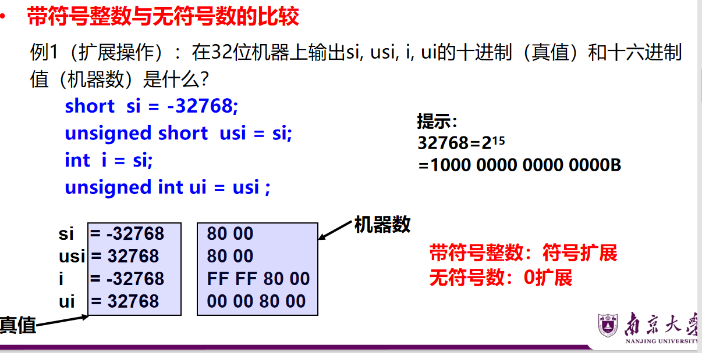
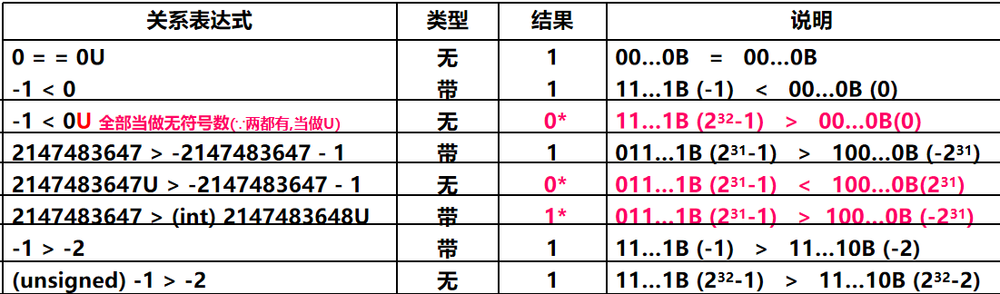
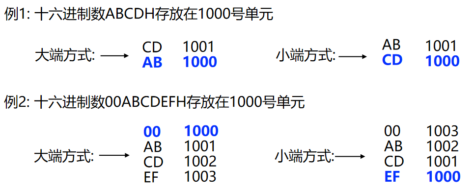

# U2 数据的机器级表示

1. 数制和编码

    1. 进制

        1. 二进制 Binary    10011B / $10011_{10}$（R=2)
        2. 八进制 Octal
        3. 十进制 Decimal
        4. 十六进制 Hexadecimal
    2. 相互转化

        

        整数部分高位补0←                        →小数部分低位补0

        

        
    3. 例（P13/P14)

          
        ​
2. 补码

    1. 补码的定义

        正数：符号为0，数值部分是它本身  
        负数：模与该负数绝对值之差
    2. 真值→补码：各位取反，末位加1  
        补码→真值：末位减1，各位取反
3. 变形补码(双符号补码)

    1. 表示一些溢出的数  
        双符号位为00（正数）、11（负数）、01（溢出）
    2. 
    3. 变补位数为n位，[X]$_{变补}$=$2^n$+X  
        ​
4. 移码

    1. s.t.每个数用非负数表示，当编码位数为n时，偏置取 2n-1或2n-1-1
    2. 例
5. 带符号数与无符号数

    1. 扩展操作

        
6. C语言中的整数类型

    同时有带符号数、无符号数，则C编译器将带符号整数强制转换为无符号数

    
7. 三码  
    负数的补码真值 = 无符号值 - 2^32

    1. 补码：正数不变；负数符号位不变，其他位取反，最后加1  
        +0/-0 都表示成 0000 0000
        1000 0000 为 -128
    2. 无论正负：移码值=真值+N（偏置常量）  
        +0/-0 都表示成 1000 0000
        0000 0000 为 -128
    3. |真值|原码（8位）|补码（8位）|移码（N\=127）|
        | ------| -------------| -------------| -------------------|
        |-127|11111111|10000001|00000000|
        |-1|10000001|11111111|01111110|
        |0|00000000|00000000|01111111|
        |+1|00000001|00000001|10000000|
        |+127|01111111|01111111|11111110|

        - 移码将真值范围 `[-127, +127]`​ 映射到 `[0, 254]`，消除了符号位干扰。
8. 非数值数据的编码表示

    1. 1
9. 数据的宽度和存储

    1. 单位

        1. 比特（bit）是计算机中处理、存储、传输信息的最小单位
        2. 字节（byte）= 8bits
        3. 字（word）默认为 4字节 = 32bits
        4. 字vs字长  
            字（数据本身的宽度）；字长（总线宽度，一次性传输的数据大小）
    2. 单位

        1. 容量（2的幂次方）

            - “千字节”(KB)，1KB=210字节=1024B
            - “兆字节”(MB)，1MB=220字节=1024KB
            - “千兆字节”(GB)，1GB=230字节=1024MB
            - “兆兆字节”(TB)，1TB=240字节=1024GB
        2. 带宽（10的幂次方）

            - “千比特/秒”(kb/s)，1kbps=103 b/s=1000 bps
            - “兆比特/秒”(Mb/s)，1Mbps=106 b/s =1000 kbps
            - “千兆比特/秒”(Gb/s)，1Gbps=109 b/s =1000 Mbps
            - “兆兆比特/秒”(Tb/s)，1Tbps=1012 b/s =1000 Gbps
    3. 存储和排列方式（eg. 存储ABCD12）
        高位←低位

        1. MSB大端存储方式  
            高位字节存储在起始地址

            |100|101|102|
            | -----| -----| -----|
            |AB|CD|12|
        2. LSB小端存储方式  
            低位字节存储在起始地址

            |100|101|102|
            | -----| -----| -----|
            |12|AB|CD|
        3. 例（H表示16进制）  
            ​
    4. ‍

‍
