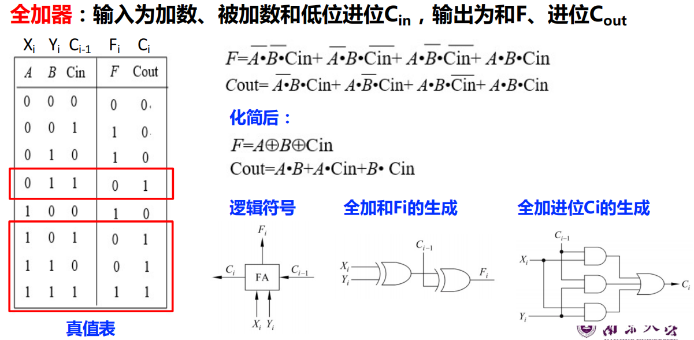

# U3 运算方法和运算部件

1. 运算

    1. 算术运算
    2. 按位运算    &amp;与  |或  ~非  ^异或
    3. 逻辑运算    &amp;&amp;与  ||或  !非
    4. 移位运算    &lt;&lt;左移  &gt;&gt;右移

        - 无符号数：左右移都补0
        - 带符号数：左移补0，右移补符号位

    ---
2. 位扩展和位截断

    1. 扩展

        - 无符号数：0扩展
        - 带符号数：符号扩展（前面补符号位）

    ---

    例1：在大端机上输出si,usi, i, ui的十进制和十六进制值是什么？

    short si = -12345;unsigned short usi = si;int i = si;unsigned ui = usi ;

    si = -12345                CF C7

    usi = 53191               CF C7

    i = -12345       FF FF CF C7

    ui = 53191      00 00 CF C7

    ---

    例2：在大端机上执行后，

    i和j是否相等？

    int i = 53191;

    short si = (short)i;

    int j = si;

    不相等！

    i   = 53191     00 00 CF C7

    si = -12345              CF C7（截断）

    j = -12345     FF FF CF C7

    原因：对i截断时发生了“溢出”，即：53191截断为16位数时，无法正确表示！
3. 基本运算部件

    1. 全加器

        
    2. 串行进位加法器

        
    3. 先行进位加法器？？？
