# U4

1. 相对寻址

    要确定是按照字还是字节编制、位移量D是指令条数还是单元数，才能确定目标地址范围

    ---

    例：[双字节定长指令字](U4/双字节定长指令字.md)，其中转移指令的第一字节是操作码Jxx，第二字节是位移量D，用补码表示，按字节编址且D为单位数，则转移目标指令相对于转移指令的范围为多少？

    转移目标地址=(PC)+2+D

    ---
2. 程序的机器级表示

    1. 3种指令格式  
        不是直接给定寻址方式，而是通过op等隐含

        1. R-type

            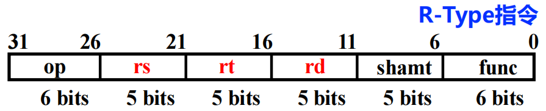  
            op:000 000  
            func:查表可得  
            ​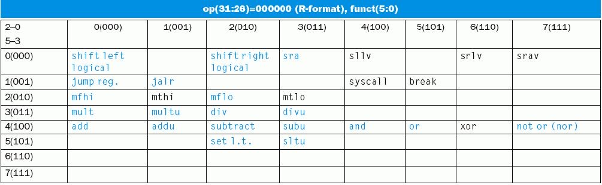
        2. I-type  
            ​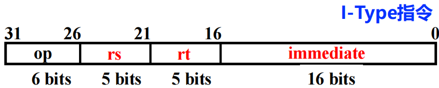
        3. J-type  
            ​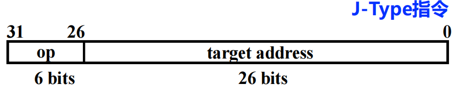  
            op:000 010/011  
            寻址方式：PC前4位+后2位补0（4+26+2=32位）

        ---
    2. 反汇编&amp;汇编

        1. 反汇编  
            指令→汇编  
            ​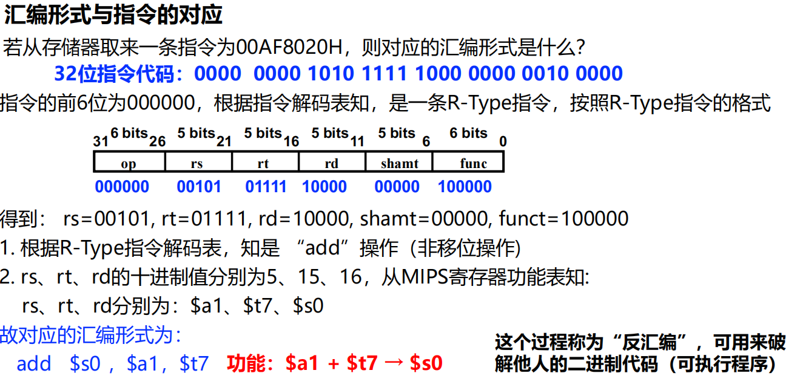

            寄存器的汇编表示以$符号表示，可以使用名称（$ a0），也可以用编号（\$ 4）
        2. 汇编  
            ​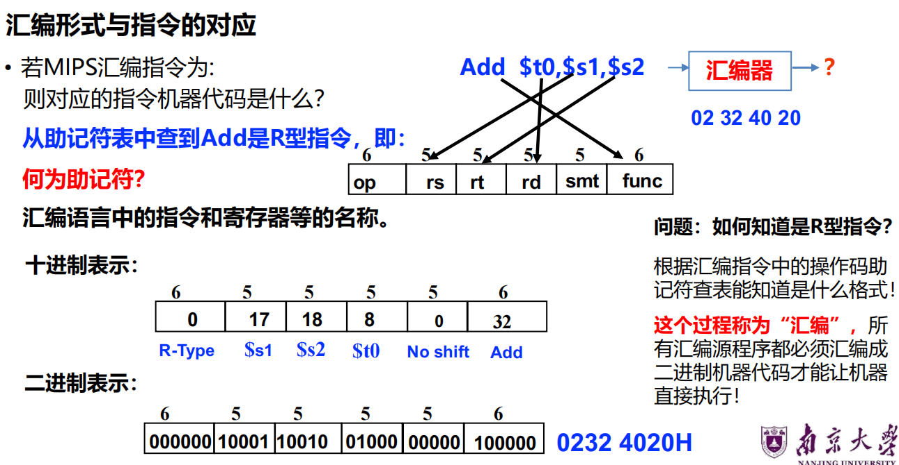
        3. 查表  
            ​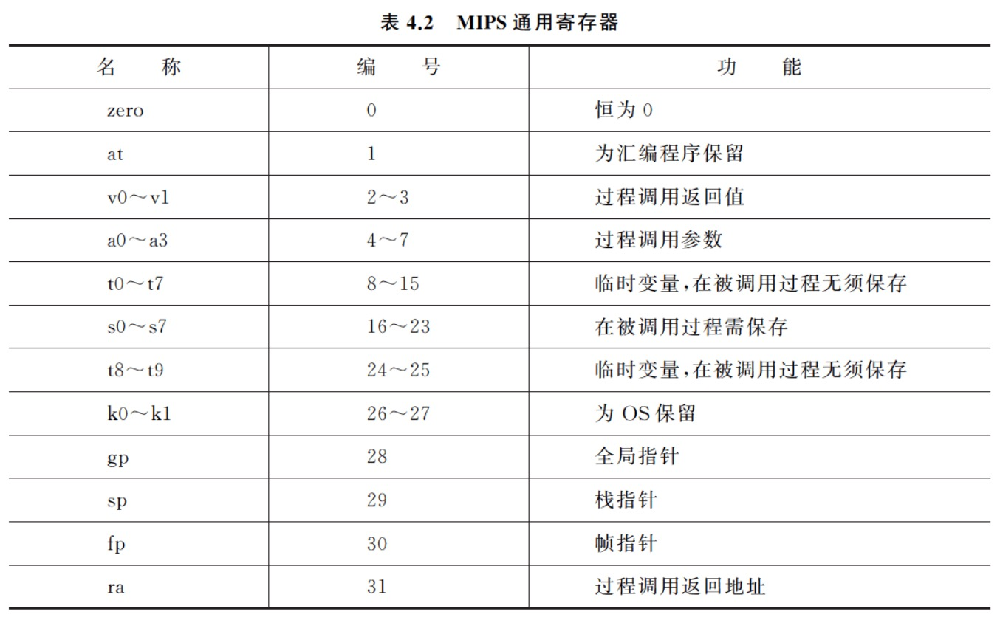

        ---
    3. 示例  
        ​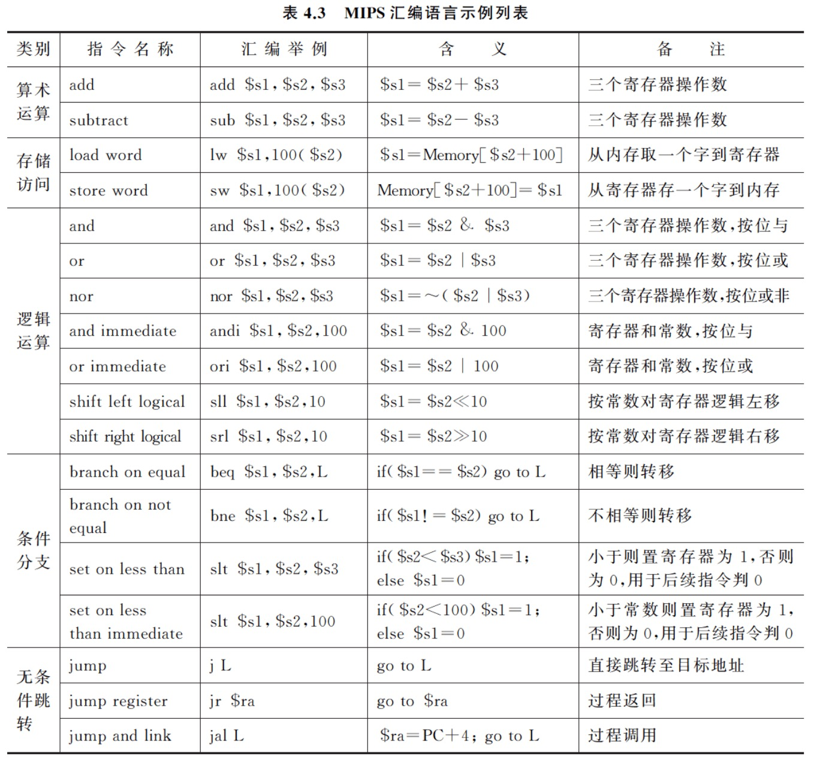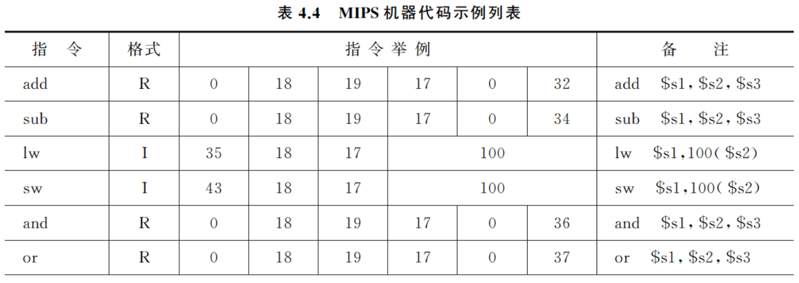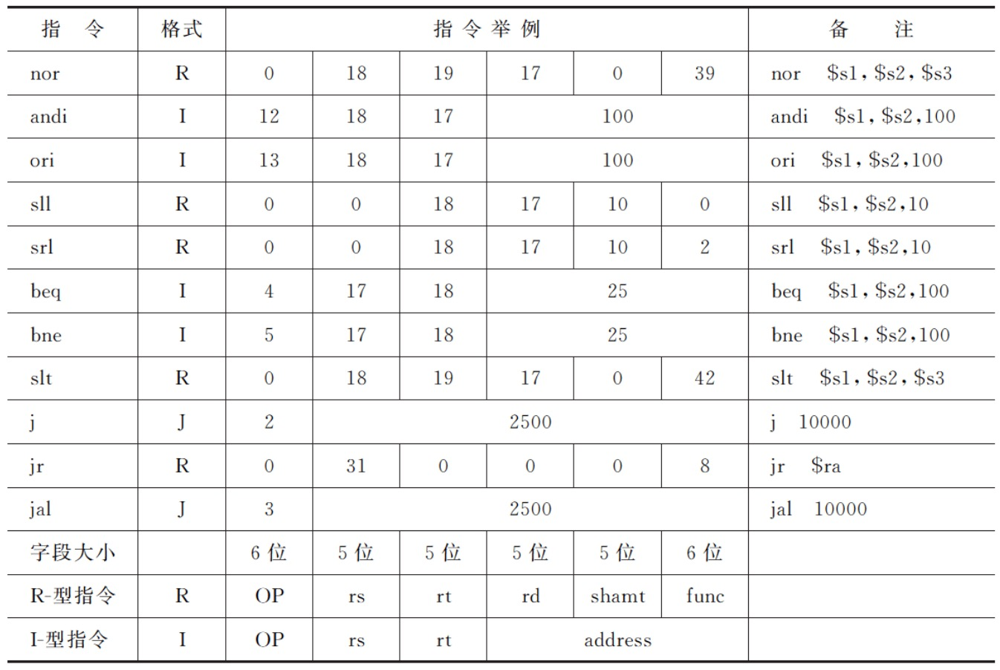

    ---
3. 执行过程P3-5  
    （R-型指令的电路）  
    ​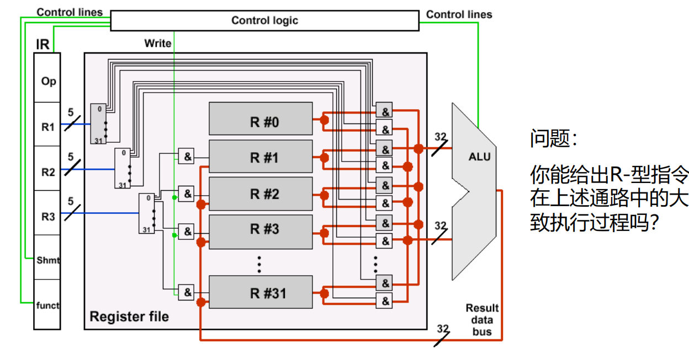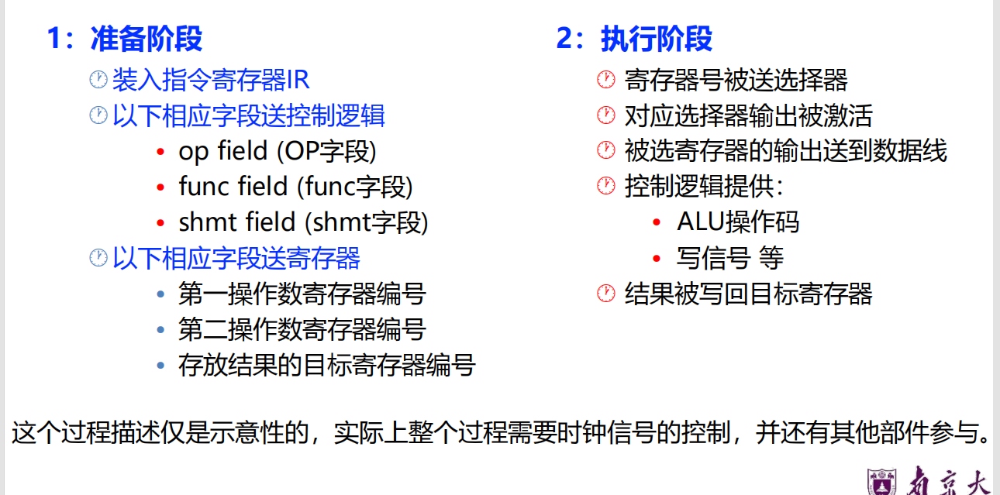
4. 指令
5. 高级语言→汇编语言

    1. 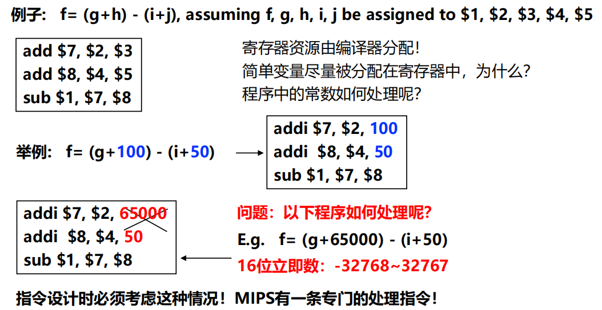
    2. 条件判断（选择结构）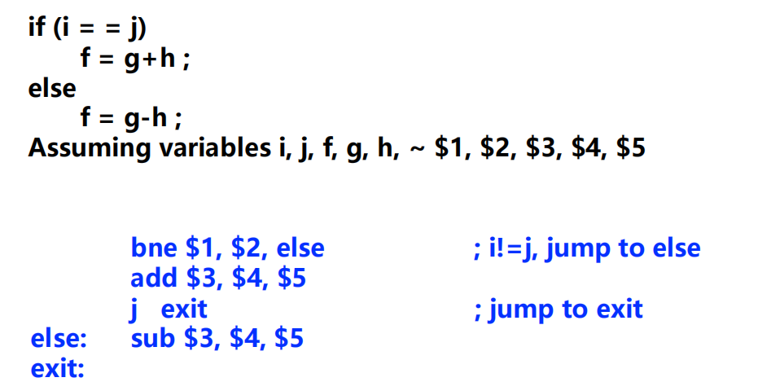
    3. 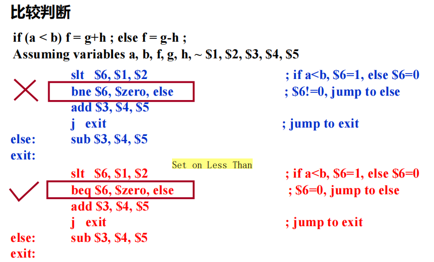
    4. 循环结构的表示

        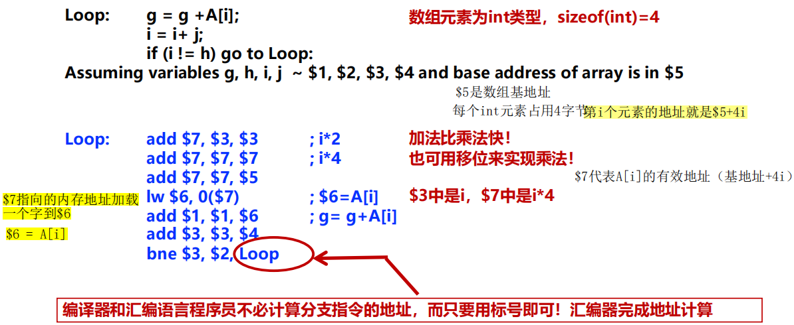
6. 过程调用
7. 栈

    1. 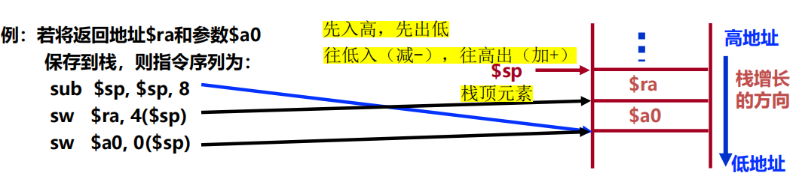  
        后存放的元素在栈顶  
        sp先下移8个单位，放入ra，（sp上移4）的位置，放入ra（存储占用在上）  
        再在sp放入a0  
        此时sp指向最下方
    2. 栈帧

    ‍

‍
