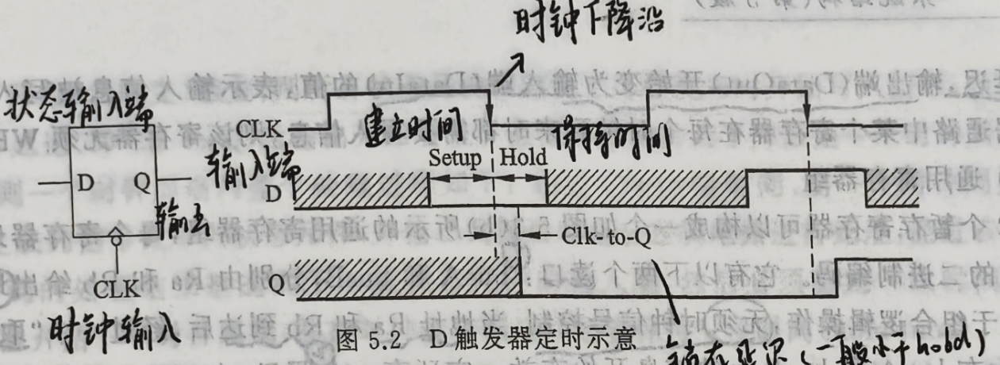
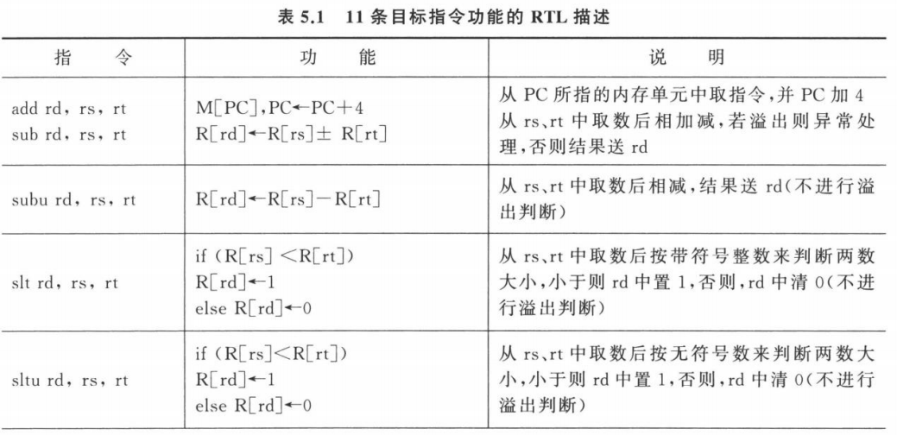
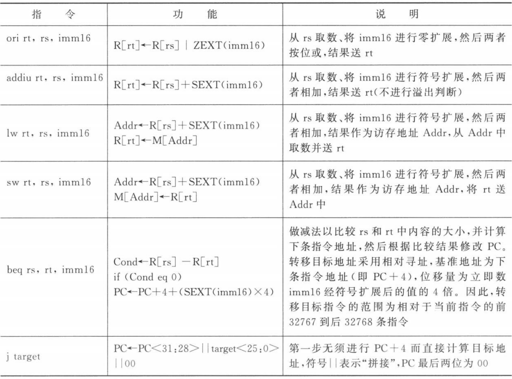
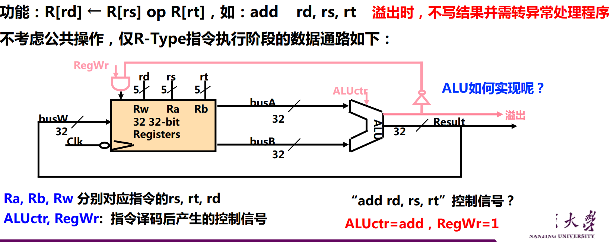
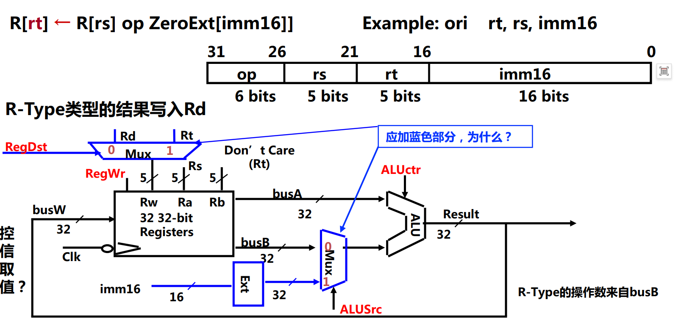
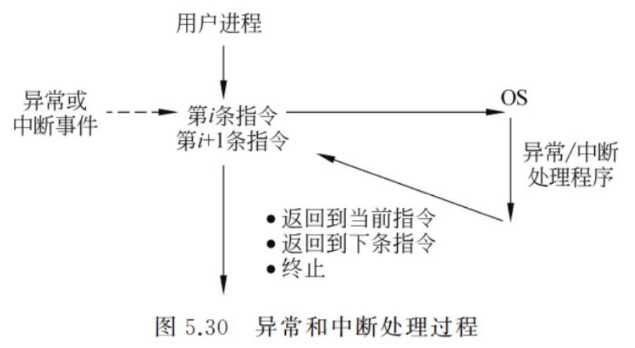
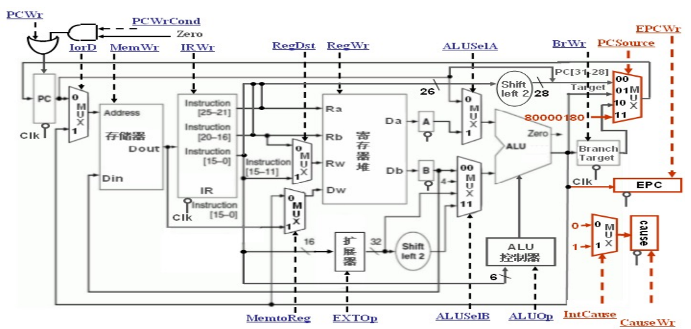

# U5 CPU

# CPU概述

1. CPU的[基本职能](U5%20CPU/基本职能.md)
2. 程序由指令序列和所处理的数据组成，指令按顺序存放在连续的内存单元中

    ##### CPU指令执行过程

    1. 取指令
    2. PC + 1→ PC
    3. 指令译码   对IR中的指令操作码译码
    4. 计算主存地址   计算源操作数地址并取源操作数，根据取址方式确定源操作数地址计算方式
    5. 取操作数进行算术 / 逻辑运算
    6. 存结果

---

### CPU的基本组成

1. ##### 数据通路（Datapath）

    ---

    数据通路是由操作元件和存储元件通过总线方式或分散方式连接而成的进行数据存储、处理、传送的路径。

    **what？** 指令执行过程中，数据所经过的路径，包括路径中的部件。它是指令的执行部件

    - ###### 操作元件

      又称组合逻辑元件  
      输出值取决于当前的输入，与时钟周期无关  
      定时，有一定的逻辑门延时，无需时钟周期来定时  
      eg：& | ~
    - ###### 状态元件

      又称时序逻辑元件、存储元件  
      有存储功能，需要时钟控制  -输入状态在时钟控制下被写入电路，并保持电路的输出值不变，直到下一个时钟到达  
      ​  
      状态元件有三个指标：

      -建立时间（Setup）：在时钟信号到达前，输入信号需要维持多长时间稳定  
      -保持时间（Hold）：在时钟信号到达后，输入信号还需要维持多长时间稳定  
      -锁存延迟（Clock-to-Q）：从输入信号改变到输出信号改变的时间

    连接方式：由 **总线连接方式** 或 **分散连接方式** 连接而成

    功能：负责 **数据的存储、处理、传送**

    ---
2. ##### 控制器（control unit）

    **what？** 对指令进行译码，生成指令对应的控制信号，控制数据通路的动作。是指令的执行部件

    发出控制信号，是指令的控制部件

    - 指令译码器
    - 控制信号形成部件

---

### 指令周期、时钟周期

**指令周期**指CPU取出并执行一条指令的时间；各指令的指令周期各不相同。  
**时钟周期**=锁存延迟+最长传输延迟+建立时间+时钟偏移

数据通路正常工作的**约束条件**：(锁存延迟+最短传输延迟-时钟偏移)>保持时间

---

# 指令

1. MIPS三种指令

    - R型  

      |op |rs|rt|rd|shamt|func|
      | ------| ----| ----| ----| -------| ------|

            6            5            5           5           5           6
    - I型

      |op |rs|rt|Imm|
      | ------| ----| ----| -----|

            6            5            5                      16
    - J型

      |op |target adress|
      | ------| ---------------|

            6                                        26

    ---
2. 指令功能的描述

    

    

---

# 单周期处理器设计

1. R-type  
    ​  
    RegWr（Register Write）最后结果写入Reg  
    ALUSrc（ALU Sourse）=0只有R型，ALU的第二个输入数来自Reg
2. I-type  
    ​  
    RegDst（Register Destination）写回阶段选择写入的寄存器  
    RegDst（Register Write）将数据写入寄存器  
    ALUctr（ALU control）进行add/sub/and/…  
    ALUSrc（ALU Sourse）=1 ，ALU的第二个输入为扩展后的Imm

---

# 多周期处理器设计

‍

---

# 异常 & 中断

-  异常是在CPU内部发生的
-  中断是由外部事件引起的

1. ### 异常和中断处理的大致过程

    

    1. 在执行第i条时检测到异常事件/  
        执行第i条指令后，发现有一个中断请求信号
    2. CPU中断当前程序的执行→跳转到 **os** 中相应的 **异常/中断处理程序** 中去执行

        1. 若 **异常/中断处理程序** 能解决相应问题：执行完异常/中断程序之后，回到被打断的第i条/第i+1条指令继续执行
        2. 若 **异常/中断处理程序** 能解决相应问题(时不可恢复的致命错误)：终止用户进程

    ---
2. ### 异常/中断响应过程中CPU的两个任务

    带异常处理的多周期数据通路  
    ​

    1. PCSourse 控制下一PC值的多路选择器

        ---
    2. EPC 异常/中断时，将当前PC值保存到EPC（保存断点）

        1. 自陷：PC的值减4后送到EPC
        2. 中断：直接送PC到EPC

        EPCWr 是否将当前PC值写入EPC（EPCWr=1 检测到异常时）

        ---
    3. Cause 记录异常/中断的具体类型（有很多数字编码IntCause）  
        CauseWr 是否将检测到的异常原因写入Cause

        ---
    4. PCSourse控制的多路选择器增加一条 8000 0180，  
        PCSourse=11 时，多路选择器选择这一路，PC更新为 0x8000 0180，CPU从这个地址取指执行-进入异常处理程序

    1. [了解完整过程](U5%20CPU/了解完整过程.md)

    ---

    变化

    1. 需要添加2个寄存器

        1. 异常程序计数器（EPC）存放断点（返回地址） Exception Program Counter
        2. 异常状态寄存器（Cause）记录异常/中断
    2. 需要加入2个寄存器的“写使能”控制信号：  
        EPCWr：在保存断点时有效。  
        CauseWr：在发现异常时有效。  
        还有一个控制信号：IntCause -选择正确的异常编码值来写入Cause中）
    3. 需要加入2个异常状态：  
        未定义指令（Cause=0）  
        溢出（Cause=1）
    4. 将异常查询程序入口地址（MIPS为0x8000 0180）写入PC，  
        可在原PCSource控制的多路器中再增加一路，其输入为 0x8000 0180
