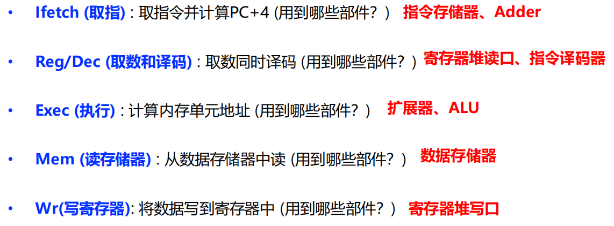

# 指令流水线

### background

单周期处理器和多周期处理器的执行都是采用[串行](指令流水线/串行.md)方式 $\Rightarrow$ 执行效率低下  
 $\Rightarrow$ 采用流水线方式，使多条指令相互重叠起来，提高CPU执行指令的效率

### 流水线概述

- 指令流水线由哪些流水段组成、各流水段的功能？使用哪些部  
  件？

  取指令(IF)：从存储器取指令  
  指令译码(ID): 产生指令执行所需的控制信号  
  取操作数(OF): 读取操作数  
  执行(EX): 对操作数完成指定操作  
  写回(WB): 将结果写回

  ---

  对于Load指令  
  ​  
  每个周期有5个功能部件同时在工作

  ---
- 具有什么特征的指令集有利于流水线执行？

  长度尽可能一致  
  格式规整，尽可能对齐  
  只有Load/Store指令才能访问存储器  
  内存中“对齐”存放

### 流水线处理器的实现

- 各指令对齐后的结果

  Load:    Ifetch，Reg/Dec，Exec，Mem，Wr
  R-type: Ifetch，Reg/Dec，Exec，**nop**​，Wr
  Store:    Ifetch，Reg/Dec，Exec，Mem，**nop**​
  Beq:      Ifetch，Reg/Dec，Exec，Mem，**nop**​
  J:           Ifetch，Reg/Dec，Exec，**nop**，**nop**  
  [详细过程](指令流水线/详细过程.md)

  与多周期通路有什么不同？

  多周期通路中，在Reg/Dec阶段投机进行了转移地址的计算！可以减少Branch指令的时钟数

  为什么流水线中不进行“投机”计算？

  因为流水线中所有指令的执行阶段一样多，Branch指令无需节省时钟，因为有比它更复杂的指令。

  ---
- 数据通路的设计

  1. PC和各个流水段寄存器都 **没有写使能WE** 信号  
      ∵每个时钟都改变PC的值每个流水段寄存器在每个时钟都会写入一次$\Rightarrow$ 不需要写使能控制信号
  2. **前两个流水段** 的功能每条指令都相同，是公共流水段，∴**不需要控制信号**

      ---
  3. Exec段的控制信号

      1. ExtOp(扩展器操作):1—符号扩展；0—零扩展。
      2. ALUSrc(ALU的B口来源):1—来源于扩展器；0—来源于busB。
      3. ALUop(用于辅助局部ALU控制逻辑来决定ALUctr的操作信号):3位编码。
      4. RegDst(指定目的寄存器):1—Rd;0—Rt。
      5. R-type(区分是否为R-型指令):1—R-型指令；0—非R-型指令。

      ---
  4. Mem段的控制信号

      1. MemWr(数据存储器DM的写信号):sw指令时为1,其他指令为0。
      2. Branch(是否为分支指令):分支指令时为1,其他指令为0。
      3. Jump(是否为无条件转移指令):无条件转移指令时为1,其他指令为0。Wr段的控制信号有两个。
      4. MemtoReg(寄存器的写入源):1—DM输出；0—ALU输出。
      5. RegWr(寄存器堆写信号):结果写寄存器的指令都为1,其他指令为0。
