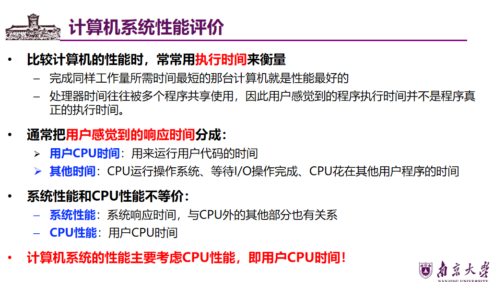
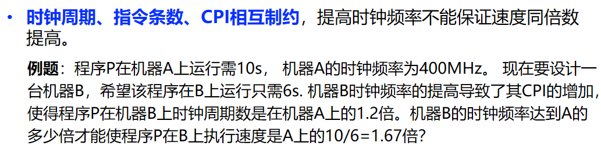
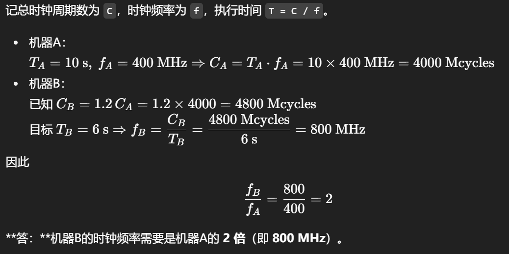
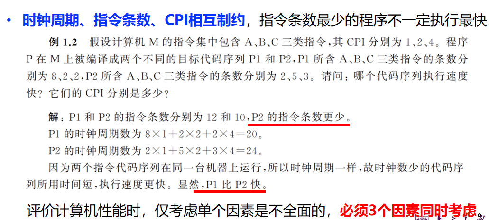

# 绪论-Unit1

1. 计算机的发展历程

    1. 真空管

        1. ENIAC 不是冯诺依曼模型
        2. 冯诺依曼模型

            1. 运算器、控制器、存储器、输入设备和输出设备五个基本部件组成
            2. 采取“存储程序”的工作方式
    2. 晶体管
    3. SSI/MSI

        1. 逻辑元件与主存储器均由集成电路（IC）实现
        2. IBM公司引入“兼容机”（系列机)概念

            - 问题1：引入“兼容机”有什么好处？

              避免重复开发、降低学习成本、便于系统升级、
            - 问题2：保持“兼容”的关键是什么？

              相同或相似的指令集结构（ISA）、操作系统、统一的I/O与存储访问标准
        3. PDP-8机 首次采用总线结构

            可扩充性好、节省器件、体积小、价格便宜
    4. 大规模、超大规模集成电路
2. 计算机系统的基本组成

    1. 硬件

        1. CPU
        2. 主存
        3. I/O设备
    2. 软件（程序+数据）
3. 计算机系统性能评价

    1. 
    2. 执行时间 = 指令条数 x CPI（平均每条指令需要多少时钟周期） x 时钟周期（基本操作的最小时间）

        1. 时钟周期（CPU内部执行基本操作的最小时间单位）
        2. 时钟频率（时钟周期的倒数）
        3. CPI（Clock Cycles Per Instruction）时钟周期每指令  
            每条指令平均需要多少个时钟周期
    3. 例题  
        ​  
        ​

        
