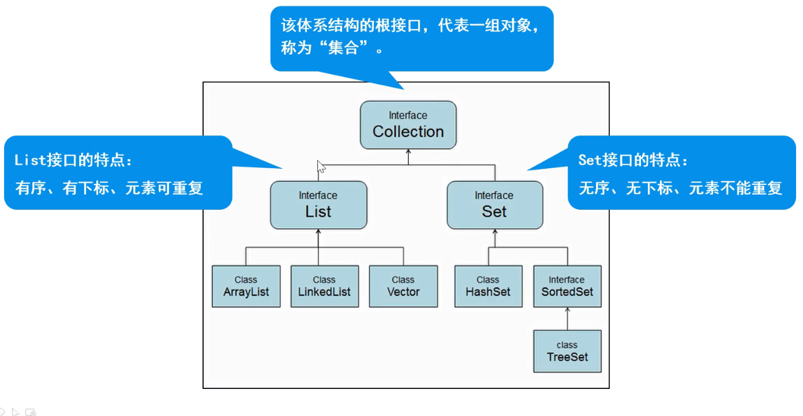

⭐<a href="https://docs.oracle.com/javase/8/docs/api/" target="_blank">Oracle推出的Java SE文档-核心API</a><br>
重写快捷键：按下 Fn+Alt+Insert / 右键 -> generate -> toString -> OK<br>
看方法的源码：选中方法，按 Ctrl+B

- [Java语言的特点](#java-language-features)
- [数据类型](#数据类型)
- [泛型](#MyGeneric)
    - [泛型类](#class)
    - [泛型接口](#interface)
    - [泛型方法](#function)
- 关键字
    - [static](#static)
    - [super](#super)
    - [final](#final)
- 常用类
    - [包装类](#包装类)
        - [装箱/拆箱](#类型)
        - [类型转换](#类型)
    - [整数缓冲区](#zshc)
    - [Object类](#Object)
    - [Objects类](#objects)
    - [Math类](#Math类)
    - [Arrays类](#Arrays)
    - [String类](#String类)
    - [StringBuffer](#stringbuffer)
    - [StringBuilder]()
    - [BigDecimal类](#BigDecimal)
- 集合结构体系
    - [集合基础 ](#集合基础)
    - [Collections 工具类](#cls)
    - [Collection 接口](#Collection)    &emsp;[迭代器](#iterator)
        - [List 子接口](#List)
            - ArrayList
            - Vector
            - LinkList
        - [Set 子接口](#Set)
            - HashSet
            - TreeSet &emsp;[Comparator接口](#Comparator)
    - [Map集合](#Map)
        - HashMap
- 其他类
    - [System类](#System)
    - [Calendar](#Calendar)
    - [SimpleDateFormat/DateTimeFormatter](#) 略
- [内部类](#内部类)

[]()

- [JVM](#jvm)

### Java语言的特点

<span id="java-language-features"></span>

- _**面向对象OOP**_， 省略 C中一些难点(eg: 指针)
- **_平台无关性_**：**Java虚拟机** 实现，Java软件不受计算机硬件和操作系统的约束
- _**健壮性**_：Java的 **安全检查机制**，将许多程序中的错误扼杀在摇篮之中

  具备许多保证程序稳定、健壮的特性（强类型机制、异常处理、垃圾的自动收集等），有效地减少了错误
- _**安全性**_：Java通常被用在网络环境中，为此，Java提供了一个 **安全机制** 以防恶意代码的攻击
- _**支持多线程**_：多线程机制使应用程序在同一时间并行执行多项任务，该机制使得程序能够具有更好的交互性、实时性。
- **_编译与解释共存_**

---

### 数据类型

<span id="数据类型"></span>


基本数据类型：数值直接存储在栈空间；引用数据类型：引用类型在栈里，对象在堆里(堆中创建对象，存储属性，栈中存储对象的相应地址)

---

## 泛型

### 泛型类

<span id="class"></span>

```java
public static class MyGeneric<T> {
    T t;

    public MyGeneric(T t) {
        this.t = t;
    }

    public T getT() {
        return t;
    }

    public void setT(T t) {
        this.t = t;
    }
}

public static void main(String[] args) {
    // 使用String类型的泛型对象
    MyGeneric<String> stringBox = new MyGeneric<>("Hello 泛型");
    String str = stringBox.getT();
    System.out.println(str); // 输出：Hello 泛型

    // 使用Integer类型的泛型对象
    MyGeneric<Integer> intBox = new MyGeneric<>(100);
    Integer num = intBox.getT();
    System.out.println(num); // 输出：100

    // intBox.setT("错误类型"); // 编译失败：不兼容的类型
}
```

### 泛型接口

<span id="interface"></span>

```java
public class code1 {
    public interface MyInterface<T> {
        String name = "ZhangSan";

        T server(T t); //自定义抽象方法
    }

    /* 创建类的时候直接确定类型T */
    public static class MyInterfaceImpl1 implements MyInterface<String> {
        @Override
        public String server(String s) {
            return s;
        }
    }

    /* 之后确定 */
    public static class MyInterfaceIml2<T> implements MyInterface<T> {

        @Override
        public T server(T t) {
            return t;
        }
    }

    public static void main(String[] args) {
        MyInterfaceImpl1 impl = new MyInterfaceImpl1();
        System.out.println(impl.server("Hello"));

        MyInterfaceIml2<Integer> impl2 = new MyInterfaceIml2<>();
        System.out.println(impl2.server(1000));
    }
}
```

### 泛型方法

<span id="function "></span>

```java
public class MyGenericMethod {
    public <T> T show(T t){
        System.out.println(t);
        return t;
    }//整个方法中可以使用泛型T，作为返回值/参数类型

    public static void main(String[] args) {
        MyGenericMethod myGenericMethod = new MyGenericMethod();
        myGenericMethod.show("String");
        myGenericMethod.show(100);
        //相当于自动重载方法
    }
}
```

---

## 关键字

### static

<span id="static"></span>

- **静态变量**：<u>静态变量</u> 在内存中只有一个副本，当且仅当在类初次加载时会被初始化；而 <u>非静态变量</u>
  是对象所拥有的，在创建对象的时候被初始化，存在多个副本，各个对象拥有的副本互不影响。
- **静态方法**：静态方法可以不依赖于任何对象进行访问（对于静态方法来说，是没有this的），在静态方法中 <u>**不能**
  访问类的非静态成员变量/非静态成员方法</u>(因为非静态成员方法变量都是必须依赖具体的对象才能够被调用)；只 **能** 调用<u>
  静态对象/静态方法</u>

### super

<span id="super"></span>
super 代表的是 **父类对象**。<br>
每一个子类的构造方法在没有显示调用 super() <u>系统</u> 都会 <u>提供默认的 super()</u>，super() 必须是构造器的 <u>
第一条语句</u>

### final

<span id="final"></span>

***

### 包装类

<span id="包装类"></span>
基本数据类型所对应的引用类型,在java.lang包中

| 基本数据类型  |   包装类型    |
|:-------:|:---------:|
|  byte   |   Byte    |
|  short  |   Short   |
|   int   |  Integer  |
|  long   |   Long    |
|  float  |   Float   |
| double  |  Double   |
| boolean |  Boolean  |
|  char   | Character |

### 类型转换与装箱/拆箱

<span id="类型"></span>

```java
int num1 = 19;
// 装箱：基本数据类型/String → 引用数据类型
Integer integer1 = new Integer(num1);//每次调用都创建一个对象
Integer integer2 = Integer.valueOf(num1); //推荐使用，复用[-128~127]常量池对象
// 拆箱：引用数据类型 → 基本数据类型
Integer integer3 = new Integer(100);
int num2 = integer3.intValue();
/*-------------JDK1.5之后，提供自动装箱/拆箱-------------*/
int age = 30;
Integer integer4 = age;// 自动装箱
int age2 = integer4;// 自动拆箱
```

### 基本类型 ↔ 字符串

都是 **包装类** 内的方法，**目标类** 内的方法<br>
int → string   `String s = String.valueOf(number);`<br>
string → int   `int i = Integer.parseInt(s);`

```java
/*基本类型转换成字符串*/
int n1 = 100;
String s1 = n1+"";
String s2 = Integer.toString(n1);//toString(n1,16)按照16进制转换/toOctalString(n1)
/*字符串转换成基本类型*/
String str = "150";
int n2 = Integer.parseInt(str);
/*boolean类型 只有"true"才转化成true，其余都是false*/
String str2 = "true";
boolean b1 = Boolean.parseBoolean(str2);// true
boolean b1 = Boolean.parseBoolean("treu");// false

```

### 整数缓冲区

<span id="zshc"></span>

```java
Integer int1 = new Integer(100);
Integer int2 = new Integer(100);
sout(int1 == int2);// false
/*------自动装箱------*/
Integer integer1 = 100;
Integer integer2 = 100;
sout(integer1 == integer2);// true

Integer integer3 = 200;
Integer integer4 = 200;
sout(integer3 == integer4);// false
```

堆中有-128 ~ 127 之间的对象，在此范围内的数据把地址赋值给栈中，<br>
不在这个范围内的 new Integer(num);创建新对象

---

### Object类

<span id="Object"></span>
基类/超类，是所有类的父类。

1. `getClass()` 返回对象类型
2. `hashCode()` 返回对象的哈希码
3. `toString()` 返回该对象的字符串表示，常在类内重写该方法
4. `obj1.equals(obj2)` 比较两个对象的地址是否相等,直接比较两个对象的地址是否完全相同，可以用"=="替代equals;常在类中重写

---

### Objects类

<span id ="objects"></span>

```java
Objects.equals(s1,s2);
Objects.isNull(s1);
```

---

### Math类

<span id="Math类"></span>
所有方法都是静态的（static修饰），通过类名直接调用

```java
public class MathDemo {
    public static void main(String[] args) {
        //1、public static int abs(int a)	a的绝对值
        System.out.println(Math.abs(88)); //88
        System.out.println(Math.abs(-88)); //88

        //2、public static double ceil(double a)	向上取整
        System.out.println(Math.ceil(12.34)); //13.0
        System.out.println(Math.ceil(12.56)); //13.0

        //3、public static double floor(double a)	向下取整
        System.out.println(Math.floor(12.34)); //12.0
        System.out.println(Math.floor(12.56)); //12.0

        //4、public static long round(double a)	四舍五入取整
        System.out.println(Math.round(12.34)); //12
        System.out.println(Math.round(12.56)); //13

        //5、public static int max(int a,int b)	返回两个数中较大值
        System.out.println(Math.max(66,88)); //88

        //6、public static int min(int a,int b)	返回两个数中较小值
        System.out.println(Math.min(66,88)); //66

        //7、public static double pow(double a,double b)	获取a的b次幂
        System.out.println(Math.pow(2.0,3.0)); //8.0

        //8、public static double random()	返回值为double类型随机数 [0.0~1.0）
        System.out.println(Math.random()); //0.36896250602163483
        System.out.println(Math.random()); //0.3507783145075083
    }
}
```

---

### Arrays类

<span id="Arrays"></span>

```java
    int[] arr = {21,56,15,89,62};
//toString 数组转化为字符串
    System.out.println("排序前："+ Arrays.toString(arr)); //排序前：[21, 56, 15, 89, 62]
//按照指定顺序排序
    Arrays.sort(arr);
    System.out.println("排序后："+Arrays.toString(arr)); //排序后：[15, 21, 56, 62, 89]
```

---

### String类

<span id="String类"></span>

- 字符串是常量，创建之后不可改变；
- 字符串字面量存储在字符串池中，可以共享。
- 创建：
    - `String s = "Hello"` 产生一个对象，**字符串池**中存储
    - `String s = new String("Hello")` 产生两个对象，~~**堆**/**池**中各存储一个~~（实际上是堆中对象指向常量池）
    ```java
    String s1 = new String();
    System.out.println("s1:"+s1); //s1:（无内容）

    char[] chs = {'a','b','c'};
    String s2 = new String(chs);
    System.out.println("s2:"+s2); //s2:abc

    byte[] bys = {97,98,99}; //对应计算机底层字符
    String s3 = new String(bys);
    System.out.println("s3:"+s3); //s3:abc

    String s4 = "abc";
    System.out.println("s4:"+s4); //s4:abc
    ```

- 存储
  ```java
  String name1 = "Hello";
  name1 = "zhangsan";//Hello 还存储在常量池中，只是name指向"zhangsan"
  String name2 = "zhangsan";
  System.out.println(name1 == name2);//true，地址都是"zhangsan"所在的地址
  
  String str1 = new String("Java");
  String str2 = new String("Java");
  System.out.println(str1 == str2);//false,创建的两个对象都指向池中的"Java"，但是两个对象在堆中的地址不同
  System.out.println(str1.equals(str2));//true,比较的是值，而非地址
  ```
- 常用方法
  ```java
  str.length();//字符串长度
  str.charAt(0);//第i位字符
  str.contains("apple");//是否包含字符串
  
  str.toCharArray();//转化成字符数组
  str.indexOf("app");//第一个app的开始下标
  str.lastIndexOf("app");//最后一个app的开始下标
  
  str1="  hello world  ";
  sout(str1.trim());//去掉前后空格
  str1.toUpperCase();//全部转换成大写字母
  str1.toLowerCase();//全部转换成小写字母
  
  str.replace('a','c');//把a替换成c
  str.replace("Java","php");//替换字符/字符串
  
  String s ="java is the best programing language.";
  String[] arr = s.split(" ");//以" "为分割，得到字符串数组
  
  /*正则表达式
  s.split("[ ,]");//以空格/,进行分割
  s.split("[ ,]+");//空格/,可以出现多个*/
  
  String s1 = "hello";
  String s2 = "HELLO";
  s1.equals(s2);
  s1.equalsIgnoreCase(s2);//忽略大小写 比较大小
  
  String s3 ="abc";
  String s4 ="xyz";
  String s5 = "abcdef";
  sout(s3.compareTo(s4));//第一个不同的字符相差数值（'a'-'x' = -23）
  sout(s3.compareTo(s5));//和一个String相同，返回长度差(3-6 = -3)
  
  //substring子字符串
  str.substring(1);//第1号位置开始的子字符串
  
  ```

---

### StringBuffer/StringBuilder

<span id="stringbuffer"></span>
一般用 ***StringBuilder***

1. 为什么需要StringBuffer？

   [**String**](#String) 是不可变的。若执行 `str = str + "a"`, JVM 会 **创建新的字符串对象**，频繁拼接会产生大量临时对象，效率极低。
   <span id="str"></span>

   2.**StringBuffer 特性**：

   **线程安全**：所有方法都加了 `synchronized` 同步锁，多线程环境下使用不会出现数据错乱（这是它和 StringBuilder
   的核心区别）；<br>
   **可变字符序列**：支持增、删、改、插等操作，且操作后对象本身不变；<br>
   **初始容量/自动扩容**：默认初始容量是 16 个字符，当字符数超过容量时，会自动扩容（扩容为原容量 * 2+2）

```java
// 1. 初始容量20
  StringBuffer sb = new StringBuffer(20); 
// 2. 追加 append
  sb.append("Hello");
  sb.append(" ").append("Java"); // 链式编程
  System.out.println("拼接后：" + sb); // 输出：Hello Java

// 3. 插入字符/字符串（insert）
  sb.insert(5, ", World"); // 在索引5的位置插入
  System.out.println("插入后：" + sb); // 输出：Hello, World Java

// 4. 替换(replace)
  sb.replace(0,5,"hi");

// 5. 修改指定索引的字符（setCharAt）
  sb.setCharAt(0, 'h'); // 把第一个字符改为h
  System.out.println("修改后：" + sb); // 输出：hello, World Java

// 6. 删除字符（delete）
  sb.delete(5, 12); // 删除索引5到11的字符（左闭右开）
  System.out.println("删除后：" + sb); // 输出：hello Java

// 7. 反转字符串（reverse）
  sb.reverse();
  System.out.println("反转后：" + sb); // 输出：avaJ olleh

// 8. String 和 StringBuilder 的相互转换
  String finalStr = sb.toString();
  StringBuilder sb1 = new StringBuilder(s1);
```

---
<span id="BigDecimal"></span>

### BigDecimal类

需要进行 **精确运算** 时使用 BigDecimal

```java
double d1 = 1.0;
    double d2 = 0.9;
    double d = d1 - d2;
    System.out.println(d);//0.09999999999999998
/*字符串创建*/
    BigDecimal b1 = new BigDecimal("1.0");
    BigDecimal b2 = new BigDecimal("0.9");
    BigDecimal bd1 = b1.subtract(b2); //0.1
    BigDecimal bd2 = b1.add(b2); //1.9
    BigDecimal bd3 = b1.multiply(b2); //0.90
    System.out.println(bd1 + " " + bd2 + " " + bd3);

    BigDecimal r1 = new BigDecimal("1.4").
            subtract((new BigDecimal("0.5"))
            .divide(new BigDecimal("0.9"),2,BigDecimal.ROUND_HALF_UP));
    BigDecimal r2 = new BigDecimal("10").divide(new BigDecimal("3"), 2, BigDecimal.ROUND_HALF_UP);//除不尽，必须加保留几位小数，否则会报错
```

---

## 集合

### 集合基础

<span id="集合基础"></span>

1. 集合与数组的区别
   数组的容量固定，集合容量可变。
   数组可以存储基本类型和引用类型，集合只能引用类型
2. 关系
   


6. **ArrayList** 的常用方法
    ```java
       ArrayList<String> array = new ArrayList<>();

    // add 添加到集合末尾
       array.add("hello");
       array.add("word");
    // add 指定位置，添加元素
       array.add("2,java"); //[hello, word, java]
    // remove 删除指定元素
       System.out.println(array.remove("hello")); //true; 集合变为[word, java]
    // set 修改指定索引处的元素，返回被修改的元素
       array.set(1,"javase"); 
    // get(index) 返回指定索引处的元素
       array.get(0); //hello
   // size 返回元素个数
      array.size();// 3
   ```

---

### Collections 方法类

<span id="cls"></span>
集合工具类，定义了除了存取以外的集合常用方法。

```java
List<Integer> list = new ArrayList<>();
    list.add(10);
    list.add(20);
    list.add(17);
    list.add(19);
/* sort排序 */
    Collections.sort(list);
    System.out.println(list.toString());
/* binarySearch */
    int idx = Collections.binarySearch(list, 17);
    System.out.println(idx);
/* copy */
    List<Integer> dest = new ArrayList<>();
    for (int i = 0; i < list.size(); i++) {
        dest.add(null); // 填充null作为占位符
    }//copy方法的不足：要求占位元素和复制元素个数相同
    Collections.copy(dest, list);

    /* 一般用Arrays.addAll(list) */
    List<Integer> dest2 = new ArrayList<>(list.size()); // 指定初始容量优化性能
    dest2.addAll(list);

/* reverse反转 */
    Collections.reverse(list);

/* shuffle打乱 */
    Collections.shuffle(list);

/* list → 数组 */
    Integer[] arr = list.toArray(new Integer[0]);
    System.out.println(Arrays.toString(arr));

/* 数组 → list */
    String[] names ={"Lily","Molly","June"};
    List<String> list2 = Arrays.asList(names);
//list2.add("hi");现在集合是一个受限集合，不能增删元素
```

---

### Collection 集合

<span id="Collection"></span>
无序、无下标、不能重复

```java
    Collection c = new ArrayList<>();
/* 添加元素 */
    c.add("apple");
    c.add("pear");
    c.add("hair");//["apple","pear","hair"]
/* 移除指定元素 */
    c.remove("hair");//["apple","pear"]
/* 清空 */
        //c.clear();
/* 判断是否包含/为空 */
    c.contains("apple"); //true
    c.isEmpty(); //false
/* 遍历 */
   Iterator it = c.iterator();
   while(it.hasNext()){
       String s = (String) it.next();
       System.out.println(s);
// c.remove(s);错误，ConcurrentModificationException并发修改异常,
//迭代器迭代过程中不能使用collection的方法
       it.remove();//✔
```

<span id="iterator"></span>

---

### List 子接口

有序、有下标、元素可以重复

1. 常用方法
    ```java
    List list = new ArrayList<>();
    /* 添加元素 */
        list.add("apple");
        list.add("pear");
        list.add("hair");//["apple","pear","hair"]
    /* 移除指定元素 */
        list.remove("hair");//["apple","pear"]
    /* 返回子集合（含头不含尾） */
        List subList = list.subList(0,2);  //[apple, pear]
    /* 判断是否包含/为空 */
        list.contains("apple"); //true
        list.isEmpty(); //false
    /* 获取下标 */
        list.indexOf("pear");

    /* 遍历(可以从前往后/从后往前) */
        ListIterator it = list.listIterator();
        while(it.hasNext()){
            String s = (String) it.next();
            System.out.println(s);
       }//从前往后
        while(it.hasPrevious()){
            String s = (String) it.previous();
            System.out.println(s);
        }//从后往前
    ```
2. List的实现类
    1. ArrayList(效率高，线程不安全)
       (源码分析)[https://www.bilibili.com/video/BV1zD4y1Q7Fw?t=340.1&p=12]
    2. Vector(线程安全，效率低)
     ```java
        Vector vector = new Vector<>();
        vector.add("b");
        vector.add("c");
        vector.add("a");
        vector.add("a");
     /* 枚举器 */
       Enumeration en = vector.elements();
        while(en.hasMoreElements()){
            String s =(String)en.nextElement();
            System.out.println(s);
        }
     ···略
     ```
    3. LinkList（链表集合，增删快/改查慢）
     ```java
   LinkedList ll = new LinkedList<>();
    ll.add("apple");
    ll.add("banana");
    ll.add("orange");
    ll.remove("orange");
    Iterator it = ll.iterator();
   ```

---

### Set 子接口

<span id="Set"></span>
无序、无下标、不能重复

1. HashSet
    ```java
    HashSet hs = new HashSet<String>();
    hs.add("a");
    hs.add("b");
    hs.remove("b");
    hs.contains("a");
    hs.isEmpty();
    ```
2. TreeSet
   基于红黑树的集合<br>
   Comparator接口：自定义比较规则
   <span id="Comparator"></span>
    ```java
    import java.util.*;
    
    public class code2 {
        static class Person {
            int age;
    
            Person(int age) {
                this.age = age;
            }
    
            @Override
            public String toString() {
                return "Person{age=" + age + "}";
            }
        }
    
        public static void main(String[] args) {
            // 创建TreeSet，传入Comparator自定义比较规则（按age升序）
            TreeSet<Person> persons = new TreeSet<>(new Comparator<Person>() {
                @Override // 重写compare方法
                public int compare(Person p1, Person p2) {
                    return p1.age - p2.age; // 按age升序排列
                }
            });
            /* Lambda 表达式 */
            /* TreeSet<Person> persons = new TreeSet<>((p1, p2) -> p1.age - p2.age); */
    
            persons.add(new Person(25));
            persons.add(new Person(18));
            persons.add(new Person(30));
            persons.add(new Person(18)); // age相同，TreeSet会去重，不会添加
    
            System.out.println("按age升序排列的Person集合：");
            for (Person p : persons) {
                System.out.println(p);
            }
        }
    } 
    ```

---

### Map集合

<span id="Map"></span>

1. Map(interface)
    - 实现类
        - HashMap 运行效率高，线程不安全
        - Hashtable 运行效率低，线程安全。已被 ConcurrentHashMap 替代
            - Properties (Hashtable的子类，要求key和value都是String)，是开发中配置读写的标准工具。
    - SortedMap(interface)
        - TreeMap(class) 红黑树存储
2. 常用方法
    ```java
    Map<Integer,String> map = new HashMap<>();
    //添加(key,value)
        map.put(2,"Molly");
        map.put(1,"Lily");
        map.put(3,"Star");
        map.put(7,"emm");
    //删除key
        map.remove(7);
   //个数
        map.size();//3
    //keySet
        for(Integer key : map.keySet()){
            System.out.println(key);
        }
    //entrySet 映射对
        Set<Map.Entry<Integer,String>> entries = map.entrySet();
        for (Map.Entry<Integer,String> entry: entries){
            System.out.println(entry);
        }
    //判断是否包含
        System.out.println(map.containsKey(3));
        System.out.println(map.containsValue("Star"));
    ```

---

### System类

<span>System</span>


---

### Calendar

```java
//Calendar 是抽象类，不能直接 new，需通过 getInstance() 获取实例
    Calendar calendar = Calendar.getInstance();
    System.out.println(calendar.getTime().toInstant());

    int year =calendar.get(Calendar.YEAR);
    int month =calendar.get(Calendar.MONTH+1);
    int day =calendar.get(Calendar.DAY_OF_MONTH);

    System.out.println(year+" "+month+" "+day);
    ...
```

---

### 内部类

<span id="内部类"></span>
在类的内部定义一个完整的类。<br>
编译后可生成独立的**字节码文件**;内部类可访问外部类的私有成员。

- 成员内部类

    - 初始化 ```  class Outer{ class Inner{可以访问Outer对象} }```<br>
    - 创建对象 ```Outer.Inner oi = new Outer().new Inner();```<br>
    - 访问：当内外部类存在重名属性时，优先访问**内部类**属性，访问外部类 Outer.this.name;

- 静态内部类

    - 初始化 ```  class Outer{ **static** class Inner{可以访问Outer对象} }```<br>
    - 创建对象：`Outer.Inner oi = new Outer.Inner();`不需要先创建外部类对象<br>
      类内访问：
    - 访问外部类的属性

      静态内部类不能访问 non-static 的外部类成员<br>
      先创建外部类对象 `Outer outer = new Ounter()`;<br>
      再 `outer.name;`
    - 访问内部类的属性
      通过类名访问 `Inner.name;`

- 局部内部类

    - 初始化

      在类的 **方法** 中写类`class Outer{ public void function(){ class Inner{} } }`<br>
      `Inner i = new Inner();   i.show2();`
      方法运行完毕，类就消失
    - [内部类内访问局部变量](#内部类内)
      <span id="内部类内访问局部变量"></span>
      变量必须是**常量**（相当于加上final修饰符）<br>
      在内部类中调用变量才不能修改(final)，没有调用还可以修改

- 匿名内部类
  没有名字的内部类<br>
  必须继承一父类/实现接口，减少代码量。

  ```java
  USB usb = new USB(){
    public void show(){
      sout("Usb is working...");
    }
  }
  ```
  相当于实现继承的局部内部类：
  ```java
  class Fan implements USB{
    void service(){
      sout("Usb is working...");
    }
  }
  USB Usb = new Fan();
  Usb.service();
  ```

### JVM

---
<span id="String"></span>
[**String的不可变性**](#str)

- 实现原理

  ```java
   public final class String{
        private final char value[];
   }
   ```   
    1. String 类被 **final** 修饰，<u>无法被继承</u>；内部存储字符的 char[] value 数组也被 **final** 修饰，保证 <u>
       该数组引用不可指向新数组</u>。
    2. 数组的 **private** 封装char[] value 被 private 修饰，外部无法直接访问或修改这个数组。
    3. 无修改方法，操作返回新对象String 没有提供修改内部数组的公开方法，所有字符串操作（如拼接、替换）都会返回新的 String
       对象，原对象内容不变。
- 为什么这样设计？

    1. 支撑常量池：保证常量池中的字符串可安全复用，大幅节省内存；
    2. 适配哈希表：哈希值（hashCode）固定，作为 HashMap/HashSet 的键时稳定且高效；

---

<span id="内部类内"></span>
[内部类内](#内部类内访问局部变量)

局部内部类访问外部类的成员变量时，_**因无法保障变量的生命周期与自身相同**_，变量必须修饰为 final

```java
public void show(){
  String adress = "home";
  
  class Inner{
    public void show2(){
      sout...
    }
    Inner inner = new Inner();
    inner.show2();
  }
}
```

若没有final：<br>
show 方法执行完后，局部变量 adress 立即消失；<br>
Inner 对象在堆中不会立即消失，未消失的对象中的show2方法引用的address变量不存在，不能访问到；

解决方法：<br>
加上final，变成常量
