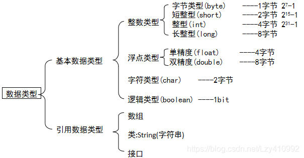

- [Java语言的特点](#java-language-features)
- [数据类型](#数据类型)
- 关键字
  - [static](#static)
  - [super](#super)
  - [final](#final)
- 核心类库
  - 常用API（Application Programming Interface）应用程序编程接口
    - [Math类](#Math类)
    - [System类](#System类)
    - [Object类](#Object类)
    - [Arrays类](#Arrays类)
    - 基本类型包装类 
  - String类
    - [StringBuffer](#stringbuffer)
    - 

- [内部类](#内部类)

[]()


- [JVM](#jvm)


### Java语言的特点 

- _**面向对象OOP**_， 省略 C中一些难点(eg: 指针)
- **_平台无关性_**：**Java虚拟机** 实现，Java软件不受计算机硬件和操作系统的约束  
- _**健壮性**_：Java的 **安全检查机制**，将许多程序中的错误扼杀在摇篮之中

  具备许多保证程序稳定、健壮的特性（强类型机制、异常处理、垃圾的自动收集等），有效地减少了错误
- _**安全性**_：Java通常被用在网络环境中，为此，Java提供了一个 **安全机制** 以防恶意代码的攻击
- _**支持多线程**_：多线程机制使应用程序在同一时间并行执行多项任务，该机制使得程序能够具有更好的交互性、实时性。
- **_编译与解释共存_**
---

### 数据类型


---
### static

- **静态变量**：<u>静态变量</u> 在内存中只有一个副本，当且仅当在类初次加载时会被初始化；而 <u>非静态变量</u> 是对象所拥有的，在创建对象的时候被初始化，存在多个副本，各个对象拥有的副本互不影响。
- **静态方法**：静态方法可以不依赖于任何对象进行访问（对于静态方法来说，是没有this的），在静态方法中 <u>**不能** 访问类的非静态成员变量/非静态成员方法</u>(因为非静态成员方法变量都是必须依赖具体的对象才能够被调用)；只 **能** 调用<u>静态对象/静态方法</u>
---

### super

super 代表的是 **父类对象**

每一个子类的构造方法在没有显示调用 super() <u>系统</u> 都会 <u>提供默认的 super()</u>，super() 必须是构造器的 <u>第一条语句</u>

---
### final


---
### Math类
所有方法都是静态的（static修饰），通过类名直接调用

```java
public class MathDemo {
    public static void main(String[] args) {
        //1、public static int abs(int a)	a的绝对值
        System.out.println(Math.abs(88)); //88
        System.out.println(Math.abs(-88)); //88

        //2、public static double ceil(double a)	向上取整
        System.out.println(Math.ceil(12.34)); //13.0
        System.out.println(Math.ceil(12.56)); //13.0

        //3、public static double floor(double a)	向下取整
        System.out.println(Math.floor(12.34)); //12.0
        System.out.println(Math.floor(12.56)); //12.0

        //4、public static long round(double a)	四舍五入取整
        System.out.println(Math.round(12.34)); //12
        System.out.println(Math.round(12.56)); //13

        //5、public static int max(int a,int b)	返回两个数中较大值
        System.out.println(Math.max(66,88)); //88

        //6、public static int min(int a,int b)	返回两个数中较小值
        System.out.println(Math.min(66,88)); //66

        //7、public static double pow(double a,double b)	获取a的b次幂
        System.out.println(Math.pow(2.0,3.0)); //8.0

        //8、public static double random()	返回值为double类型随机数 [0.0~1.0）
        System.out.println(Math.random()); //0.36896250602163483
        System.out.println(Math.random()); //0.3507783145075083
    }
}
```
---
### System类

```java
import java.text.SimpleDateFormat;

public class code1 {
    public static void main(String[] args) {
        /*
        System.out.println("开始"); //开始
        //1、public static void exit(int status)	终止JVM虚拟机，非 0 是异常终止
        System.exit(0);
        System.out.println("结束"); //没有输出结束
        */

        //2、public static long currentTimeMillis()	返回当前时间（以毫秒为单位）
        System.out.println(System.currentTimeMillis()); //1625491582918
        long time = System.currentTimeMillis();
        SimpleDateFormat sdf = new SimpleDateFormat("yyyy年MM月dd日 HH:mm:ss EEE a");
        System.out.println(sdf.format(time)); //2026年02月07日 21:42:14 周六 下午
    }
}
```
---
### Object类
Object 类是 Java 中的 **祖宗类**，所有类都直接或者间接继承自该类
,只有无参构造方法：public Object()

---
### Arrays类


### StringBuffer 

1. 为什么需要StringBuffer？

    [**String**](#String) 是不可变的。若执行 `str = str + "a"`, JVM 会 **创建新的字符串对象**，频繁拼接会产生大量临时对象，效率极低。
    
 
   2.**StringBuffer 特性**：

  **线程安全**：所有方法都加了 `synchronized` 同步锁，多线程环境下使用不会出现数据错乱（这是它和 StringBuilder 的核心区别）；

  **可变字符序列**：支持增、删、改、插等操作，且操作后对象本身不变；

  **初始容量/自动扩容**：默认初始容量是 16 个字符，当字符数超过容量时，会自动扩容（扩容为原容量 * 2+2）

```java
    StringBuffer sb = new StringBuffer(20); // 初始容量20

    sb.append("Hello");
    sb.append(" ");
    sb.append("Java");
    System.out.println("拼接后：" + sb); // 输出：Hello Java

    // 3. 插入字符/字符串（insert）
    sb.insert(5, ", World"); // 在索引5的位置插入
    System.out.println("插入后：" + sb); // 输出：Hello, World Java

    // 4. 修改指定索引的字符（setCharAt）
    sb.setCharAt(0, 'h'); // 把第一个字符改为小写h
    System.out.println("修改后：" + sb); // 输出：hello, World Java

    // 5. 删除字符（delete）
    sb.delete(5, 12); // 删除索引5到11的字符（左闭右开）
    System.out.println("删除后：" + sb); // 输出：hello Java

    // 6. 反转字符串（reverse）
    sb.reverse();
    System.out.println("反转后：" + sb); // 输出：avaJ olleh

    // 7. 转为普通 String
    String finalStr = sb.toString();
```
   
---


---
<span id="String"></span>
String的不可变性

- 实现原理

  ```java
   public final class String{
        private final char value[];
   }
   ```   
  1. String 类被 **final** 修饰，<u>无法被继承</u>；内部存储字符的 char[] value 数组也被 **final** 修饰，保证 <u>该数组引用不可指向新数组</u>。
  2. 数组的 **private** 封装char[] value 被 private 修饰，外部无法直接访问或修改这个数组。
  3. 无修改方法，操作返回新对象String 没有提供修改内部数组的公开方法，所有字符串操作（如拼接、替换）都会返回新的 String 对象，原对象内容不变。
- 为什么这样设计？

  1. 支撑常量池：保证常量池中的字符串可安全复用，大幅节省内存； 
  2. 适配哈希表：哈希值（hashCode）固定，作为 HashMap/HashSet 的键时稳定且高效；


---
### 内部类

- 成员内部类
  初始化 ```  class Outer{ class Inner{可以访问Outer对象} }```
  创建对象 ```Outer.Inner oi = new Ounter().new Inner();```
- 局部内部类
  在类的方法中写类```class Outer{   public void function(){class Inner{} } }``

  方法运行完毕，类就消失

- 静态内部类
  静态内部类不能访问   non-static 的外部类成员


- 匿名内部类


### JVM


