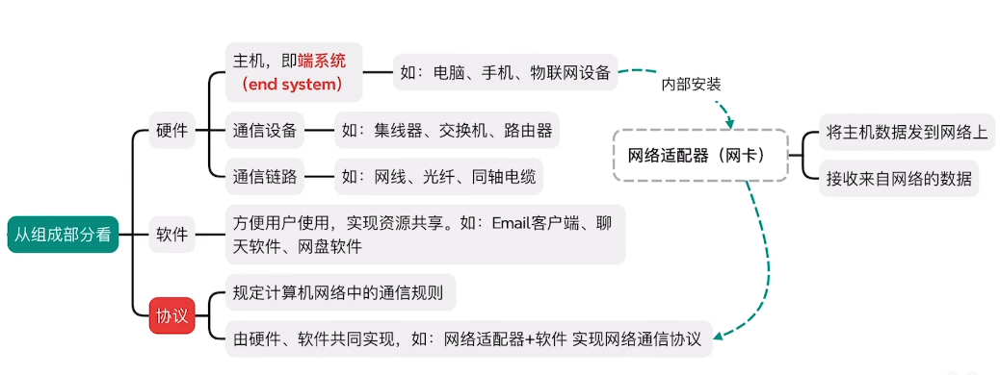
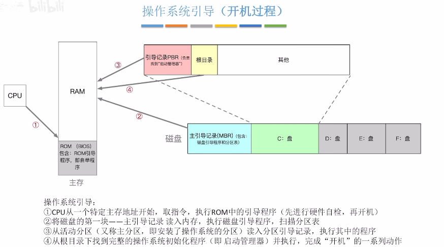

1.4没看
6 (5 times) ：4闭卷期末

- U1 操作系统基础
    - [操作系统的功能](#操作系统的功能)
    - [操作系统的特征](#操作系统的特征)
    - [操作系统的历史和分类](#操作系统的历史和分类)
- U2 操作系统
    - 运行机制[操作系统的运行机制](#操作系统的运行机制)
    - [中断](#中断)
    - [系统调用](#系统调用)
    - [操作系统地引导]()
- 
- 

## U1 操作系统基础

### 操作系统的功能

1. 作为系统资源的管理者
    1. 处理器管理 U2
    2. 存储器管理 U3
    3. 文件管理 U4
    4. 设备管理 U5
2. 向上层提供方便易用的服务
    1. GUI 图形化用户接口
    2. 联机命令接口(交互式命令接口)
    3. 脱机命令接口(批处理命令接口)
    4. 程序接口（只能通过程序代码间接使用）

### 操作系统的特征

1. 并发
    1. 并发 vs 并行
       并发：在同一个时间间隔进行多个事件，围观来看是交替发生的；
        并行：在同时间进行多个时间，实际上也是同时进行
    2. **单核CPU** 同一时刻只能执行一个程序，各个程序只能 **并发** 执行
         **多核CPU** 同一时刻可以同时执行多个程序，多个程序可以 **并行** 执行
2. 共享
    1. 定义：即资源共享，指系统中的资源1可供内存中多个并发执行的进程共同使用
    2. 两种资源共享方式：
        1. **互斥共享方式**：一个时间段内只允许一个进程访问该资源
            &emsp;&emsp;eg:微信视频聊天使用摄像头时不能在QQ开启
        2. **同时共享方式**：一个时间段内只允许多个进程“ 同时”访问该资源(有时微观 交替)
            &emsp;&emsp;eg:微信和QQ同时发送文件，微观下交替访问硬盘
3. 虚拟
   空分复用技术（虚拟存储器）；时分复用技术（虚拟处理器）
4. 异步

### 操作系统的历史和分类

---

## 操作系统的运行机制

内核态（跑内核程序的特权指令） $\xleftrightarrow[\text{中断引起，硬件自动完成}]{\text{一条修改PSW的特权指令}}$
用户态（跑应用程序的非特权指令）

### 中断

- 作用：让操作系统内核夺回CPU的控制权，使CPU从用户态变为内核态

1. 内中断（异常）
    - 与当前执行的指令**有关**，中断信号来源于CPU**内**部
    - 例： 试图在用户态执行特权指令/执行除法指令时发现除数为0
        - 陷入 trap：由陷入指令引发，主动把CPU使用权归还系统内核
        - 故障 fault：由错误条件引起，可能被内核修复，修复后把CPU使用权归还应用程序。eg：缺页故障
        - 终止 abort：由致命错误引起，内核程序无法修复，一般不再将CPU使用权归还给引发终止的应用程序。eg：整数$div$0，非法使用特权指令
2. 外中断（中断）
    - 与当前执行的指令**无关**，中断信号来源于CPU**外**部。CPU在每一个指令执行结束时，会例行检查是否有外中断需要执行。
    - 例：时钟部件传来的中断信号，用于并发执行指令；I/O请求中断

---

### 系统调用

- [过程](https://www.bilibili.com/video/BV1YE411D7nH?t=367.7&p=7)
- 描述：代码中调用的库函数内部封装了 **系统调用**，先传递系统调用需要的参数 → 执行陷入指令(把CPU控制权交给内核) →
  内中断，转向执行内核程序(核心态) → 返回原应用程序

---  

### 操作系统的体系结构

两种体系结构：大内核、微内核（不同内核划分）

  

    
  

  

    
  

| 体系结构 | 优点              | 缺点                   |
|------|-----------------|----------------------|
| 大内核  | 高性能，用户态和内核态切换少  | 内核代码庞大，结构混乱，难以维护     |
| 微内核  | 内核功能少，结构清晰，方便维护 | 需要频繁在核心态和用户态之间切换，性能低 |

---

### 操作系统引导-开机过程

开机过程

---

### 虚拟机
- 物理机器虚拟化为多台虚拟机(VM)，需要使用虚拟机管理程序/虚拟机监控程序(VMM/Hypervisor)

