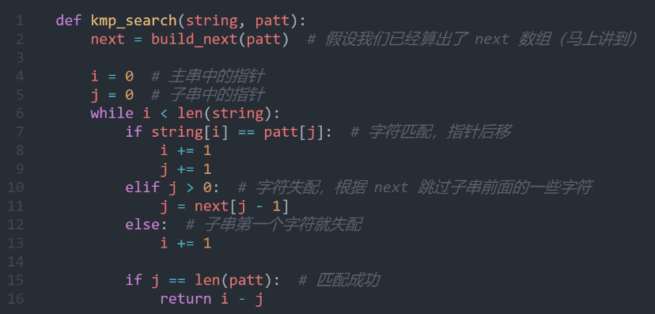

链表：7. 链表相交(面试02.07)  &emsp; 8. 环形链表II(142)
<br>哈希表：6. 四数相加II(454) &emsp; 8.三数之和(15) &emsp; 9. 四数之和(18)
<br>字符串
<br>双指针法

- [数组](#数组)
  - [快慢指针](#slowfast) 
  - [滑动窗口](#滑动窗口)
- [链表](#linklist)
- [哈希表](#哈希表)
- [字符串](#字符串)
  - [KMP算法](#KMP1) 
- [二叉树](#二叉树)

> ## 2026

### 1.23

## 数组
<span id="数组"></span>

- [x] [***704. 二分查找***](https://leetcode.cn/problems/binary-search/)

  关于 <mark>**>=/medal±1**</mark> 的判断

  关于能取到的范围, target 所在范围：
    - 若 [left,right]，则 right 初始化为len-1， `while(left<=right)`； media > target 时，right = media-1；media < target
      时，left = media + 1
        - 若 [left,right)，则 right 初始化为 **len**，`while(left<right)`； media > target 时，right = <mark>media</mark>；media < target 时，left = media + 1
- [x] [59. 螺旋矩阵II](https://leetcode.cn/problems/spiral-matrix-ii/description/)
    <br>关于边界条件、循环不变式的确定。
  - [x] [54. 螺旋矩阵](https://leetcode.cn/problems/spiral-matrix/description/)
    1. _**避免单行/列重复遍历**_
    2. 按层遍历，收缩边界
---
### 快慢指针
<span id="slowfast"></span>

- [x] [***27. 移除元素***](https://leetcode.cn/problems/remove-element/)

    1. <mark>**快慢指针**</mark>  O(n)

       slow代表下标， fast代表查询到的元素。遍历 fast 到 len
    2. ***相对指针***

       最开始的思路，left指针检测当前 nums[left] == val，

        1. 如果是，就把 right 的值覆盖
        2. 如果不是，就后移

       **在最开始和每一次覆盖之后**，把所有 nums[right] == val 的值排除掉

*<u>while(**大循环**){ while(**小循环**)每次把特殊情况处理完 }</u>*

- [x] [***26. 删除有序数组中的重复项***](https://leetcode.cn/problems/remove-duplicates-from-sorted-array/)
- [x] [844. 比较含退格的字符串](https://leetcode.cn/problems/backspace-string-compare/solutions/683776/shuang-zhi-zhen-bi-jiao-han-tui-ge-de-zi-8fn8/)
  最后的比较需要优化 / stack方法

- [x] [***283. 移动零***](https://leetcode.cn/problems/move-zeroes/)
  只遍历一遍数组

- [x] [***997.有序数组的平方***](https://leetcode.cn/problems/squares-of-a-sorted-array/)  此题争议较大（原数组上怎么实现）
- [x] [***19. 删除链表的倒数第 N 个结点***](https://leetcode.cn/problems/remove-nth-node-from-end-of-list/)
    ① 一次遍历法(最优解)：<u>快指针先走 N 步，快慢指针再一起走，直到快指针到达null</u><br>
    ② 两次遍历法：第一遍确定总个数 len，再 len-n 求出需要进行操作的节点序号(删除的前一个节点)。要添加 dummy 虚拟头节点。
- [x] [160. 相交链表](https://leetcode.cn/problems/intersection-of-two-linked-lists/description/)
    计算两链表长度的差值，
---

### 滑动窗口
<span id="滑动窗口"></span>
找**连续**字串、数组的最小/最好字串、子数组

暴力解法会把数组嵌套遍历两遍，时间复杂度O(n^2);<br>
滑动窗口的思想是直接把数组遍历两遍，时间复杂度O(2n)

- [x] [3. 无重复字符的最长子串](https://leetcode.cn/problems/longest-substring-without-repeating-characters/description/)
  HashMap存储区间内字母所在的位置；<br>
  对于每次检测的字符:
    1. 存在区间内 (idx>l)，把 l更新为idx+1
    2. 不存在区间内，不含重复字符的数组长度 length++
- [x] [904. 水果成篮](https://leetcode.cn/problems/fruit-into-baskets/description/)
  <br>含有1/2个不同数字的 最长连续子数组 长度。
- [x] [209. 长度最小的子数组](https://leetcode.cn/problems/minimum-size-subarray-sum/)
  每一轮迭代，将 nums[r] 加到sum，如果 sum ≥ target，则更新 l，更新子数组的最小长度，l不断右移到 sum<target

## 链表
<span id="linklist"></span>
- [x] [203. 移除链表元素](https://leetcode.cn/problems/remove-linked-list-elements/description/)<br>
    ①移除头节点 head 和移除其他节点有区别，②Solution：添加虚拟头节点<br>
    ① 头节点<br>
    ```java
    while(head!=null && head.val==val) {
        head = head.next;
    }
    ```
    其他节点，_**连续target值的处理**_
    ```java
  ListNode cur = head;
    while(cur!=null && cur.next !=null) {
        if(cur.next.val == val){
            cur.next = cur.next.next; //处理连续target值
        } else {
            cur = cur.next;
        }
    }
  ```
  ② <mark>**_虚拟头节点（哨兵）_**</mark>
    ```java
    ListNode dumpy = new ListNode();
        dumpy.next = head;
  ```
  
- [x] [反转链表](https://leetcode.cn/problems/reverse-linked-list/)  易
- [x] [两两交换链表中的节点](https://leetcode.cn/problems/swap-nodes-in-pairs/)
    <br>_**添加虚拟头节点**_ :操作当前节点，至少要指向当前的前一个节点 
    <br>① 做的复杂化了，是递归假象的 while 循环，优化：一次循环只交换一对
    <br>② 递归&emsp;很巧妙（跪）

**_快慢指针_**
- [x] [19. 删除链表的倒数第 N 个结点](https://leetcode.cn/problems/remove-nth-node-from-end-of-list/)
- [x] [160. 相交链表](https://leetcode.cn/problems/intersection-of-two-linked-lists/description/)


---
## 哈希表/散列表
<span id="哈希表"></span>
- [x] [242. 有效的字母异位词](https://leetcode.cn/problems/valid-anagram/submissions/699923689/)
    桶计数法。
- [x] [349. 两个数组的交集](https://leetcode.cn/problems/intersection-of-two-arrays/description/)
    数据类型的转换，Set<Integer> → int[]<br>
    包装类型流 转化为 基本数据类型数组：包装类型流 → 基本类型流 → 基本类型数组
    ```java
       res.stream().mapToInt(Integer::intValue).toArray();
     ```
- [x] [202. 快乐数](https://leetcode.cn/problems/happy-number/)
    hash 空间复杂度是 O(n);改用快慢指针，空间复杂度O(1).
- [x] [1. 两数之和](https://leetcode.cn/problems/two-sum/description/)


---
## 字符串
<span id="字符串"></span>
- [x] [344. 反转字符串](https://leetcode.cn/problems/reverse-string/description/)
- [x] [541. 反转字符串II](https://leetcode.cn/problems/reverse-string-ii/submissions/701699936/)
- [x] [28. 找出字符串中第一个匹配项的下标 strStr()](https://leetcode.cn/problems/find-the-index-of-the-first-occurrence-in-a-string/description/)
      <br>👆很简单的模拟题，但T28值得一提的 [<u>**_KMP算法_**</u>](#KMP2)
<span id="KMP1"></span>
- [x] [替换数字](https://kamacoder.com/problempage.php?pid=1064)
- [x] [151. 反转字符串中的单词](https://leetcode.cn/problems/reverse-words-in-a-string/)
    Java中的 **_split_** 两个string之间的空格＞1，会多增加一个空单词（""）
    删除尾部空格 s.**strim();**
- [] [459. 重复的子字符串](https://leetcode.cn/problems/repeated-substring-pattern/description/)

### KMP
<span id="KMP2"></span>
[视频教程](https://www.bilibili.com/video/BV1AY4y157yL?t=149.7)
1. 对于两个字符数组的遍历
    1. string[i] == patt[j] 时，i++ j++；
   2. 否则当 j>0 时，`j=next[j-1]`指向前一个匹配的 next数值（可以跳过的匹配位数）
   3. 否则，patt第一个字符就无法匹配，i++
    
2. <mark>next数组</mark>
    匹配失败时，返回最后一个匹配字符，next代表子串中“相同前后缀的长度”
    <div style="display: flex; width: 70%; gap: 10px;">
      <div style="flex: 1; text-align: center;">
        
      </div>
    </div>

---
## 二叉树
<span id="二叉树"></span>
- [x] [1022. 从根到叶的二进制数之和](https://leetcode.cn/problems/sum-of-root-to-leaf-binary-numbers/description/?envType=daily-question&envId=2026-02-24)
    <br>dfs + 递归
- [] []()


  
  
<style>
    mark {
        background-color: #b5627d;  
        color: #2d3748;  
        padding: 0 2px; 
        border-radius: 2px;  
        }
        
        @media (prefers-color-scheme: dark) {
        mark {
        background-color: #BB8FCE;  
        color: #333333;  
        }
    }
</style>