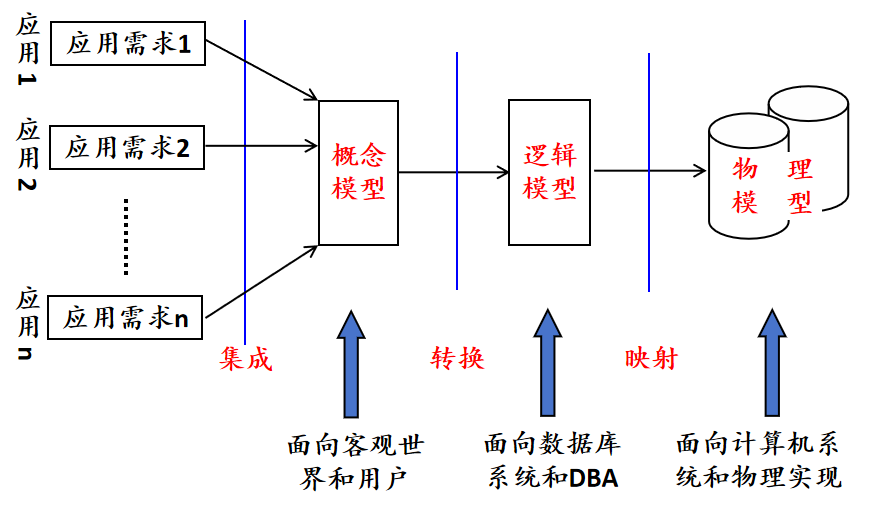
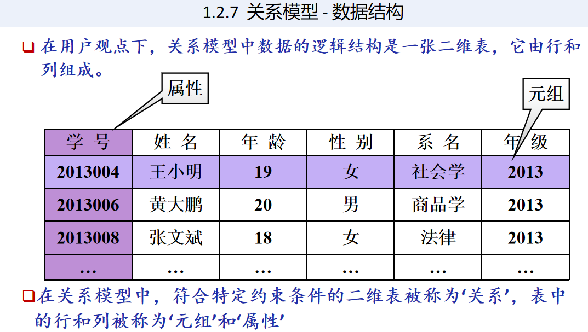
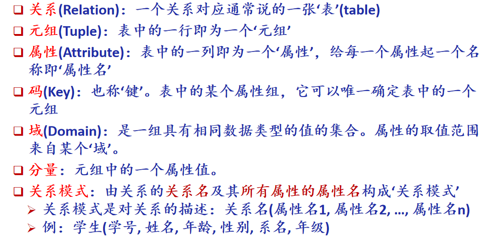
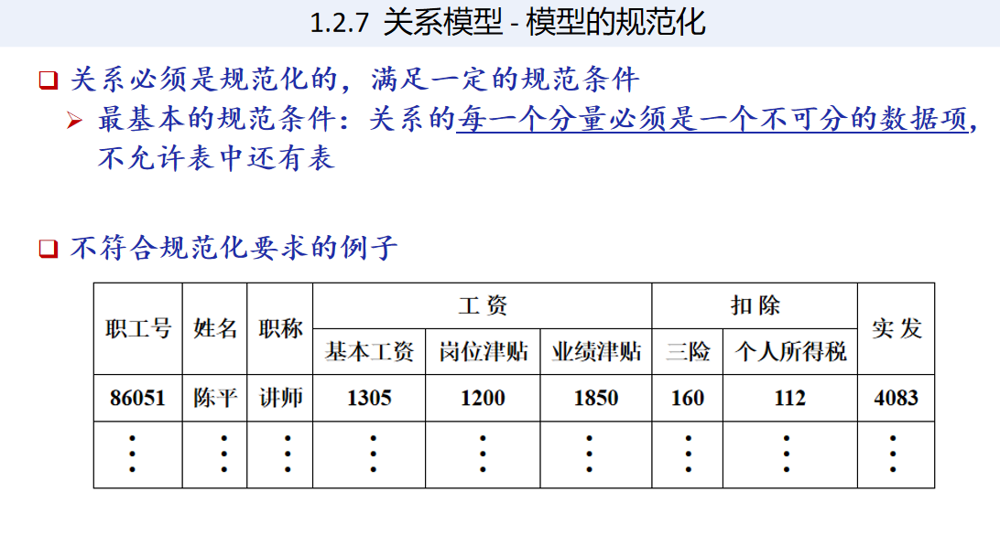
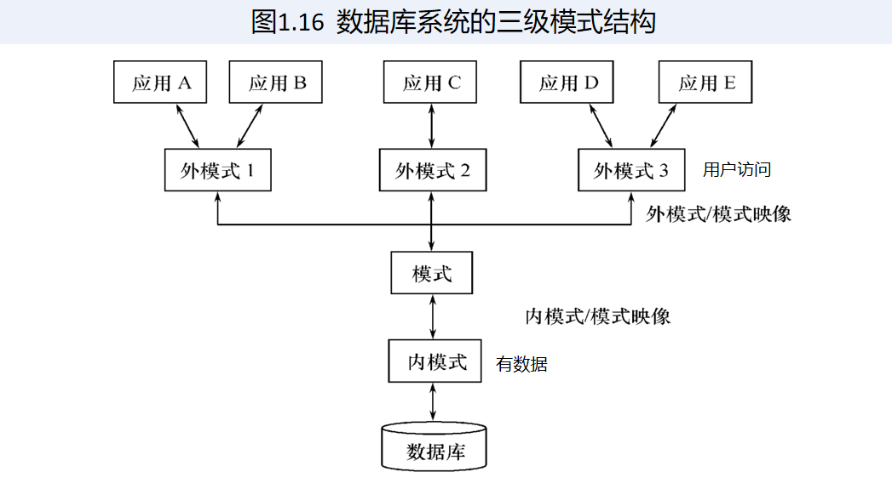

成绩组成 4:6
- [C1 绪论](#绪论)
  - 
- [C2 数据模型概述](#c2-数据模型概述)

## C1 绪论
### 数据库的基本概念
1. 数据库系统概述
   1. 数据库的四个基本概念
      1. <u>**_数据_**</u> 是指具有一定的语义(semantic)含义，并且可以被记录下来的已知信息。
      2. <u>**_数据库_**</u> 中的数据的特点：结构化、集成化、集中管理
      3. <u>**_数据库管理系统 DBMS_**</u> 
         统一的关系数据子语言：**SQL** (Structured Query Language)
      4. <u>**_数据库系统/数据库应用系统 DBS_**</u>
   2. 数据管理技术的产生和发展
   3. 数据库系统的<u>**_特点_**</u>
      1. **数据结构化**
      2. **数据共享性高，冗余度低、易扩充**
      3. **数据独立性高**
      4. **数据由数据库管理系统 统一管理和控制**

2. <u>**_数据模型_**</u>
    1. 两大类、共三种数据模型：
        1. **概念数据模型**
        2. **逻辑数据模型**
        3. **物理数据模型**
   2. 数据模型的<u>**_组成要素_**</u>
      1. **数据结构**
      2. **数据操作**
      3. **数据约束**
   3. 关系模型
       1. 基本概念
         
         
      2. 规范化
        

3. 数据库系统的结构
   1. 从数据库应用开发人员角度看
        数据库通常采用 <u>**三级模式结构**</u>
        
   2. 从数据库最终用户角度看
      单用户结构、
      主从式结构、
      分布式结构、
      客户-服务器、
      浏览器-应用服务器／数据库服务器多层结构等
   3. 模式 & 实例
      1. 模式
         eg：学生记录的‘型’：（学号，姓名，性别，系别，年龄，籍贯）
          一个学生记录的‘值’：
         (201315130, 李明, 男, 计算机系, 19, 江苏省南京市)
          1. 模式：描述的是数据的全局逻辑结构
           2. 外模式(子模式/用户模式)：描述的是数据的局部逻辑结构
         3. 内模式：
        - 三级模式是对数据的三个抽象级别
        - 二级映象在数据库管理系统内部实现这三个抽象层次的联系和转换
          - 外模式／模式映像
          - 模式／内模式映像
      2. 

4. 数据库系统的组成
5. 小结

### 数据模型的组成要素 & 常用数据模型

### 数据库的三级模式 & 数据库系统的主要组成部分

---
## C2 数据模型概述