成绩组成 4:6

- [C1 绪论](#c1-绪论)
    - [数据库的基本概念](#数据库的基本概念)
    - [数据模型的组成要素 \& 常用数据模型](#数据模型的组成要素--常用数据模型)
    - [数据库的三级模式 \& 数据库系统的主要组成部分](#数据库的三级模式--数据库系统的主要组成部分)
- [C2 关系数据库](#c2-关系数据库)
    - [关系数据结构](#关系数据结构)
    - [关系的完整性](#关系的完整性)
    - [关系代数](#关系代数)
    - [关系代数的基本运算](#关系代数的基本运算)
    - [关系代数的补充运算](#关系代数的补充运算)
- [C3 SQL](#c3-sql)
  - [SQL数据定义](#sql数据定义)
    - [定义/删除模式（CREATE/DROP SCHEMA）](#定义删除模式createdrop-schema)
    - [基本表 TABELE](#基本表-tabele)
    - [索引 INDEX](#索引-index)
    - [关系代数 vs SQL语言](#关系代数-vs-sql语言)
  - [SQL数据查询](#sql数据查询)
    - [单表查询](#单表查询)
    - [连接查询（多表）](#连接查询多表)
    - [嵌套查询（子查询）](#嵌套查询子查询)
    - [聚集函数/统计函数](#聚集函数统计函数)
    - [对查询结果的处理](#对查询结果的处理)
    - [集合操作](#集合操作)
    - [基于派生表的查询](#基于派生表的查询)
  - [数据更新](#数据更新)
  - [事务](#事务)
  - [SQL中的空值](#sql中的空值)
  - [视图](#视图)
- [C4 数据库的安全性](#c4-数据库的安全性)
  - [数据安全性概述](#数据安全性概述)
  - [数据库安全性控制](#数据库安全性控制)
    - [用户身份鉴别](#用户身份鉴别)
    - [存取控制](#存取控制)
    - [自主存取控制 DAC](#自主存取控制-dac)
    - [授权：授予GRANT 与 收回REVOKE](#授权授予grant-与-收回revoke)
    - [数据库角色 ROLE](#数据库角色-role)
    - [强制存取控制 MAC](#强制存取控制-mac)
    - [其他安全技术](#其他安全技术)
    - [GRANT语句](#grant语句)
- [C6 关系数据理论](#c6-关系数据理论)
  - [问题的提出](#问题的提出)
    - [关系模式 \& 第一范式(1NF)](#关系模式--第一范式1nf)
    - [不良关系模式的问题](#不良关系模式的问题)
    - [数据依赖基础](#数据依赖基础)
    - [范式与规范化](#范式与规范化)
  - [函数依赖 \& 码](#函数依赖--码)
    - [一、常用符号表示](#一常用符号表示)
    - [二、函数依赖 FD](#二函数依赖-fd)
      - [1. 平凡/非平凡函数依赖](#1-平凡非平凡函数依赖)
      - [2. 完全/部分函数依赖](#2-完全部分函数依赖)
      - [3. 传递函数依赖](#3-传递函数依赖)
    - [三、函数依赖的判定规则](#三函数依赖的判定规则)
    - [四、码与相关概念](#四码与相关概念)
      - [例](#例)
  - [范式 \& 规范化](#范式--规范化)
    - [一、核心概述](#一核心概述)
    - [二、1NF（第一范式）](#二1nf第一范式)
    - [三、2NF（第二范式）](#三2nf第二范式)
    - [四、3NF（第三范式）](#四3nf第三范式)
    - [五、BCNF（巴斯范式）](#五bcnf巴斯范式)
    - [4NF（第四范式）](#4nf第四范式)
  - [Armstrong公理系统](#armstrong公理系统)
  - [模式分解](#模式分解)
  - [分解后，**原来**的函数依赖能在**子关系**中**直接检查**。](#分解后原来的函数依赖能在子关系中直接检查)
    - [🌟3NF模式分解](#3nf模式分解)
    - [🌟BCNF 模式分解](#bcnf-模式分解)
  - [多值依赖](#多值依赖)
- [🌟C6例题](#c6例题)
- [C7 数据库设计](#c7-数据库设计)
  - [数据库设计的基本方法](#数据库设计的基本方法)
  - [数据库设计基本步骤（新奥尔良法）](#数据库设计基本步骤新奥尔良法)
    - [1. 需求分析](#1-需求分析)
  - [2. 概念结构设计](#2-概念结构设计)
    - [E-R模型](#e-r模型)
    - [联系](#联系)
    - [⭐怎么画E-R图？](#怎么画e-r图)
    - [EE-R模型](#ee-r模型)
    - [E-R模型设计原则](#e-r模型设计原则)
      - [i、实体 or 属性](#i实体-or-属性)
      - [ii、实体 or 联系](#ii实体-or-联系)
      - [iii、二元联系 or 多元联系](#iii二元联系-or-多元联系)
      - [iv、属性依附于实体 or 联系](#iv属性依附于实体-or-联系)
      - [E-R图集成](#e-r图集成)
  - [3. 逻辑结构设计](#3-逻辑结构设计)
  - [数据模型优化](#数据模型优化)
  - [物理结构设计](#物理结构设计)
  - [数据库实施](#数据库实施)
- [C8 数据库编程](#c8-数据库编程)
  - [嵌入式SQL](#嵌入式sql)
    - [异常处理](#异常处理)
    - [不用游标的SQL语句](#不用游标的sql语句)
    - [使用游标的SQL语句](#使用游标的sql语句)
    - [动态SQL](#动态sql)
  - [过程化SQL](#过程化sql)
    - [过程化SQL的块结构](#过程化sql的块结构)
    - [PL/SQL变量和常量的定义](#plsql变量和常量的定义)
    - [流程控制](#流程控制)
  - [存储过程和函数](#存储过程和函数)


# C1 绪论

### 数据库的基本概念
1. 数据库的四个基本概念
    1. <u>**_数据_**</u> 是指具有一定的语义(semantic)含义，并且可以被记录下来的已知信息。
    2. <u>**_数据库_**</u> 中的数据的特点：结构化、集成化、集中管理
    3. <u>**_数据库管理系统 DBMS_**</u>
       <br>统一的关系数据子语言：**SQL** (Structured Query Language)
    4. <u>**_数据库系统/数据库应用系统 DBS_**</u>
2. 数据管理技术的**_产生和发展_**：人工管理阶段 → 文件系统阶段 → 数据库系统阶段
3. 数据库系统的<u>**_特点_**</u>
    1. 数据结构化
    2. 数据共享性高，冗余度低、易扩充
    3. 数据独立性高
    4. 数据由数据库管理系统 统一管理和控制
---
### 数据模型的组成要素 & 常用数据模型
1. #### 数据模型
    <div style="display: flex; width:80%; gap: 1px;">
    <div style="flex: 1; text-align: center;">
    
    </div>
    </div>

    - 两大类、共三种数据模型：**概念**数据模型、 **逻辑**数据模型、**物理**数据模型
    - 数据模型的组成要素：数据结构、数据操作、数据约束
    - #### 关系模型
        i. 基本概念
        <div style="display: flex; width: 100%; gap: 10px;">
        <div style="flex: 1; text-align: center;">
        
        </div>
        <div style="flex: 1; text-align: center;">
        
        </div>
        </div>
        ii. 规范化
        
        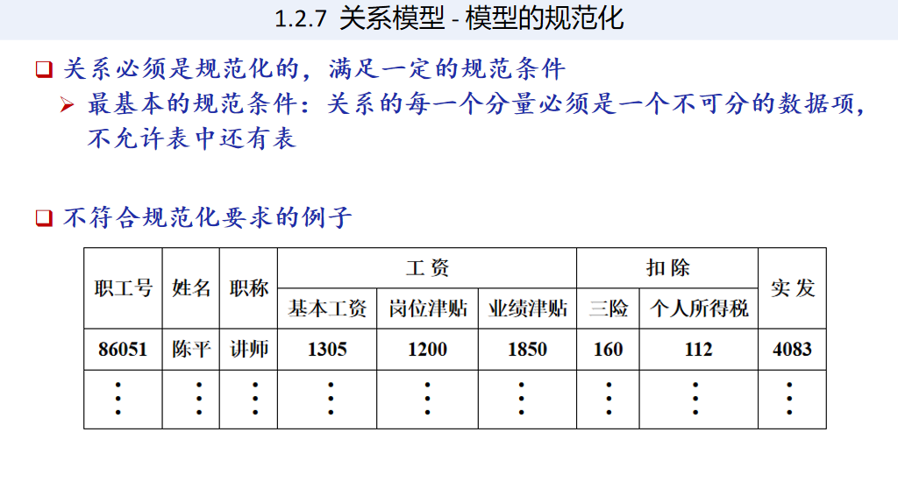
2.  #### 概念模型
    <span id="概念模型"></span>
       - 实体之间的联系/实体内部的联系
            <div style="display: flex; width: 100%; gap: 10px;">
            <div style="flex: 1; text-align: center;">
            
            </div>
            <div style="flex: 1; text-align: center;">
            
            </div>
            </div>
      - 实体-联系方法 E-R模型
          <div style="display: flex; width: 100%; gap: -10px;">
          <div style="flex: 1; text-align: center;">
          
          </div>
          <div style="flex: 1; text-align: center;">
          
          </div>
          <div style="flex: 1; text-align: center;">
          
          </div>
          </div>
          <div style="display: flex; width: 100%; gap: -10px;">
          <div style="flex: 1; text-align: center;">
          
          </div>
          <div style="flex: 1; text-align: center;">
          
          </div>
          <div style="flex: 1; text-align: center;">
          
          </div>
          </div>
---
### 数据库的三级模式 & 数据库系统的主要组成部分
1. 从数据库应用开发人员角度看
   数据库通常采用 <u>**三级模式结构**</u>
   
2. 从数据库最终用户角度看：单用户结构、主从式结构、分布式结构、客户-服务器、浏览器-应用服务器／数据库服务器多层结构等
3. 模式
    - **模式 Schema**
       <br>是“型”的描述。eg：学生记录的‘型’：（学号，姓名，性别，系别，年龄，籍贯）
       <br>一个学生记录的‘值’：(201315130, 李明, 男, 计算机系, 19, 江苏省南京市)
        1. **模式**：描述的是数据的全局逻辑结构和特征，一个数据库只有一个模式。
            <br>数据的逻辑结构、数据之间额联系、数据有关的安全性、完整性要求。
        2. **外模式**(子模式/用户模式)：描述的是数据的局部逻辑结构
        3. **内模式**(存储模式、物理模式)：数据物理结构和存储方式的描述，一个数据库只有一个内模式。
4. 实例
   <br>是模式的一个具体值，随数据库中的数据更新而变动。

---

# C2 关系数据库

### 关系数据结构

1. 关系
    1. 关系模型只有单一的数据结构：关系；<br>关系模型的逻辑结构：二维表
    2. **关系**：在域 $D_1, D_2, \dots, D_n$ 上的关系 $R$ 也是一个 $n$ 元有序组的集合，
       并且是其笛卡尔积的一个 **子集**：$R \subseteq D_1 \times D_2 \times \dots \times D_n$
        - **属性**：二维表中的 **每一列**，被称为是该关系中的一个‘属性’
        - **元组 tuple**：二维表中的 **每一行**，$(d_1,d_2,…,d_n)$，$t[A_i]$表示元组t在属性 $A_i$上的取值；$t[i]$
          表示元组t在第i列上的取值。如：(李敏君，软件工程专业，19)
        - **分量**：元组中的每一个值$d_i$叫做一个分量.如：李敏君、软件工程专业、19
         <br>元组连接：$t_r t_s$上弧线，表示把两个表连接起来。
        - **基数**：一个域允许的不同取值个数
        - 关系的表示：在域 $D_1,D_2,…,D_n$ 上的关系R可以被表示为 $R(A_1,A_2,…,A_n)$
          <br>其中 $A_i$ 是属性名&emsp;eg:“专业”
    3. **域**
        <br>相同数据类型的值的集合，域内元素互不相同。如：整数集合、{男，女}、char (25) 字符串集合
    4. **（候选）码 Key**
       <br>若关系中的某一 **属性组** 的值能唯一地标识一个元组，而其所有的真子集都不能，则称该 **属性组** 为关系的 ‘候选码’
       ，简称 ‘码’
    5. **主码**：  
    6. **全码 All-key**：关系中的所有属性构成的属性组是这个关系的候选码，称为 ‘全码’（All-key）
    7. **主属性** 与 **非主属性/非码属性**
        - <u>候选码</u>中的诸属性称为该关系的 ‘主属性’（Prime attribute）
        - 不包含在任何侯选码中的属性称为该关系的 ‘非主属性’/‘非码属性’
### 关系的完整性
1. **实体完整性**
   <br><u>主键唯一、且不能为空(NULL)</u>
2. 参照完整性
    1. <u>外码值要么为空，要么等于被参照关系的主码值</u>
    2. **外码**：专业号是学生的一个属性，但不是学生关系的码，且与专业的主码相对应(同一个东西但出现在不同的地方，域相同)
        <br>参照关系：R（拿着外码的表，比如学生表）
        <br>被参照关系：S（被引用主键的表，比如专业表）
        <div style="display: flex; width: 100%; gap: 10px;">
        <div style="flex: 1; text-align: center;">
        
        </div>
        <div style="flex: 1; text-align: center;">
        
        </div>
        <div style="flex: 1; text-align: center;">
        
        </div>
        </div>
3. 用户定义的完整性
---
### 关系代数

1. 关系运算
   
2. **象集**
   <br>该属性值对应的其他属性值集合
    <div style="display: flex; width: 100%; gap: 10px; margin: 5px 0;">
    <div style="flex: 1; text-align: center;">
        
    </div>
    <div style="flex: 1; text-align: center;">
        
    </div>
    </div>
3. 相容表（关系模式）
   <br>是否是相同的关系模式 = 是否是相容表
   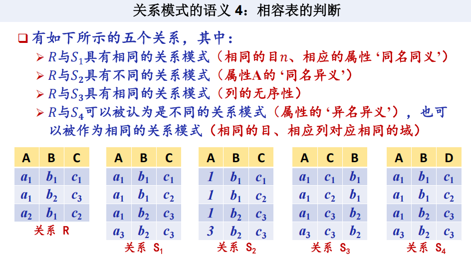

### 关系代数的基本运算


1. 并$\cup$、差-、笛卡尔积$\times$
<div style="display: flex; width: 100%; gap: 10px;">
    <div style="flex: 1; text-align: center;">
    
    </div>
    <div style="flex: 1; text-align: center;">
    
    </div>
</div>  

2. 选择 $\sigma_{Sub}=_{限定条件}(Obj)$ &emsp;/ &emsp; Student  where  SC = 'ISE'
   <br>题干：
    <div style="display: flex; width: 100%; gap: 10px;">
      <div style="flex: 1; text-align: center;">
        
      </div>
      <div style="flex: 1; text-align: center;">
        
      </div>   
      <div style="flex: 1; text-align: center;">
        
      </div>
    </div>
    <div style="display: flex; width: 100%; gap: 10px;">
    <div style="flex: 1; text-align: center;">
        
    </div>
    <div style="flex: 1; text-align: center;">
        
    </div>
    </div>


3. 投影 $\pi_{property1,property2}(Domain)$ &emsp;/ &emsp;$Domain[property]$
    <div style="display: flex; width: 100%; gap: 10px;">
      <div style="flex: 1; text-align: center;">
        
      </div>
      <div style="flex: 1; text-align: center;">
        
      </div>
      <div style="flex: 1; text-align: center;">
        
      </div>
    </div>

---

### 关系代数的补充运算

1. $\theta-$连接&emsp;$R \underset{C < E}{\bowtie} S$
    <br>等值连接&emsp;$R \underset{C.B = E.B}{\bowtie} S$ 
    <br>自然连接&emsp;$R \bowtie S$：把相同属性全都尽可能拼接到一起
    <br>(左/右)外连接：加上悬浮元组
<div style="display: flex; width:100%; gap: 10px;">
    <div style="flex: 1; text-align: center;">
        
    </div>
    <div style="flex: 1; text-align: center;">
        
    </div>
    <div style="flex: 1; text-align: center;">
        
    </div>
</div>
<div style="display: flex; width:100%; gap: 10px;">
    <div style="flex: 1; text-align: center;">
        
    </div>
    <div style="flex: 1; text-align: center;">
        
    </div>
</div>

   - 例
        <div style="display: flex; width:100%; gap: 10px;">
            <div style="flex: 1; text-align: center;">
                
            </div>
            <div style="flex: 1; text-align: center;">
                
            </div>
            <div style="flex: 1; text-align: center;">
                
            </div>
        </div>


2. 除运算 R ÷ S
<span id="除运算"></span>
    <br>找出R、S中相同的属性列(B、C)，R 剩下的属性列(A) 作为结果。
    <br>$a_i$的所有($b_j$,$c_j$)，S中全都包含的$a_i$作为结果。    
    <div style="display: flex; width:100%; gap: 10px;">
        <div style="flex: 1; text-align: center;">
            
        </div>
        <div style="flex: 1; text-align: center;">
            
        </div>
    </div>
    
   - 例
    <div style="display: flex; width:100%; gap: 10px;">
    <div style="flex: 1; text-align: center;">
    
    </div>
    <div style="flex: 1; text-align: center;">
    
    </div>
    </div>

- 综合例题
<span id="综合例题"></span>
    <div style="display: flex; width:100%; gap: 10px;">
        <div style="flex: 1; text-align: center;">
            
        </div>
        <div style="flex: 1; text-align: center;">
            
        </div>
        <div style="flex: 1; text-align: center;">
            
        </div>
    </div>

- 在当前的所有顾客中, 查询折扣(discnt)最高的顾客的编号？
  <br>令 $S := C$, “折扣不是最高的顾客的id”  
$R_2 := \pi_{C.cid}(\sigma_{C.discnt < S.discnt}(C \times S))$
  <br>答案是 $\pi_{cid}(C) - \pi_{C.cid}(\sigma_{C.discnt < S.discnt}(C \times S))$
<div style="display: flex; width:100%; gap: 10px;">
    <div style="flex: 1; text-align: center;">
        
    </div>
    <div style="flex: 1; text-align: center;">
        
    </div>
</div>
    
<div style="display: flex; width:100%; gap: 10px;">
    <div style="flex: 1; text-align: center;">
        
    </div>
    <div style="flex: 1; text-align: center;">
        
    </div>
</div>

---

# C3 SQL
1. SQL（Structured Query Language）结构化查询语言，是关系数据库的标准语言
2. SQL与关系数据库的三级模式
3. 核心功能：
   - 数据定义：CREATE，DROP，ALTER
    - 数据查询：SELECT
    - 数据操作：INSERT，UPDATE，DELETE
    - 数据控制：GRANT，REVOKE
---

## SQL数据定义
   
| 操作对象 | 创建 | 删除 | 修改 |
| :---: | :---: | :---: | :---: |
| 模式 **SCHEMA** | CREATE SCHEMA | DROP SCHEMA | - |
| 表 **TABLE** | **CREATE** TABLE | **DROP** TABLE | **ALTER** TABLE |
| 视图 **VIEW** | CREATE VIEW | DROP VIEW | - |
| 索引 **INDEX** | CREATE INDEX | DROP INDEX | **ALTER** INDEX |
   
### 定义/删除模式（CREATE/DROP SCHEMA）
   
 1.  例：为用户WANG 定义一个学生-课程模式S-T
     ```sql
     CREATE SCHEMA “S_T” AUTHORIZATION WANG;
     CREATE SCHEMA AUTHORIZATION WANG;  -- 该语句没有指定<模式名>，<模式名>隐含为<用户名> WANG
     ```

2.  模式中定义其他
<br>为用户ZHANG创建了一个模式TEST，并且在其中定义一个表TAB1
```sql
CREATE SCHEMA TEST AUTHORIZATION ZHANG
    CREATE TABLE TAB1 ( 
        COL1 SMALLINT,
        COL2 INT,
        COL3 CHAR(20),
        COL4 NUMERIC(10,3),
        COL5 DECIMAL(5,2) );
```

3. 删除模式
    ```sql
    DROP SCHEMA <模式名> <CASCADE|RESTRICT> 
    ```
    - CASCADE（级联）：删除模式的同时，把里面所有表/数据/对象全部删除；
    - RESTRICT（限制）：模式里有任何东西(表/视图/数据)，就禁止删除
    <br>eg:DROP SCHEMA ZHANG CASCADE;
    删除模式ZHANG，同时该模式中定义的表TAB1也被删除


### 基本表 TABELE

1. 定义基本表 -三大核心完整性约束：
   - **PRIMARY KEY 主键**，唯一标识一行数据，不能重复、不能为空
   - **UNIQUE 唯一**，不能重复，但能为空
    ```sql
    CREATE TABLE Student
        (Sno CHAR(9) PRIMARY KEY,  /* 列级完整性约束条件, Sno是**主码**/
        Sname CHAR(20) UNIQUE,  /* **约束**，Sname的取值具有唯一性*/
        Ssex CHAR(2) NOT NULL CHECK (Ssex IN ('男', '女')),/*  非空且只能是男/女 */
        Sage SMALLINT,
        Sdept CHAR(20)
        );
    ```
    ```sql
    CREATE TABLE enrollment(
        sno char(9) NOT NULL,
        clsno char(8) NOT NULL,
        grade INT CHECK (grade BETWEEN 0 AND 100),
        PRIMARY KEY(sno,clsno), -- 课程班代码和学号联合构成PRIMARY KEY
        );
    ```
2. ### 外键
    - 两张表关联起来，SC表里的Cno必须来自Student里的Cno 
        ```sql
       CREATE TABLE courseclass(
        clsno char(8) PRIMARY KEY,
        cno char(8) NOT NULL,
        tno char(9) ,
        -- 先定义再外键 + 违约规则
        FOREIGN KEY (cno) REFERENCES coures(cno) ON UPDATE CASCADE ON DELETE RESTRICT,
        FOREIGN KEY (tno) REFERENCES teachers(tno) ON UPDATE CASCADE ON DELETE SET NULL
        -- 父表更新cno，子表cno自动同步更新；父表删除cno，子表还有该课程就禁止删除
        -- 父表更新tno，子表tno自动同步更新；父表删除tno，子表对应的tno自动设为NULL
        );
        ```
    - 违约规则
    <br>什么是违约？ 父表更新主键/删除父表记录会破坏参照关系，触发违约
        |关键字|	中文	|含义|
        |---|---|---|
        |**CASCADE**|	级联|	父表改 / 删 → 子表自动跟着改 / 删|
        |**SET NULL**|	置空|	父表删 → 子表外键自动设为 **NULL**|
        |**RESTRICT**|	限制 / 拒绝|	数据库直接**禁止**父表的改/删操作|

3. 修改基本表（ALTER TABLE）
    - ADD新增列/完整性约束 
        ```sql
        ALTER TABLE Student 
        ADD COLUMN S_email VARCHAR(50) NOT NULL UNIQUE;  -- 增加邮箱列，要求非空且唯一
        ADD CONSTRAINT chk_sex CHECK (Ssex IN ('男', '女'));  -- 为 Ssex 增加 CHECK 约束（性别只能是男 / 女）
        ```
    - DROP 删除列   
        ```sql
        ALTER TABLE Student 
        DROP COLUMN S_email CASCADE; --删除“邮箱”列，默认RESTRICT
        DROP CONSTRAINT chk_sex; -- 删除性别CHECK约束
        ```
    - 修改列的定义
        ```sql
        ALTER TABLE Student 
        ALTER COLUMN Sage INT;  -- 修改数据类型：年龄从SMALLINT改为INT
        ALTER COLUMN Sname CHAR(30); -- 修改列长度（姓名从 CHAR (20) 改为 CHAR (30)）
        ALTER TABLE Course ADD UNIQUE(Cname); -- 增加课程名称必须取唯一值的约束条件
        ```
4. 删除基本表 
   ```sql
   DROP TABLE <表名>［RESTRICT| CASCADE］;
   ```
### 索引 INDEX
1. 建立索引 CREATE INDEX
```sql
CREATE UNIQUE INDEX Coucno ON Course(Cno); -- Course表按课程号
CREATE UNIQUE INDEX SCno ON SC(Sno ASC,Cno DESC); -- 升序建唯一索引，SC表按学号升序和课程号降序建唯一索引
```
1. 修改索引 ALTER INDEX
```sql
ALTER INDEX SCno RENAME TO SCSno; -- 将SC表的SCno索引名改为SCSno
```
1. 删除索引 DROP INDEX
```sql
 DROP INDEX Stusname; -- 删除Student表的Stusname索引
```
---
### 关系代数 vs SQL语言
1. $$ \pi_{A_1, A_2, ..., A_m} \left( \sigma_F ( R ) \right) $$其中 $A_i \in head(R)$ for $i = 1, 2, \dots, m$
    <br>SQL表示
    ```sql
    SELECT A_1, A_2, ..., A_m
    FROM   R
    WHERE  F
2. 笛卡尔积 $R\times S$
   <br>SQL表示
    ```sql
    SELECT R.A_1,...,R.A_n,s.b_1,...,s.b_m
    FROM   R,S
    ```
3. $\theta-$连接
    $R\underset{F}\bowtie S$
    <br>SQL表示
    ```sql
        SELECT R.A_1,...,R.A_n,s.b_1,...,s.b_m
        FROM R,S
        WHERE F
    ```
4. 自然连接
    $R\bowtie S$
    <br>SQL表示
    ```sql
        SELECT R.A_1,...,R.A_n,s.b_1,...,s.b_m
        FROM R,S
        WHERE R.B_1 = S.B_1 and R.B_2 = S.B_2 and ... and R.B_k = S.B_k
    ```
5. $\pi_{attr\_1, attr\_2, ..., attr\_x} (\sigma_F (R \times S))$
    <br>SQL表示
    ```sql
    SELECT attr_1, attr_2, ..., attr_x
    FROM   R,S
    WHERE  F
    ```

## SQL数据查询
### 单表查询
1. 基本格式：```SELECT SNO   FROM Student   WHERE Sage<18```
2. SELECT 目标子句
    - 查所有列：SELECT * FROM Student
    - 查指定列：SELECT Sno, Sname FROM Student;&emsp;查询全体学生的学号与姓名
    - 起别名：SELECT Sname,2026-Sage AS&emsp;计算(2026-Sage)结果出生年份起名为AS
    - 列去重：SELECT **DISTINCT** Sno FROM SC;&emsp;查询学号
         
    - 计算
        ```sql
        SELECT ordno, year(orddate), month(orddate), day(orddate)
        FROM orders;  -- 查询每一份订单的编号、订购的年、月、日；

        SELECT ordno, orddate, datediff(curdate(), orddate)
        FROM orders ;  -- 查询每一份订单的编号、订购日期、距离至今相隔的天数；
        ```
    - 例：查询全体学生的姓名、出生年份和所在的院系，要求用小写字母表示系名。
        ```sql
        SELECT Sname,'Year of Birth: ', 2014 - Sage, LOWER(Sdept)
        FROM Student;
        ```
<span id="FROM 范围子句"></span>

1. FROM 范围子句
    ```sql
    SELECT S.Sno, S.Sname 
    FROM Student S;  //S是Student的别名
    ```
<span id="WHERE条件子句"></span>

1. WHERE 条件子句
    - 比较
    ```sql
    SELECT Sname
    FROM Student
    WHERE Sdept = ‘CS’ ;
    WHERE Sdept <> ‘CS’;//过滤条件，相当于!=不等于
    ```
    - 确定范围
    ```sql
    SELECT Sname, Sdept, Sage
    FROM Student
    WHERE Sage (NOT) BETWEEN 20 AND 23; -- 查询年龄(不)在[20,23]的学生的姓名、系别和年龄
    ``` 
    - 确定集合
    ```sql
    SELECT Sname, Ssex
    FROM Student
    WHERE Sdept (NOT) IN ( 'CS','MA','IS' );-- 查询(不是)计算机科学系（CS）、数学系（MA）和信息系（IS）学生的姓名和性别。
    ```
    - '字符串常量'加单引号
    ```sql
    SELECT Sname,'Year of Birth: ', 2014 - Sage, LOWER(Sdept)  FROM Student;//系名小写
    ```
    - 字符匹配 **LIKE**/**=**
    ```sql
    SELECT* FROM Student WHERE Sno LIKE '24%'  -- 通配符，查询学号以24开头的学生的详细信息
    SELECT* FROM Student WHERE Sno = '24%' -- 查询学号就是'24%'学生的详细信息
    ```
    - 字符串中的通配符
    ```sql
    SELECT Sname, Sno, Ssex
    FROM Student
    WHERE Sname LIKE '刘%';  -- 查询所有姓刘学生的姓名、学号和性别

    SELECT Sname
    FROM Student
    WHERE Sname LIKE '欧阳__'; -- 查询姓"欧阳"且全名为三个汉字的学生的姓名
    
    SELECT Sname, Sno
    FROM Student
    WHERE Sname LIKE '__阳%'; -- 查询名字中第2个字为"阳"字的学生的姓名和学号

    SELECT Sname, Sno, Ssex
    FROM Student
    WHERE Sname NOT LIKE '刘%'; -- 查询所有不姓刘的学生姓名、学号和性别
    ```
    - 转义字符
    用 ESCAPE '\' 表示字符\为换码字符（转义指示符） 
    ```sql
    查询DB_Design课程的课程号和学分。
    SELECT Cno，Ccredit
    FROM Course
    WHERE Cname LIKE 'DB\_Design' ESCAPE '\' ;
    WHERE Cname = 'DB_Design';  -- 等效
    ```
    - 涉及空值的查询
    ```sql
    SELECT Sno，Cno
    FROM SC
    WHERE Grade IS NOT NULL; -- 查所有有成绩的学生学号和课程号
    ``` 
    - 多重条件查询（**AND**/**OR**）

---
### 连接查询（多表）
1. **等值连接/自然连接查询**=
    <div style="display: flex; gap: 8px; align-items: center; margin: 4px 0;">
    
    </div>
2. **自身连接**&emsp;起别名 =
   <br>查询每一门课的间接先修课（即先修课的先修课）
    ```sql
    SELECT FIRST.Cno, SECOND.Cpno
    FROM Course FIRST, Course SECOND -- 需要给表起别名
    WHERE FIRST.Cpno = SECOND.Cno;
    ```
    <div style="display: flex; width: 100%; margin-left: 0;">
      <div style="flex: 1; text-align: center;">
        
      </div>
    </div>
3. **外连接**
    ```sql
    SELECT Student.Sno,Sname,Ssex,Sage,Sdept,Cno,Grade
    FROM Student LEFT OUTER JOIN SC ON (Student.Sno=SC.Sno); -- 左外连接：左边为标准，右边不存在的填NULL
    FROM Student RIGHT OUTER JOIN SC ON (Student.Sno=SC.Sno); -- 右外连接：右边为标准，右边不存在的填NULL
    FROM Student FULL OUTER JOIN SC ON S.Sno = SC.Sno; -- 全外连接，全部补NULL
    ```
### 嵌套查询（子查询）
1. IN
   <div style="display: flex; width: 100%; margin-left: 0;">
      <div style="flex: 1; text-align: center;">
        
      </div>
      <div style="flex: 1; text-align: center;">
        
      </div>
      <div style="flex: 1; text-align: center;">
        
      </div>
    </div>
2. 带有比较运算符的子查询
    ```sql
    SELECT Sno,Sname,Sdept
    FROM Student
    WHERE Sdept = (SELECT Sdept FROM Student WHERE Sname = '刘晨');
    -- 在[例3.55]中，由于一个学生只可能在一个系学习，则可以用 = 代替IN 
    SELECT Sno, Cno
    FROM SC x
    WHERE Grade >= ( SELECT AVG(Grade)
    FROM SC y
    WHERE y.Sno = x.Sno ); -- 找出每个学生超过他选修课程平均成绩的课程号。
    ```
3. 限定比较谓词(SOME/ANY/ALL)
    ```sql
    -- 查询非计算机科学系中比计算机科学系任意一个学生年龄小的学生姓名和年龄
    SELECT Sname,Sage
    FROM Student
    WHERE Sage < ANY (
            SELECT Sage
            FROM Student
            WHERE Sdept = 'CS')
        AND Sdept <> 'CS' ;
    -- 聚集函数
    SELECT Sname,Sage
    FROM Student
    WHERE Sage < (
            SELECT MAX（Sage）
            FROM Student
            WHERE Sdept= 'CS ' )
        AND Sdept <> 'CS';
    ```
    < ANY → 小于最大值；
    ```sql
    SELECT * FROM SC
    WHERE Grade < ANY (80,90,70); -- 任意一个，小于最大值。成绩 < 90

    SELECT * FROM SC
    WHERE Grade < ALL (80,90,70); -- 所有，小于最小值。成绩 ＜ 70
    ```
4. EXISTS谓词
   子查询有结果，返回TRUE；子查询无结果，返回FALSE
    ```sql
    SELECT Sname
    FROM Student S
    WHERE EXISTS (
        SELECT *
        FROM SC
        WHERE SC.Sno = S.Sno
        AND Cno = '1' -- 从 Student 表里，找出那些‘存在’选修 1 号课程记录的学生
    ); -- 查询选修了 1 号课程的学生

    SELECT Sname
    FROM Student S
    WHERE NOT EXISTS (
        SELECT *
        FROM SC
        WHERE SC.Sno = S.Sno
        AND Cno = '1'
    ); -- 查询没选1号课程的学生
    ```
    - 查询选修全部课程的学生
        ```sql
        SELECT Sname
        FROM Student
        WHERE NOT EXISTS ( -- ③ 除去没有选择课程的学生
            SELECT *
            FROM Course -- ② 有NOT EXISTS学生选择的课程中的：学生没有选择的课程
            WHERE NOT EXISTS (
                SELECT *
                FROM SC
                WHERE SC.Sno = Student.Sno  
                AND SC.Cno = Course.Cno -- ① 对SC中的每门课程，去Student、Course中寻找有无记录
            ) -- 学生选择的课程
        );
        ✅ 理解：不存在一门课是这个学生没选的
        ```
    - 例
    <div style="display: flex; width: 100%; margin-left: 0;">
      <div style="flex: 1; text-align: center;">
        
      </div>
      <div style="flex: 1; text-align: center;">
        
      </div>
    </div>
    <div style="display: flex; width: 100%; margin-left: 0;">
      <div style="flex: 1; text-align: center;">
        
      </div>
      <div style="flex: 1; text-align: center;">
        
      </div>
    </div>
### 聚集函数/统计函数
1. **COUNT** 统计元组个数
2. **SUM** 计算一列的总和/**AVG** 计算一列的平均值
3. **MIN** 一列值中的最大值/**MIN** 一列值中的最小值
<div style="display: flex; gap: 8px; align-items: center; margin: 4px 0;">
  
  
</div>

---
### 对查询结果的处理
1. 对查询结果**排序** **ORDER BY 属性名 ASC升序/DESC降序**
    查询选修了3号课程的学生的学号及其成绩，查询结果按分数降序排列。
    ```sql
    SELECT Sno, Grade
    FROM SC
    WHERE Cno= '3'
    ORDER BY Grade DESC;
    ```
2. 对查询结果**分组** **GROUP BY**/**HAVING**
   求各个课程号及相应的选课人数。
    ```sql
    SELECT Cno，COUNT(Sno)
    FROM SC
    GROUP BY Cno; // 按照Cno为一行,相同Cno为一行
    ```
    查询选修了3门以上课程的学生学号。
    ```sql
    SELECT Sno
    FROM SC
    GROUP BY Sno
    HAVING COUNT(*) >3;
    ```
   - 辨析 HAVING 与 WHERE
        
3. 指定结果列的列标题
    ```sql
    SELECT Sname NAME,'Year of Birth:' BIRTH,2014-Sage BIRTHDAY,
    -- Sname一列的结果列标题为NAME，'Year of Birth:'常量列的列标题为BIRTH…
    FROM Student;
    ```
4. 查询结果
   <br>WHERE → GROUP → **SELECT** → ORDER &emsp;&emsp;WHERE → GROUP → HAVING → **SELECT** → ORDER
   <div style="display: flex; width: 100%; margin-left: 0;">
      <div style="flex: 1; text-align: center;">
        
      </div>
      <div style="flex: 1; text-align: center;">
        
      </div>
    </div>
---

    
### 集合操作
1. **并操作 UNION [ALL]**
   
2. **交操作 INTERSECT [ALL]**
3. **差操作 EXCEPT [ALL]**
   <div style="display: flex; width: 100%; margin-left: 0;">
      <div style="flex: 1; text-align: center;">
        
      </div>
      <div style="flex: 1; text-align: center;">
        
      </div>
    </div>
### 基于派生表的查询


---
## 数据更新
1. ### 插入
    1. 格式
        ```sql
        INSERT
        INTO <表名> (属性名1，属性名2,…)
        VALUES (expr1|NULL , expr2|NULL ,…)
        ```
        
    2. 插入子查询结果
        ```sql
        INSERT
        INTO <表名>(属性1，属性2，…)
        子查询
        ```
        
2. ### 修改
   1. 格式
        ```sql
        UPDATE <表名>
        SET <属性1>=<expr1>，<属性2>=<expr2>
        WHERE <条件>
        ```
          
3. ### 删除
   1. 格式
        ```sql
        DELETE
        FROM <表名>
        [WHERE <条件>]
        ```
        


## 事务
1. 定义
   是用户定义的一个数据库操作序列，这些操作要么全做，要么全不做
2. 例
   
3. 事务的特性（ACID）
   原子性(Atomicity)、一致性(Consistency)、隔离性(Isolation)、持久性(Durability)
4. 定义事务
   - 事物的启动：**隐式**方式（由数据库管理系统来决定，何时为何用户启动一个新的事务）
   - 事物的结束：用户调用commit或rollback命令，**显式**地结束当前事务；由数据库管理系统强行结束一个用户的当前正在运行中的事务
   1. ### 事务启动方式
      - **数据定义命令 DDL**
           <br>只要你执行 CREATE、ALTER 等定义语句，系统自动把这一条语句当成一个独立事务。
           <br>执行前，如果你正在做其他操作，系统会**自动先提交之前**的事务。
       - **将系统设为自动提交方式（打开自动提交标志）**
           <br>这是最常见的默认状态。每一条 SELECT、UPDATE 等操作，做完后**系统自动帮你 COMMIT**，立即生效。
       - **数据操纵命令(DML)**
           <br>如果你没有开启自动提交，当你执行 INSERT/UPDATE/DELETE 时，系统检测到你没有事务，就**自动帮你开启**一个新事务，等着你手动提交或回滚。
   2. ### 事务结束方式
      - **事务提交：COMMIT**
           <br>事务正常结束，确认所有操作生效
      - **事务回滚：ROLLBACK**
           <br>事务异常终止，撤销所有操作。**保存点** savepoint，支持部分回滚。只撤销保存点后的操作
5. 相关的SQL语句
   - 事务结束命令
        事务提交命令：**COMMIT**/事务放弃命令：**ROLLBACK**
    - 事务设置命令
        - 设置事务的自动提交命令：SET AUTOCOMMIT ON | OFF
        - 设置事务的类型：SET TRANSACTION READONLY | READWRITE
    - 在MySQL数据库中，设置事务自动提交功能的SQL命令格式是
        - SET AUTOCOMMIT = 0; /* 关闭事务自动提交功能 */
        - SET AUTOCOMMIT = 1; /* 打开事务自动提交功能 */
    - 只读/读写型事务
        SET TRANSACTION READONLY | READWRITE ;
    - 事隔离级别——解决相互干扰
        1. READ UNCOMMITTED 读未提交
        2. READ COMMITTED 读已提交
        3. REPEATABLE READ 可重复读
        4. SERIALIZABLE 串行化
    - 基于封锁的并发控制（Locking）——具体执行策略
        1. 读锁（共享锁/S锁）
            事务 T 持有读锁时，只允许别人读，不允许写。作用：保证大家看到的是同一时刻的数据。
        2. 写锁（排他锁/X锁）
            事务 T 持有写锁时，别人既不能读，也不能写。作用：保证修改操作不被打断，原子性执行。
        3. 互斥原则
            一个数据对象上，同一时刻只能有一种锁（要么一堆读锁，要么一个写锁），不能混着来。    
## SQL中的空值
注意取值

## 视图
1. 格式
    ```sql
    CREATE VIEW <视图名> [(<列名> [,<列名>]…)]
    AS <子查询>
    [WITH CHECK OPTION];
    ```
2. 例-**行列子集视图**
   若一个视图是从单个基本表导出的，并且只是去掉了基本表的某些行和某些列，但保留了**主码**，我们称这类视图为**行列子集视图**。
      
3. WITH CHECK OPTION
   
   阻止不符合条件的数据加入/修改成不符合条件的数据…/而基本表没有限制
4. 建立视图
   
5. 删除视图 
   DROP VIEW <视图名> [CASCADE]
   
6. 查询视图
7. 更新视图
---
# C4 数据库的安全性
## 数据安全性概述
1. 数据库安全性：保护数据库防止非法使用造成的数据泄露、更改或破坏，是数据库系统核心性能指标之一
2. ### 数据库不安全因素 & 安全措施
   - 非授权用户对数据库的恶意存取和破坏：用户身份鉴别、存取控制、视图
   - 数据库中重要或敏感的数据被泄露：强制存取控制、数据加密存储、加密传输
   - 安全环境的脆弱性：建立可信计算机系统
   - 故障/误操作/并发访问
3. ### 安全标准
   - 美国国防部颁布TCSEC(DoD85) → 不同国家在其基础上建立的评估准则ITSEC/CTCPEC/FC → CC (国际通用标准)
   - TCSEC/TDI安全级别划分（从低到高）/ CC评估保证级(EAL)划分
    <div style="display: flex; width: 100%; margin-left: 0;">
    <div style="flex: 1; text-align: center;">
    
    </div>
    <div style="flex: 1; text-align: center;">
    
    </div>
    </div>
   - 中国标准：GB 17859-1999
    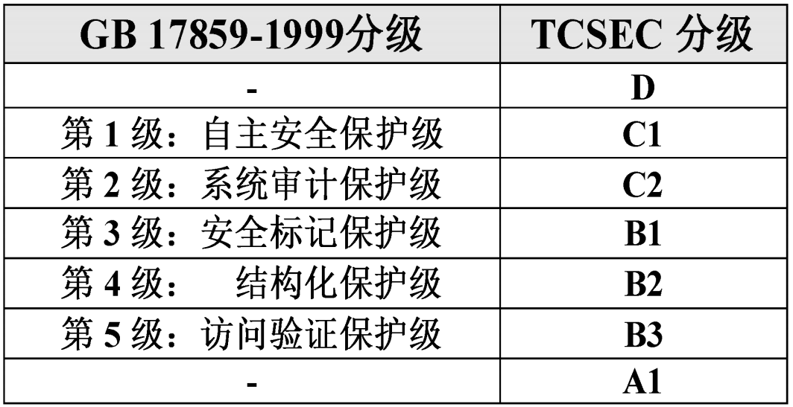
4. 计算机系统的安全模型
    <div style="display: flex; width: 100%; margin-left: 0;">
    <div style="flex: 1; text-align: center;">
    
    </div>
    </div>

5. 数据库管理系统安全性控制模型
    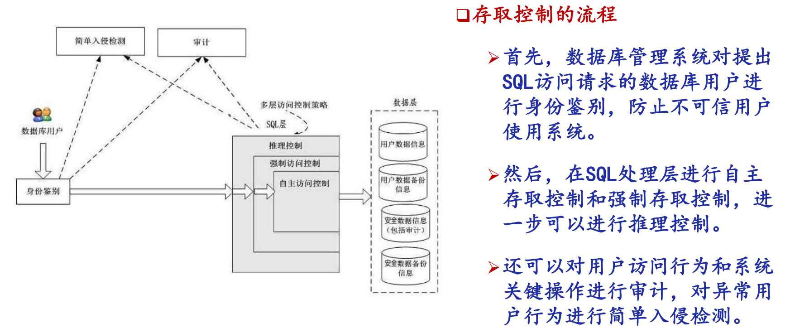
    数据库安全性控制的常用方法:用户标识和鉴定、存取控制、视图、审计、数据加密

## 数据库安全性控制
数据库安全性控制的常用方法：用户标识和鉴定、存取控制、视图、审计、数据加密
### 用户身份鉴别
   系统提供的**最外层**安全保护措施
   <br>用户标识 = 用户名 + 用户标识号（用户标识号在系统整个生命周期内唯一）
    <br>用户身份鉴别的方法：静态口令鉴别、动态口令鉴别、生物特征鉴别(掌纹/虹膜)、智能卡鉴别

### 存取控制
- 组成：定义用户权限，并将用户权限登记到数据字典中 + 合法权限检查(用户发出存取数据库的操作请求后,DBMS根据字典检查权限)
- 存取控制方法:自主存取控制、强制存取控制  

### 自主存取控制 DAC
   1. SQL支持：通过 **GRANT语句**、**REVOKE语句** 提供支持
   2. 核心目标：
   3. 用户权限的组成要素：数据库对象 + 操作类型
    
   4. 用户存取权限的方式
        <br>(i) 客体的属主(客体的创建者)自动拥有客体上的所有存取权限
        <br>(ii) 拥有权限的用户可以自主地将他拥有的权限传授给在数据库系统中注册的其他用户
    5. 访问控制检查流程
        
        第一步：是不是管理员？第二步：是不是客体的属主？第三步：有没有被授予对应的权限？(检查用户 S 是否被授予了“以方式A 访问 客体O”的权限)
### 授权：授予GRANT 与 收回REVOKE
<span id="GRANT"></span>
- 基础GRANT
```sql
GRANT SELECT
ON TABLE Student
TO U1 -- 把查询Student表权限授给用户U1

GRANT ALL PRIVILIGES
ON TABLE Student,Course
TO U2,U3 -- 把对Student表和Course表的全部权限授予用户U2和U3

GRANT SELECT
ON TABLE SC
TO PUBLIC; -- 把对表SC的查询权限授予所有用户

GRANT SELECT,UPDATE(Sno)
ON TABLE Student
TO U4-- 把查询Student表和修改学生学号的权限授给用户U4
```
- 再授权
```sql
GRANT INSERT ON TABLE SC TO U5 WITH GRANT OPTION -- 把对表SC的INSERT权限授予U5用户，并允许他再将此权限授予其他用户
-- 用户U5可以执行下述命令，将之前获得的表SC的INSERT权限及传播权限 授予用户U6。
GRANT INSERT ON TABLE SC TO U6 WITH GRANT OPTION;
-- 同样，U6还可以将此权限授予U7，但U7不能再传播此权限。
GRANT INSERT ON TABLE SC TO U7;
``` 
<span id="REVOKE"></span>
- REVOKE
```sql
REVOKE UPDATE(Sno) ON STUDENT FROM U4 -- 把用户U4修改学生学号的权限收回
REVOKE SELECT ON SC FROM PUBLIC -- 收回所有用户对表SC的查询权限
``` 
- 创建数据库模式的权限

| 拥有的权限 | CREATE USER | CREATE SCHEMA | CREATE TABLE | 登录数据库，执行数据查询和操纵 |
| --- | --- | --- | --- | --- |
| DBA | 可以 | 可以 | 可以 | 可以 |
| RESOURCE | 不可以 | 不可以 | 可以 | 可以 |
| CONNECT | 不可以 | 不可以 | 不可以 | 可以，但必须拥有相应权限 |

### 数据库角色 ROLE
     

 
### 强制存取控制 MAC


### 其他安全技术
视图机制、审计（Audit）、数据加密、其他安全性保护


### GRANT语句
1. 一般格式
    ```sql
    GRANT <权限> [ , <权限> ] ... 
    ON <对象类型> <对象名> [ , <对象类型> <对象名> ]…
    TO <用户> [ , <用户> ] ... 
    [ WITH GRANT OPTION ];
    ```
---
# C6 关系数据理论
- 如何评价关系模式设计的好坏？
- 如何设计性能良好的关系模式？
<br>关系数据库的规范化理论，就是为了解决上述两个问题而提出的关系数据库设计理论

## 问题的提出
- 为什么数据库表不能随便设计？为什么需要“规范化理论”？
### 关系模式 & 第一范式(1NF)
1. #### 关系模式结构
   完整五元组：R(U,D,DOM,F) 简化三元组：R<U,F>
   关系名(属性名集合，属性取值域，属性到域的映射，属性间数据依赖)
2. #### 第一范式(1NF)的 6 条核心性质
    - 列同质：每列数据来自同一域（同类型或范围）
    - 不同列可同域（“学生姓名”和“教师姓名”都可以是字符串）
    - 列无序（属性顺序不影响语义）
    - 行唯一（无重复元组/行）
    - 行无序（元组顺序不影响语义）
    - ⭐**分量必须取原子值**：数据项不可再分
    <br>第一范式（1NF）地位：关系数据库最基础范式，是所有高级范式的前提
### 不良关系模式的问题
- 单一的关系模式/三个关系模式
    <div style="display: flex; width: 100%; margin-left: 0; margin-top: -40px; margin-bottom: -30px;">
    <div style="flex: 1; text-align: center;">
    
    </div>
    <div style="flex: 1; text-align: center;">
    
    </div>
    </div>

- 带来的问题：数据冗余、更新异常、插入异常、删除异常
    <div style="display: flex; width: 100%; margin-left: 0; margin-top: -40px; margin-bottom: -10px;">
    <div style="flex: 1; text-align: center;">
    
    </div>
    <div style="flex: 1; text-align: center;">
    
    </div>
    <div style="flex: 1; text-align: center;">
    
    </div>
    <div style="flex: 1; text-align: center;">
    
    </div>
    </div>

### 数据依赖基础
1. 定义：关系内部属性与属性间的语义约束
2. 核心类型
    - **函数依赖**（FD）：一个属性值确定，另一属性值唯一确定（如Sno→Sdept）
    - **多值依赖**（MVD）：高级数据依赖，后续章节讲解
### 范式与规范化
1.  范式（NF）：是对一个关系中允许存在的**数据依赖**的要求
2.  范式等级（从低到高包含关系）：
    $$1NF \supset 2NF \supset 3NF \supset BCNF \supset 4NF \supset 5NF$$
3.  规范化：将**低范式**通过**模式分解**转为**高范式**，消除不良数据依赖
   <br>范式越高，对表中数据依赖的要求越严格。
## 函数依赖 & 码
函数依赖的定义
Ø 非平凡函数依赖，平凡函数依赖
q 定义6.2 完全函数依赖，部分函数依赖
q 定义6.3 传递函数依赖（直接函数依赖）

### 一、常用符号表示
| 符号表示 | 含义说明 |
| :---: | --- |
| $A, B, C$ | **属性名** |
| $ABC$ | 代表由 $A$、$B$、$C$ 三个属性组成的**属性**集合，即：$ABC = \{A, B, C\}$<br>有时候也用 $(\dots)$ 代替其中的 $\{\dots\}$，即表示为：$ABC = (A, B, C)$ |
| $X, Y, Z$ | 关系的**属性子集**(subset) |
| $XY$ | 表示 $X$ 和 $Y$ 的**并集**，即：$XY = X \cup Y$ |
| $R, S, T$ | **关系名**（关系模式） |
| $R(U)$ | 关系模式：关系名 $R$，关系中的属性集合 $U$ |
| $R(U, F)$ | **关系模式**：关系名 $R$，属性集合 $U$，函数依赖集 $F$ |
| $r, s, t$ | **关系实例**（一个关系中的元组集合） |
| $r_1, r_2, r_3$ | 关系中的**元组** |
| $r_1[A]$ | 元组 $r_1$ 在属性（集）$A$ 上的**取值** |
### 二、函数依赖 FD
1. 定义
    <br>**X确定唯一Y**，则称“X函数确定Y”或“Y函数依赖于X”，记作 $X \to Y$。
   - $X$：决定因素
   - $Y$：依赖因素
    <div style="display: flex; width: 100%; margin-left: 0; margin-top: -40px; margin-bottom: -10px;">
    <div style="flex: 1; text-align: center;">
    
    </div>
    </div>
#### 1. 平凡/非平凡函数依赖
- **平凡函数依赖**：$X \to Y$ 且 $Y \subseteq X$（Sno**本来就在左边**）
  例：$(Sno,Cno) \to Sno$ $(Sno, Cno) → Cno$
- **非平凡函数依赖**：$X \to Y$ 且 $Y \nsubseteq X$
  例：$(Sno,Cno) \to Grade$

#### 2. 完全/部分函数依赖
- **完全函数依赖**：要决定Y，X的所有部分都要用上，如要确定一门课的成绩，需要同时知道**学号+课程名**
  <br>例：$(Sno,Cno) \stackrel{F}{\to} Grade$
- **部分函数依赖**：要决定Y，只需要X中的一部分属性就可以，如确定专业，只需知道**Sno**就行，Cno是不必要的
  <br>例：$(Sno,Cno) \stackrel{P}{\to} Sdept$

#### 3. 传递函数依赖
- 定义：若 $X \to Y$，$Y \nrightarrow X$，$Y \to Z$（$Y \nsubseteq X$ $Z \nsubseteq Y$），则 $X \stackrel{\text{传递}}{\to} Z$
- 例：$Sno \to Sdept$，$Sdept \to Mname$ $\Rightarrow$ $Sno \stackrel{\text{传递}}{\to} Mname$

---
### 三、函数依赖的判定规则
1. #### 实例判定逻辑
对任意元组 $r_1,r_2$：
若 $r_1[X] = r_2[X]$，则必有 $r_1[Y] = r_2[Y]$ $\Rightarrow$ $X \to Y$。

2. #### 数量对应关系判断
   - **一对一(1:1)**：$X \to Y$ 且 $Y \to X$（如 身份证号 ↔ 学号）
   - **多对一(n:1)**：多端属性 $\to$ 一端属性（如 $Sno \to Sdept$）
   - **多对多(m:n)**：不存在函数依赖（如：Sno $$\nrightarrow$$ Cno）

3. #### 关键结论 & ⭐函数依赖集
   - $B \nrightarrow 所有$ $D \rightarrow 所有$（同一个值是否只能最初一个值）
   - $所有 \rightarrow B$（一定不会对应两个）

   <div style="display: flex; width: 100%; margin-left: 0; margin-top: -40px; top">
   <div style="flex: 1; text-align: center;">
       
   </div>
   <div style="flex: 1; text-align: center;">
       
   </div>
   </div>

---
### 四、码与相关概念
1. ####  超码
    若 $K \to U$（属性集合K → 关系R的全部属性U），则 $K$ 为**超码**。
    - 关系：**候选码**是**最小超码**，候选码的任意超集都是超码。
    - 例如：S(Sno, Sdept, Sage)，若：Sno → Sno, Sdept, Sage，
      <br>那么 Sno 是候选码 也是超妈，(Sno, Sdept)也是超码。

2. ####  候选码（码）
    设 $K \subseteq U$，若 $K \stackrel{F}{\to} U$（$K$ **完全函数**决定全部属性），则 $K$ 为**候选码**。
    - *K中属性唯一决定U*，最小决定。完全函数：要决定U，K的所有部分都要用上

3. ####  全码
    如果关系的**所有属性**U才是R的码，称为**全码**
    <br>例：$R(P,W,A)$（演奏者、作品、听众），全码为 $(P,W,A)$。P, W, A 都是关系R的主属性，在关系R中没有非主属性

4. #### 主码
   如果一个关系模式有多个候选码，则从中选一个作为主码。
   - 例如：Student(Sno, Sname, Ssex, Sage, Sdept)：Sno 是候选码，Sname 也是候选码。
     <br>可以选 Sno 作为主码。

5. #### 主属性与非主属性
     - **主属性**：包含在**任意候选码**中的属性。
     - **非主属性**：不包含在任何候选码中的属性。

6. #### 外码
    R中属性/属性组 $X$ 不是当前关系R的码，但**是另一关系的码**，则 $X$ 为 $R$ 的外码。
    <br>例：$SC(<u>Sno,Cno</u>,Grade)$ 中 Sno不是码，Sno是 S(<u>Sno</u>,Sdept,Sage)的码，
    <br>则 $Sno$ 是 $SC$ 的外码

#### 例
1. S(<u>Sno</u>, Sdept, Sage)中，只有一个**候选码Sno**，所以：**Sno**是关系S的**主属性**，**Sdept**和**Sage**是关系S的2个**非主属性**；
2. SC(<u>Sno, Cno</u>, Grade)中，只有一个**候选码(Sno, Cno)**，所以：**Sno**和**Cno**是关系SC的2个**主属性**，**Grade**是关系SC的**非主属性**。
3. Student(Sno, Sname, Ssex, Sage, Sdept)中。有两个**候选码**：**Sno** 和 **Sname**（不允许学生同名），所以：**Sno** 和 **Sname**是关系Student的2个**主属性**，**Ssex,** **Sage**, Sdept**是关系Student的3个**非主属性。

---

## 范式 & 规范化
### 一、核心概述
范式是关系模式的规范化标准，用于消除数据冗余与插入、更新、删除异常；
<br>规范化通过投影分解将低范式转换为高范式。
<br>层级关系(从低到高)：**1NF ⊃ 2NF ⊃ 3NF ⊃ BCNF ⊃ 4NF ⊃ 5NF**，高
| 范式   | 主要解决的问题 | 一句话理解               |
| ---- | ------- | ------------------- |
| 1NF  | 属性不可再分  | 每个格子只能放一个值          |
| 2NF  | 部分函数依赖  | 非主属性**不能**由主属性**部分函数依赖**推出，必须完全依赖    |
| 3NF  | 传递函数依赖  | 不存在**非主属性**对**候选码**的传递函数依赖       |
| BCNF | 决定因素不是码 | 所有非平凡函数依赖中的决定因素（**左边**），都必须是包含**候选码** |
| 4NF |-|每个非平凡多值依赖 X →→ Y 都满足 **X含有码**|

### 二、1NF（第一范式）
1. #### 定义
    关系模式的所有属性均为 **不可再分的原子数据项**，是关系数据库的最低要求。
2. #### 实例
    关系模式 `SLC(Sno, Sdept, Sloc, Cno, Grade)` 中，所有属性均为原子属性，满足 1NF。

### 三、2NF（第二范式）
1. **定义**
    <br>非主属性**不能**由候选码**部分函数依赖**推出，必须完全依赖。
    - 如：AF 是候选码，D 是非主属性。
        <br>若A → D，说明非主属性 D对候选码部份依赖 $\Rightarrow$ 不满足2NF
2. **实例**：SLC 关系
    <div style="display: flex; width: 100%; margin-left: 0; margin: -20px; top">
   <div style="flex: 1; text-align: center;">
       
   </div>
   </div>
3. **Solution**
    <br>分解成2个关系模式（但插入异常、删除异常任然存在）
    <div style="display: flex; width: 100%; margin-left: 0; margin-top: -20px; top">
   <div style="flex: 1; text-align: center;">
       
   </div>
   </div>

### 四、3NF（第三范式）
1. **定义**
    <br>不存在**非主属性**对**候选码**的传递函数依赖，**没有非主属性** → 3NF
    <br>不存在码X、属性Y、非主属性Z使得 $X→Y，Y→Z$ 成立 $\Rightarrow Y \nrightarrow X$
    <br>**码** ~不能~和 **非主属性** 有**传递依赖**关系

2. **实例**：SL 关系
    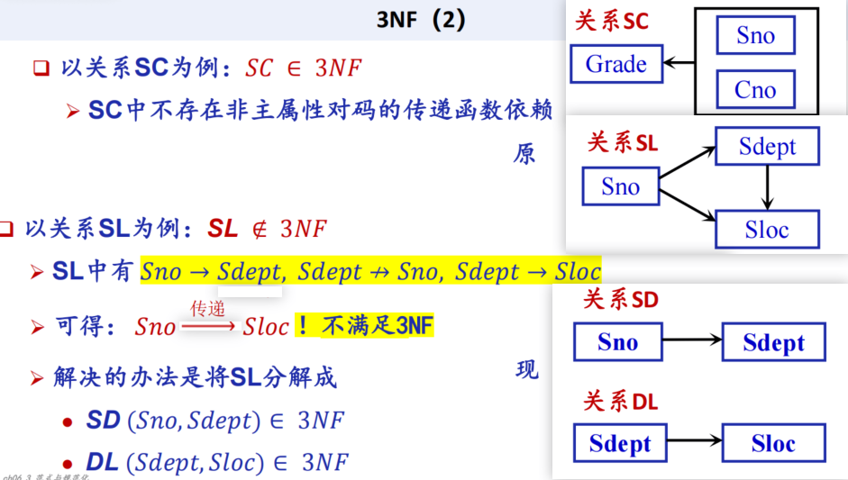

### 五、BCNF（巴斯范式）
1. **定义**
   <br>所有非平凡函数依赖中的决定因素（**左边**），都必须是包含**候选码**（都必须是**超码**）
2. **实例 1：仓库管理关系**
   <div style="display: flex; width: 100%; margin-left: 0; margin-top: -20px;">
   <div style="flex: 6; text-align: center;">
       
   </div>
   <div style="flex: 4; text-align: center;">
       
   </div>
</div>

### 4NF（第四范式）
1. **定义**
   <br>每个非平凡多值依赖 X →→ Y 都满足 **X含有码**
2. **分解**
   <br>把独立的多值事实拆开

---

## Armstrong公理系统
用于：
- 从已有函数依赖推出*新的函数依赖*
- 计算*属性集闭包*
- 计算*候选码*
- 支持*模式分解算法*
1. ### Armstrong公理系统 - 基本规则
   1. <u>**A1 自反律**</u>：知道一组属性，一定知道**部分** 
    <br>&emsp;&emsp;&emsp;{Cno, Sname} → Cno
   2. <u>**A2 增广律**</u>：若 $X \rightarrow Y$，则 $XZ \rightarrow YZ$ 
    <br>&emsp;&emsp;&emsp;Cno → Sname $\Rightarrow$ {Cno, clsno} → {Sname, clsno}
   3. <u>**A3 传递律**</u>：若 $X\rightarrow Y$ 且 $Y\rightarrow Z$，则 $X\rightarrow Z$ 
    <br>&emsp;&emsp;&emsp;Cno → Class、Class → Teacher $\Rightarrow$ Cno → Teacher

2. ### Armstrong公理系统 -扩充规则
   1. <u>**合并规则**</u>：若 X $\to$ Y 且 X $\to$ Z，则 X → YZ
   2. <u>**分解规则**</u>：若：X → YZ，则：X → Y，X → Z
   3. <u>**伪传递规则**</u>：若 X $\to $Y 且 WY $\to$ Z，则 XW $\to$ Z

   - 引理：$X \to A_1A_2\cdots A_k \Rightarrow   X \to A_i( i=1,2,\dots,k)$ 成立
   <br>学号 → (姓名, 班级, 专业)&emsp;$\Rightarrow$&emsp;学号 → 姓名，学号 → 班级，学号 → 专业

3. ### 3.1 函数依赖的逻辑蕴涵
    - F 的所有规则，必然导致 X→Y 成立（X Y是属性/属性集）。是由F带来的，没有写出但必然成立的规则。
    <br>则称：F **逻辑蕴涵** X → Y，记作 **F ⊨ X → Y** 
    - 例：F = {学号 → 系名, 系名 → 系主任 }，则：F ⊨ 学号 → 系主任

4. ### 3.2 函数依赖集的闭包 F^+
   - 定义：$F^+ = \{ X \to Y \mid F \vDash X \to Y \}$，即：所有被 F 逻辑蕴涵的**函数依赖的集合**。
   - 属性集 U={A,B,C}，函数依赖集 F={A→B, B→C} → $F^+$ ={ A→A, A→B, A→C, A→BC, A→AB, A→AC, A→ABC,
    B→B, B→C, B→BC,
    C→C,
    AB→A, AB→B, AB→C, AB→AB, AB→AC, AB→BC, AB→ABC,
    AC→A, AC→B, AC→C, AC→AB, AC→AC, AC→BC, AC→ABC,
    BC→B, BC→C, BC→BC,
    ABC→A, ABC→B, ABC→C, ABC→AB, ABC→AC, ABC→BC, ABC→ABC }
    - 直接计算 F⁺ 很麻烦。因为可能推出非常多的函数依赖。所以实际做题时，一般不直接求 F⁺，而是用 **属性集闭包** X⁺ 👇来判断某个依赖是否成立。
    ​
5. ### 3.3 属性集的闭包 $X_F^+$
    - 从 属性A 出发，用 F 中的依赖能推导出的**所有属性**的集合，$A_F^+$称为属性A关于函数依赖集F的闭包。

    - ⭐例：计算A关于F的闭包 $A_F^+$
    <br>初始：$A_F^+ = {A}$ &emsp; 用 A→B：$A_F^+ = {A,B}$ &emsp; 用 B→C：$A_F^+ = {A,B,C}$
    - 计算方法：迭代算法
        <div style="display: flex; width: 100%; margin-left: 0; margin-top: -40px;margin-bottom: -20px">
        <div style="flex: 6; text-align: center;">
        
        </div>
        </div>
6. ### 函数依赖集的覆盖与等价
   - 核心概念
       - **覆盖**：若 F 能推出 G 里的所有依赖 ($G\subseteq F^+$) ，就说 F覆盖G
       - **等价**：若 F覆盖G 且 G覆盖F（$F^+ = G^+$），就说 F和G等价（充要关系）
   - 例
     <br>设：F = { A → B, A → C }，设：G = { A → BC }
     <br>$\Rightarrow$ F 和 G 等价。
     <br>因为：由 F 可用合并规则推出 A → BC；由 G 可用分解规则推出 A → B 和 A → C
     <br>所以：F⁺ = G⁺（“分开写”和“合起来写”本质上表达的是同一件事）

7. ### 极小函数依赖集 / 最小依赖集 / 最小覆盖
    - #### 需满足 3 个条件：
        设 F 为函数依赖集，F_m 是其极小依赖集，需满足：
        1.  **右边只有一个属性**
        2.  **左边没有多余属性**
            <br>AB → C，如果：A⁺ 中已经包含 C说明只用 A 就能推出 C，B 是多余的。
            <br>于是：AB → C可以简化为：A → C
        3.  **没有冗余函数依赖**
            <br>F={A → B，B → C，A → C}，其中A → C 可由前两个推出来，所以A → C是冗余依赖，可删除
            - 例：$F' = \{ Sno \rightarrow Sdept, Sno \rightarrow Mname, Sdept \rightarrow Mname, $
                 <br> $(Sno, Cno) \rightarrow Grade, (Sno, Sdept) \rightarrow Sdept \} $ 
                 <br>不是最小覆盖，上是冗余依赖，下是左边多于属性

    - #### 计算算法
       1.  **右部拆分**：AD → EF 拆成：AD → E，AD → F；
       2.  **删左边多余属性**：对于 ADF→ C：∵AD → F ，故可简化为 AD → C；
            <br>对于 ADF → D：∵D已经包含在左边 $\rightarrow$ 可以删除该平凡函数依赖；
       3.  **删冗余依赖**：对于C → B，可以由C → F，F → B推出。 **删除** C → B；
       - 特性：每个函数依赖集都等价于一个极小依赖集，且**不唯一**。

---
## 模式分解
1. ### 模式分解的三个理解
   1. **无损连接**：自然连接后完全等于原表
   2. **保持函数依赖**：分解后所有依赖规则都能找到
   3. 既 **无损链接** 又 **保持函数依赖**
2. ### ⭐无损连接
   - 有损连接：会产生多余元组。
   - 定义：R = R1 ⋈ R2 ⋈ ... ⋈ Rn，能 **自然连接**$\bowtie$ 回来，完全等于**原表**。
   - 💫判定：两张表的<u>*公共属性*</u>，如果能推出某一张表的<u>*非公共属性*</u>，就是无损连接。
    <br>例如1：A是公共属性，能推出T1的非公共属性B。故满足无损连接性
        
        |函数依赖集|分解ρ|是否满足无损连接性？|
        |---------|----------|----------|
        |{A→B}|$T_1(A,B) T_2(A,C)$|✅|
        |{A→C，B→C}|$T_1(A,B) T_2(A,C)$|✅|
        |{A→B}|$T_1(A,B) T_2(B,C)$|❌|
        |{A→B，B→C|$T_1(A,B) T_2(B,C)$}|❌|
    
3. ### ⭐保持函数依赖
   分解后，**原来**的函数依赖能在**子关系**中**直接检查**。
---

### 🌟3NF模式分解
1. 目标：得到 满足3NF 且 既有无损连接性又保持函数依赖 的分解
2. 步骤：<u>每条依赖建一张表，最后检查有没有候选码，没有就补上</u>
   1. 求 F 的**极小函数依赖集 Fmin**
   2. 求**候选码**
   3. 谁决定谁，就把它们放在一张表里。
      <br>例如：Sno → Sdept就建：SD(Sno, Sdept)
   4. 检查是否需要补**候选码表**：如果没有任何子关系包含原关系的**候选码** K，则补一个关系 R(K)
- 💫例：到3NF的模式分解示例
    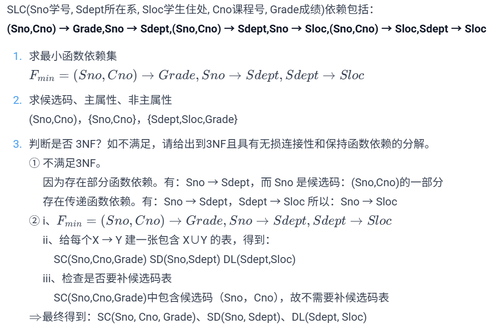


### 🌟BCNF 模式分解
1. 目标：分解到 BCNF，并且保证无损连接。
2. 步骤：
   1. 初始 ρ = {R}
   2. 检查每个关系是否满足 BCNF
   3. 如果某个关系不满足 BCNF，则存在：X → Y，且 X 不是候选码
   4. 分解为：**R₁ = XY**，**R₂ = U - Y**
   5. 继续检查，直到全部满足 BCNF
   
- 💫例：转换为BCNF的无损连接分解
    <br>STJ(S学生,T老师,J课程)，依赖包括：T → J，(S,J) → T，(S,T) → J
    <br>STJ 满足 3NF，但不满足 BCNF。

    原因：T → J 中，T 不是超码。

    所以分解为：TJ(T,J) ST(S,T)
---
## 多值依赖
1. 定义：一个属性决定的不是一个值，而是**一组值**。记作 **X →→ Y**，读作Y多值依赖于X（有其他属性Z，Y、Z都多值依赖于X的充要条件是 X、Y可以自由组合）
2. 多值依赖 vs 函数依赖
   1. 跟**Z**的关系
        <br>函数依赖：只问“X 能不能唯一确定 Y”。
        <br>多值依赖：还要问“Y 和剩下的属性是不是独立”。
   2. 跟**子集**的关系
        <br>A → BC，则：A → B A → C
        <br>多值依赖不一定成立
---
# 🌟C6例题
- ### ⭐例1：属性集闭包算法 -计算A关于F的闭包 $A_F^+$
    <br>初始：$A_F^+ = {A}$ &emsp; 用 A→B：$A_F^+ = {A,B}$ &emsp; 用 B→C：$A_F^+ = {A,B,C}$
    - 计算方法：迭代算法
        <div style="display: flex; width: 100%; margin-left: 0; margin-top: -30px;margin-bottom: -20px">
        <div style="flex: 6; text-align: center;">
        
        </div>
        </div>
- ### ⭐例：等价/最小函数依赖集 -属性集闭包算法
    <div style="display: flex; width: 100%; margin-left: 0; margin-top: -40px;margin-bottom: -20px">
    <div style="flex: 6; text-align: center;">
    
    </div>
    </div>
- ### ⭐例2：极小函数依赖集算法
    1.  **右部拆分**：AD → EF 拆成：AD → E，AD → F；
    2.  **删左边多余属性**：对于 ADF→ C：∵AD → F ，故可简化为 AD → C；
        <br>对于 ADF → D：∵D已经包含在左边 $\rightarrow$ 可以删除该平凡函数依赖；
    3.  **删冗余依赖**：对于C → B，可以由C → F，F → B推出。 **删除** C → B；
- ### ⭐（补充3）例：判断冗余依赖
    1. 函数依赖集 M = {C → E，E → B，BCD → A}，断言：BCD → A 可以简化成 CD → A（C可以推出B），它是一个冗余函数依赖
        <br>构造 N = {C → E，E → B，CD → A}，只需证明：$M^+ = N^+$（M能推出的=N能推出的）
        <br>✅只需证明：M ⊨ CD → A？ N ⊨ BCD → A？
        
        ① 证明：M ⊨ CD → A
            <br>只需证明 ${C，D}_M^+$ 中包含 A，就能证明 CD → A
            <br>初始值：{CD}_M^+ = {C，D}
            <br>第一遍：{CD}_M^+ = {C，D，E}（C → E）
            <br>第二遍：{CD}_M^+ = {B，C，D，E}（E → B）
            <br>第三遍：{CD}_M^+ = {A，B，C，D，E}（BCD → A）
        
        ② 同理得证：N ⊨ BCD → A
    2. 函数依赖集 M = {B → D，D → E，C → F，BC → A，EF → A}，断言：B→ A 是一个冗余的函数依赖
        <br>构造 N = {B → D，D → E，C → F，EF → A}，要证明 $M^+ = N^+$，<br>只需证明：N ⊨ BC → A，即：${BC}_N^+$ 包含A
    3. 函数依赖集 F = {A → B，B → A，AB → C}，判断 AB → C 是否为部分函数依赖？
        <br>只需假设把AB → C 换成 A → C/B → C是否依然成立。同上。
- ### ⭐例3：计算候选码
    要求候选码K，只需找到能推出全部属性U的 $K_R^+=U$ 即可。
    1. **没有出现在右边**的属性 → 一定在**候选码**内（因为没有属性能推出它）
    2. **只出现在右边**的属性 → 一般**不**放在候选码（因为可以由其他属性推出）
    3. 其他属性待选跟1结合
    - 先算1必须出现在候选码中的属性K，是否有 $K_R^+ = U$
    - 再依次跟3中属性结合。候选码可能不止1个。
---
# C7 数据库设计

## 数据库设计的基本方法

| 设计方法 | 对象 | 目的 |
|-------|-----------|--------------------|
| **新奥尔良法** | 整体的数据库设计流程方式 | 覆盖各阶段 |
| **基于E-R模型设计** | 概念结构设计| 用 E-R / EER 图把用户需求抽象成实体、属性、联系 |
| **3NF设计方法** | 逻辑结构设计| 将概念模型转为关系表，并保证满足3NF |
| **面向对象的数据库设计方法** | 面向对象数据库 | 把实体看作对象，属性/方法封装在对象中 |
| **统一建模语言（UML）方法** | 概念建模/逻辑设计 | 用类图、对象图、时序图等 UML 工具表示 |

## 数据库设计基本步骤（新奥尔良法）
<div style="display: flex; width: 80%; margin-left: 0; margin-top: -40px;margin-bottom: -20px">
    <div style="flex: 6; text-align: center;">
    
    </div>
    </div>

### 1. 需求分析
1. 目标：明确用户信息需求（What）与处理需求（How），为概念设计提供基础

2. #### 需求分析产出结果
   - <u>**数据字典**</u>（学号：字符型，10位，唯一标识学生）
   - <u>**用户需求规格说明书**</u>（学生可以选课、退课、查成绩；教师可以录入成绩）
   - 这两个结果是**概念结构设计**的基础输入（为下一步画 **E-R 图**提供依据）

- ### 数据字典 DD
  1. **定义**：**数据字典**是对数据库中数据的<u>描述</u>，也叫**元数据/基础数据**
     - 例：具体数据：张三，20240001，数据库原理，88
        <br>元数据：学号是 CHAR(10)，姓名是 VARCHAR(20)，成绩是 0~100 的整数

  2. #### 数据字典的内容
     - #### 数据项
        数据项是**不可再分**的数据单位，是数据的最小组成单位
       
     - #### 数据结构
        数据结构：由若干数据项/数据结构组成，反映数据之间的**组合关系**

     - #### 数据流
        数据流：数据结构在系统内部传输的**路径**(数据从哪里来，到哪里去)

     - #### 数据存储
        数据存储：数据结构**停留**或**保存**的地方，也是数据流来源和去向之一（数据存在哪里）
     
     - #### 处理过程
        - 处理过程：系统对数据进行加工处理的过程。处理过程的具体处理逻辑一般用**判定表**或**判定树**来描述。
        - #### 判定表 & 判定树
          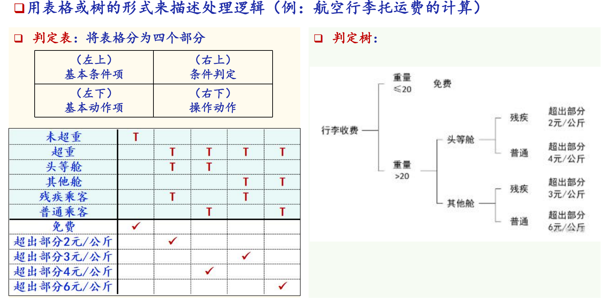
---

## 2. 概念结构设计
1. 概念结构设计：把需求抽象成概念模型
2. 描述概念模型的工具：E-R 模型 / EER 模型

3. ### 概念结构设计方法
   自顶向下、自下向上、二者混合策略、逐步扩张（学生的核心需求和概念结构 → 再扩展教师等其他需求和概念结构）
   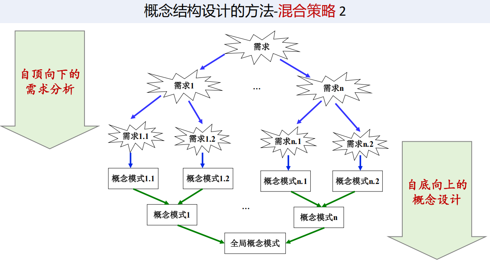

### E-R模型
- E-R 模型三要素：实体（学生，学生实体集 = 所有学生）、属性（姓名、年龄）、联系（学生“选修”课程）

### 联系
- 联系的相关概念 ```学生 —— 选修 —— 课程```
    <br>联系名：选修； 联系属性：成绩； 
    <br>联系的度：2（因为参与的是学生、课程两个实体）；函数关系：m:n，因为一个学生选多门课，一门课被多个学生选
- 联系的分类
    | 类型   | 含义         | 例子        |
    | ---- | ---------- | --------- |
    | 二元联系 | 两个实体型之间    | 学生-课程     |
    | 多元联系 | 三个或更多实体型之间 | 供应商-项目-零件 |
    | 一元联系 | 一个实体型内部    | 职工领导职工 （联系的**度**是**2**）   |


### ⭐怎么画E-R图？
- 三要素的表示
  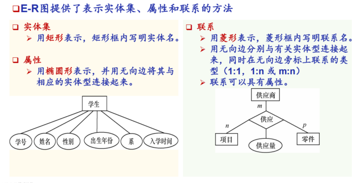
- 联系的三种分类的表示
    <div style="display: flex; width: 100%; margin-left: 0; margin-top: -20px;margin-bottom: -10px">
    <div style="flex: 6; text-align: center;">
    
    </div>
    <div style="flex: 6; text-align: center;">
    
    </div>
    <div style="flex: 6; text-align: center;">
    
    </div>
    </div>
- 例
    <div style="display: flex; width: 120%; margin-left: 0; margin-top: -20px;margin-bottom: -10px">
    <div style="flex: 6; text-align: center;">
    
    </div>
    <div style="flex: 6; text-align: center;">
    
    </div>
    <div style="flex: 6; text-align: center;">
    
    </div>
    </div>
### EE-R模型
扩展(Extended)E-R模型
1. **ISA联系**：不相交 & 完全特化
    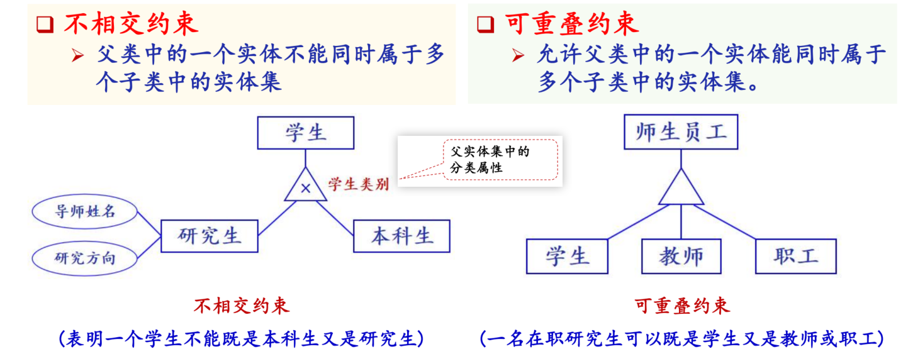
    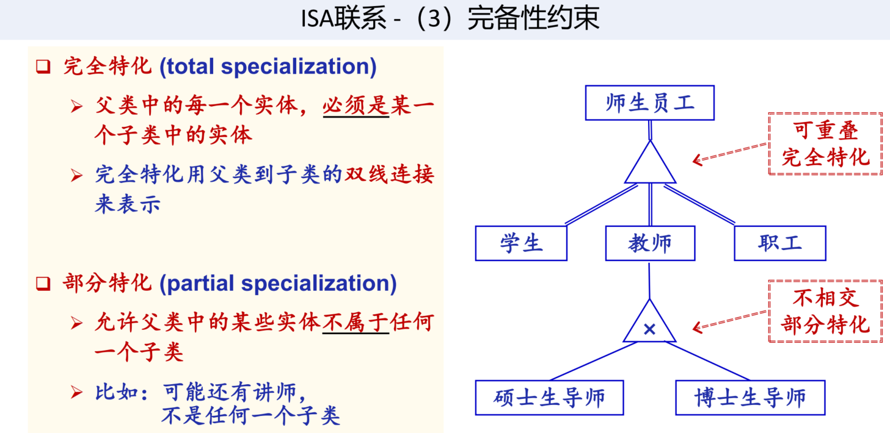
2. **Part-of联系** 双菱形
    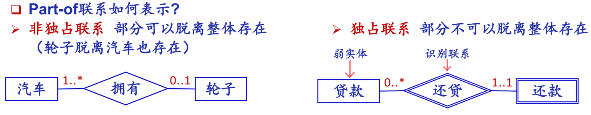

- **弱实体**：双矩形。自己的属性不一定能独立区分自己（有不同贷款但可能在同一天还款、金额也可能一样）
  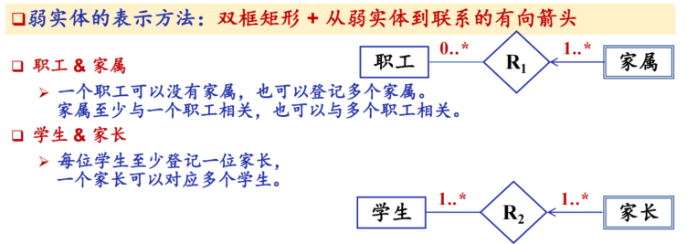
- **基数约束**表示：min（强制参与/非强制参与）..max（单值参与/多值参与）
    <br>对联系R来说，当前实体可以对应多少个另一个实体
    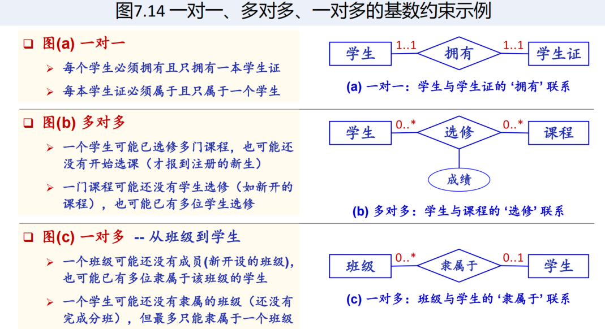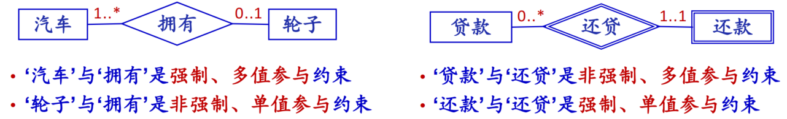
    | 标法     | 含义               |
    | ------ | ---------------- |
    | `0..1` | 可以不参与；如果参与，最多一次  |
    | `1..1` | 必须参与；且只能一次       |
    | `0..*` | 可以不参与；也可以参与很多次   |
    | `1..*` | 必须至少参与一次；可以参与很多次 |
    - 为什么引入：消除歧义
        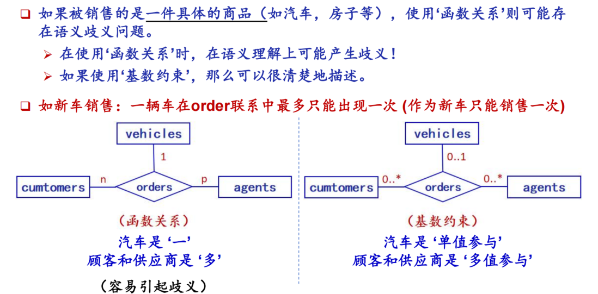
   
- **属性的划分**
    | 类型             | 含义          |  实例  |
    | -------------- | ----------- |---------------|
    | **标识符** | **唯一标识**一个实体的属性      | 学生的学号、职工的工号 |
    | **描述符** | 普通描述属性，**不能唯一识别**实体 | 姓名、性别、年龄 |
    | **单值属性**           | 一个实体在这个属性上只有一个值   | 学生的学号、学生的姓名 |
    | **组合属性**           | 本身是一个属性，但内部由多个简单属性组成   | 地址 = 省 + 市 + 区 + 街道 |
    | **多值属性**           | 一个实体在这个属性上可以有多个值  | 一个学生可以有多个兴趣爱好 |
        
    - **组合属性** / **多值属性**
        <div style="display: flex; width: 120%; margin-left: 0; margin-top: -20px;margin-bottom: -10px">
        <div style="flex: 6; text-align: center;">
        
        </div>
        <div style="flex: 6; text-align: center;">
        
        </div>
        <div style="flex: 6; text-align: center;">
        
        </div>
        </div>

---
### E-R模型设计原则
#### i、实体 or 属性
1. 原则：能作为属性处理的，尽量作为属性处理，以简化 E-R 图
2. 两条判断准则：
   - 如果某个对象本身还需要描述其他性质，应作为实体
   - 如果某个对象还要和其他实体发生联系，应作为实体

3. 例
   <div style="display: flex; width: 80%; margin-left: 0; margin-top: -40px;margin-bottom: -20px">
    <div style="flex: 6; text-align: center;">
    
    </div>
    </div>

#### ii、实体 or 联系
1. 实体：可以独立存在的持久对象
   - 例：学生、课程、商品、顾客、订单
2. 联系：因为某种事情发生而产生的信息，通常依赖多个实体
   - 例：学生选课、顾客购买商品、教师讲授课程

3. 有些事件也可以被设计成实体
   - 例：订单
     - 如果只是简单零售购买行为。   
        若购买动作有属性（购买时间、购买数量等），这些信息<u>只在购买发生时才存在</u>，不能直接放在顾客/商品上 → 属于联系属性购买[时间、数量]
        ```顾客 —— 购买（时间，数量） —— 商品```
     - 如果大量购买，订单有订单号、时间、金额、状态等属性，应把订单作为实体
        ```顾客 —— 下达 —— 订单；订单 —— 包含 —— 订单明细```

#### iii、二元联系 or 多元联系
1. 二元联系：两个实体之间的联系
   - 例：
    ```学生 —— 选修 —— 课程```
2. 多元联系：三个或更多实体之间的联系
   - 例：供应商给某项目供应某零件
    <br>联系上可以有属性：供应量、供应日期、价格 
    ```供应商 —— 供应 —— 项目 —— 零件```

#### iv、属性依附于实体 or 联系
1. 实体属性：实体本身具有的属性
   - 例：
    ```学生姓名 属于 学生；课程学分 属于 课程```

2. 联系属性：跟随联系存在而存在，消亡而消亡的属性
   - 例：
    ```学生 —— 选修(成绩, 选课时间) —— 课程```

#### E-R图集成
- 处理冲突：命名冲突、属性冲突、结构冲突
- 消除冗余：冗余数据可由基本数据推出，冗余联系可由其他联系推出（适当保留提高效率）

---
## 3. 逻辑结构设计
- 逻辑结构设计：把 E-R 图翻译成**关系表**
- ### 实体集 & 属性 → 表
  1. 规则1：**实体集**转换为**关系模式**
      - E-R图中有实体：科室、医生、病人、病例
          <br>→ 科室表、医生表、病人表、病例表
      - E-R图中有实体：医生，有属性：医生号，姓名，职称
          <br>→ **医生（<u>医生号</u>，姓名，职称）**
  2. 规则2：**组合属性拆成子属性**
     -  不写emp_address，而是子属性（staddress、city、state、zipcode 要么全为空，要么全不为空）
            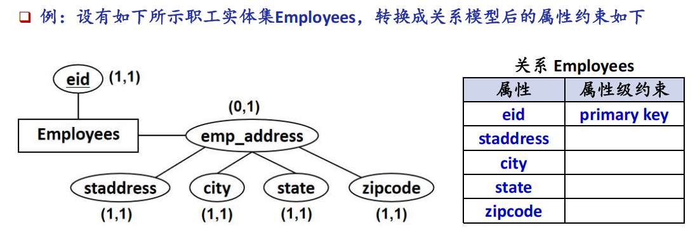
  3. 规则3：**多值属性拆成新表**
        - 对于学号S1307，姓名王承志，选修课程（Database, Operating System, Computer Network）
        - 方法一：纵向展开；方法二：分解出去，单独成表
            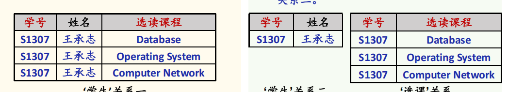

- ### 联系转换 & 全参与/非全参与
    - 补充：实体集与联系的**全参与/非全参与** 
        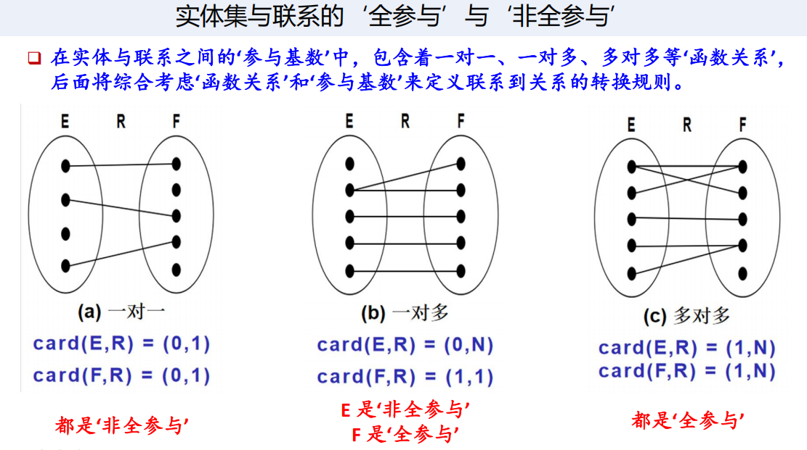
  1. **1:1联系转换**
      - 1:1 联系可以单独建表，也可以合并到任意一端（要考虑是否**全参与**）
      - 规则
        | 参与情况         | 建表方式        |  例子 |
        | ------------ | ----------- | ------ |
        | 两边非全参与（0..1/0..1）       | 联系**单独建表**      | 电单车—电池 |
        | 一边全参与(1..1)，一边非全参与(0..1) | 依赖存在方+**依赖的主码**   | 人—驾驶证  |
        | 两边全参与(1..1/1..1)        | 联系和实体**合并成一个表** | 学生—校园卡 |

       - 例：非全参与、非全参与（**分开单独建表**）
           <div style="display: flex; width: 100%; margin-left: 0; margin-top: -40px;margin-bottom: -20px">
            <div style="flex: 6; text-align: center;">
            
            </div>
            </div>
       - 例：全参与、非全参与（依赖存在的全参与端驾驶证要**加上**依赖存在的**人**的**主码**）
             <div style="display: flex; width: 100%; margin-left: 0; margin-top: -40px;margin-bottom: -20px">
            <div style="flex: 6; text-align: center;">
            
            </div>
            </div>
       - 例：全参与、全参与（**合并**）
            <div style="display: flex; width: 100%; margin-left: 0; margin-top: -40px;margin-bottom: -10px">
            <div style="flex: 6; text-align: center;">
            
            </div>
            </div>
  2. **1:n联系转换**
     - 1:n 联系通常把 **1 端的主码**加入到 n 端作为外码
     - 多端全参与：多方加上**外码**
       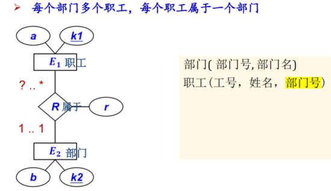
     - 多端非全参与：**3张表**
        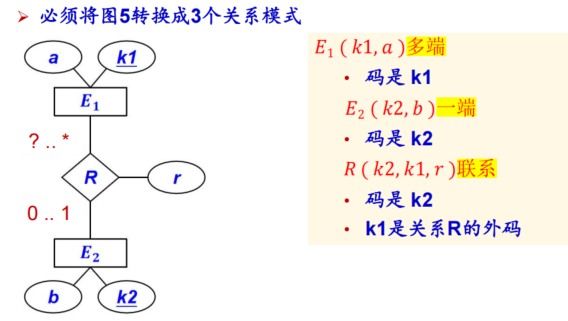
     
   3. **m:n联系转换**
     - 建**3张表**
     - 例：病人去医生那就诊（一个医生有多个病人，一个病人也有多个医生）
     ```text
     病人（病人号，姓名）
     医生（医生号，姓名）
     就诊（病人号，医生号，就诊时间，就诊记录）
     ```
  3. **多元联系转换**
     - **实体**建表之外，**多元联系**也建一个表
     - 例：供应商向项目供应零件（E-R图中E-R 图：供应商 —— 供应 —— 项目 —— 零件）
      <br>某供应商给某项目供应某零件，供应量是多少。
      ```text
      供应商(供应商号, 供应商名)
      项目(项目号, 项目名)
      零件(零件号, 零件名)

      供应(供应商号, 项目号, 零件号, 供应量)
      ```

  4. 单个实体集**内部**的联系转换
     - 例：职工之间存在领导关系
     <br>这里“领导职工号”也是职工号，表示该职工的上级（1：1）
      ```text
      职工(职工号, 姓名, 领导职工号)
      ```
     - 如果是 m:n 的内部关系，需要新建关系
     ```text
      职工(职工号, 姓名)
      合作(职工号1, 职工号2, 项目名)
      ```
      - 例：一个职工可以管理多个下级职工、一个职工只能有一个上级职工
         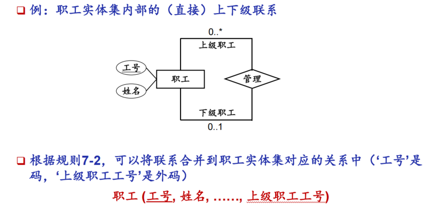

   5. **ISA**联系转换（父子类）
        - 方法一：建3个表（不相交 + 部分特化）
            <br>建```学生（），教师（），职工（），硕导（），博导（）```
            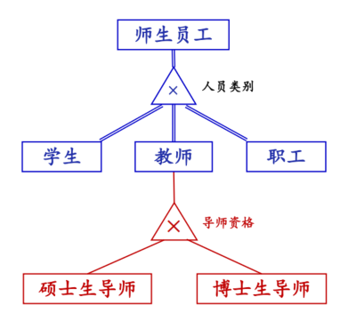
        - 方法二：只建2个子表（不相交 + 完全特化II）
        - 方法三：建1个表
- 具有相同码的关系模式合并
  1. 如果两个关系模式具有相同主码，且语义上属于同一对象，可以考虑合并
  2. 例：
    ```text
    学生基本信息(学号, 姓名, 性别)
    学生学籍信息(学号, 专业, 入学年份)
    ```
    可以合并为：```学生(学号, 姓名, 性别, 专业, 入学年份)```

## 数据模型优化
1. 数据模型优化通常用规范化理论作指导
2. 目标：
   - 减少数据冗余（拆成多个表）
   - 避免更新异常
   - 避免插入异常
   - 避免删除异常
   - 提高数据一致性
3. 分解方法：**水平分解**（分行：分成23级学生、24级学生）、**垂直分解**（分列：分成学生基本信息+联系方式）
4. 设计用户**子模式**（**视图**）
    - 视图作用：
    <br>简化用户操作；
    <br>满足不同用户需求；
    <br>隐藏敏感数据，保证安全性；
    <br>封装复杂查询。

## 物理结构设计
1. 物理结构设计：为逻辑数据结构选择最适合应用环境的物理结构
2. 常见的存取方法
    | 方法      | 适合场景             |
    | ------- | ---------------- |
    | **B+ 树索引**  | 范围查询/连接/排序/最值 |
    | **Hash 索引** | 等值查询/连接        |
    | **聚簇存取**    | 经常按某属性集中访问的数据    |

## 数据库实施


---
# C8 数据库编程
SQL语言的三种使用方式：**交互式SQL**(可独立运行)、**嵌入式SQL**(主语言+ESQL)、**过程化SQL**
## 嵌入式SQL
1. 嵌入式SQL是将SQL语句嵌入程序设计语言中，被嵌入的程序设计语言称为 (宿)主语言。如Java、C++
2. ### 格式
   前缀 **EXEC SQL**&emsp; 后缀 **;**&emsp;&emsp; **into**获取结果元组值 &emsp; 前缀 **:** 来区分主变量
   ```sql
   EXEC SQL select Sno, Sname, Sage
       into :hsno, :hsname, :hsage -- 输出主变量（由SQL语句对其赋值/设置状态信息，返回给应用程序）
       from Student
       where Sno = :givensno ; -- 输入主变量（由应用程序对其赋值，在SQL语句引用）
       -- 根据程序传入的学号，从 Student 表查询单个学生的学号、姓名、年龄，并把结果存入主变量
   ```
3. ### SQL通信区（SQLCA）
   SQL语句执行后，数据库系统需要反馈给应用程序的信息：<u>描述系统当前工作状态</u>、<u>描述运行环境</u>
   <br>这些信息将送到并保存在SQL通信区中、应用程序从SQL通信区中获取这些状态信息。
   - 定义SQLCA
    <br>用 ```EXEC SQL INCLUDE SQLCA``` 定义
    - 使用SQLCA
    <br>SQLCA中有一个用于存放每次执行SQL语句后返回当前SQL语句执行状态的代码变量**SQLCODE**；
    <br>每执行完一条SQL语句之后都测试：执行成功返回SUCCESS（0），否则表示出错或异常。
SQLCODE的值，以了解该SQL语句执行情况并做相应处理。
1. ### 主变量
   嵌入式SQL语句中可以使用的主语言程序变量
    - **指示变量**
    <br>是一个整型变量，是一种特殊的主变量，用来“指示”相关主变量的值是否为 **空值**
    <br>指示变量的用途：指示输入主变量是否为空值；检测输出变量是否为空值，值是否被截断
        
        |指示变量取值	|含义|
        |---|---|
        |0	|主变量正常接收到了非空的数据库值|
        |> 0	|数据库字符串被截断，只存了部分到主变量|
        |-1	|数据库值是NULL，主变量里的值无意义|
    - 例：查询返回的Grade属性值是否为NULL/根据课程号把该课程的成绩都置为空。
        ```sql
        EXEC SQL SELECT Sno, Cno, Grade
            INTO :Hsno, :Hcno, :Hgrade :Gradeid 
            -- 多一个:Gradeid。:Hgrade 是接收成绩的主变量，:Gradeid 就是它的指示变量
            FROM SC
            WHERE Sno = :givensno AND Cno = :givencno;
        -- 如果数据库里 Grade 不是空值 → Gradeid = 0，可以直接用 Hgrade 的值
        -- 如果数据库里 Grade 是 NULL → Gradeid = -1，说明 Hgrade 里的值是无效的，不能直接用
        ```
        ```sql
        gra_ind = -1 ;  -- 要把数据库里的值改成 NULL
        EXEC SQL UPDATE SC
            SET Grade = :Hgrade INDICATOR :gra_ind 
            -- 把 Grade 字段的值设置成 :Hgrade，但要首先参考指示变量 gra_ind
            -- 数据库会忽略 :Hgrade 里的数字，直接把 Grade 设为 NULL
            WHERE cno = :givencno; -- 根据学号查找
        ```
    - 为了使用主语言变量，必须首先在DECLARE SECTION部分声明这些变量
        <br>Why? 编译时类型检查、预先申请内存空间。只有在declare section中定义的主语言变量才能被用在ESQL中
        ```sql
        exec sql begin declare section; -- 主变量声明开始
        char hsno[10]，givensno[10], hsname[21];
        int hsage;
        exec sql end declare section; -- 主变量生声明结束
        
        EXEC SQL select Sno, Sname, Sage
        into :hsno, :hsname, :hsage
        from Student
        where Sno = :givensno ; --根据学号查询学号、姓名、年龄
        ```
2. ### 游标 Cursor
   游标是系统为用户开设的一个**数据缓冲区**，用于存放SQL查询的**执行结果**。解决SQL批量返回数据、主语言单条处理之间的矛盾
   - 声明游标 ```EXEC SQL DECLARE 游标名 CURSOR FOR 查询语句;```
    - 打开游标 ```EXEC SQL OPEN 游标名;```
    - 提取数据 ```EXEC SQL FETCH 游标名 INTO 主变量;```
    - 关闭游标 ```EXEC SQL CLOSE 游标名;```
3. ### 过程
- 建立/关闭数据库连接
  ```sql
  EXEC SQL CONNECT TO target [AS 连接名] [USER 用户名]; -- 建立连接
  EXEC SQL SET CONNECTION 连接名 | DEFAULT; -- 切换连接
  EXEC SQL DISCONNECT 连接名 | DEFAULT; -- 关闭连接
  ``` 
- 例
  依次检查某个系的学生记录，交互式更新某些学生年龄。
    ```sql
    EXEC SQL BEGIN DECLARE SECTION; /*主变量声明开始*/
        char Deptname[21];
        char Hsno[10];
        char Hsname[21];
        char Hssex[3];
        int HSage;
        int NEWAGE;
    EXEC SQL END DECLARE SECTION; /*主变量声明结束*/
    
    long SQLCODE;
    EXEC SQL INCLUDE SQLCA; /*定义SQL通信区*/

    #include <sqlca.h>

    int main(void) /*C语言主程序开始*/
    {
        int count = 0;
        char yn; /*变量yn代表yes或no*/
        printf("Please choose the department name(CS/MA/IS): ");
        scanf("%s",deptname); /*为主变量deptname赋值*/
        EXEC SQL CONNECT TO TEST@localhost:54321 USER "SYSTEM"/"MANAGER"; /*连接数据库TEST*/
        -- 我现在要登录连接到数据库，数据库地址是本机，端口是 54321，数据库名字叫 TEST，登录账号是 SYSTEM，密码是 MANAGER
        EXEC SQL DECLARE SX CURSOR FOR /*定义游标SX*/
            SELECT Sno,Sname,Ssex,Sage /*游标SX对应的查询语句*/
            FROM Student
            WHERE SDept = :deptname;
        EXEC SQL OPEN SX;
    /*打开游标SX，执行游标对应的查询，并指向查询结果的第一行*/

        for (;;) -- 循环读取游标里的每一条数据，直到游标读完 / 出错时退出
        {
            /* 推进游标，将当前数据放入主变量 */
            EXEC SQL FETCH SX INTO :Hsno, :Hsname, :Hssex, :HSage;
            if (sqlca.sqlcode != 0) { -- 操作不成功时退出
                break;
            }

            /* 是第一行的话，打印表头和学生信息 */
            if (count++ == 0) {
                printf("\n%-10s %-20s %-10s %-10s\n", "Sno", "Sname", "Ssex", "Sage");
            }

            /* 打印当前学生信息 */
            printf("%-10s %-20s %-10s %-10d\n", Hsno, Hsname, Hssex, HSage);

            /* 询问用户是否要更新该学生的年龄 */
            printf("UPDATE AGE(y/n)? ");
            do {
                scanf("%c", &yn);
                -- getchar();  --吃掉多余的换行符
            } while (yn != 'N' && yn != 'n' && yn != 'Y' && yn != 'y');
            -- 强制让用户必须输入 Y/y/ N/n 才往下走，输错就一直重新输

            /* 如果选择更新操作 */
            if (yn == 'y' || yn == 'Y') {
                printf("INPUT NEW AGE: ");
                scanf("%d", &NEWAGE);
                getchar();

                /* 嵌入式SQL更新语句*/
                EXEC SQL UPDATE Student
                    SET Sage = :NEWAGE  -- Sage更新为读入的NWEAGE
                    WHERE CURRENT OF SX;
            } /* 对当前游标指向的学生年龄进行更新 */
        }

        /* 收尾 */
        EXEC SQL CLOSE SX; -- 关闭游标SX，不再和查询结果对应
        EXEC SQL COMMIT WORK; -- 提交更新
        EXEC SQL DISCONNECT TEST; -- 断开数据库连接
    } -- 只在 EXEC SQL FETCH SX INTO 语句之后检查了状态码 SQLCA.SQLCODE
    -- 在其他嵌入式SQL语句之后，都没有检查SQL语句的执行状态码！
    -- Solution：添加异常处理👇
    ```
### 异常处理
1. ```whenever```是嵌入式SQL的全局异常捕获机制
    ```sql 
    EXEC SQL WHENEVER 条件 动作;
    ```
    **预编译器**在处理过程中，会根据WHENEVER语句的定义，在每一条**嵌入式SQL语句**之后添加下面的异常状态检查命令： ```if ( condition ) { action }```
2. 常见执行异常
   <br>**SQLERROR**、**NOT FOUND**、**SQLWARNING**
3. 处理方法
    **CONTINUE**、**GOTO**、**STOP**、**DO function **| **BREAK** |** CONTINUE**
4. 例
    ```sql
    exec sql whenever sqlerror goto report_error ;
    exec sql whenever not found goto notfound ;
    ```

### 不用游标的SQL语句
- 说明性语句、数据定义 / 控制语句
    ```sql
    -- 1. 主变量声明（必须用固定段包裹）
    EXEC SQL BEGIN DECLARE SECTION;
        char givensno[10];  
        char hsno[10], hsname[21];  
    EXEC SQL END DECLARE SECTION;

    -- 2. 定义SQL通信区（获取SQL执行状态）
    EXEC SQL INCLUDE SQLCA;

    -- 3. 异常处理声明（出错跳转、无数据跳转）
    EXEC SQL WHENEVER SQLERROR GOTO error_handle;  
    EXEC SQL WHENEVER NOT FOUND GOTO no_    data;  

    -- 创建学生表 CREATE
    EXEC SQL CREATE TABLE Student (
        Sno CHAR(9) PRIMARY KEY,   
        Sname CHAR(20) NOT NULL,    
        Sage SMALLINT,              
        Sdept CHAR(20)             
    );   
    --删除表DROP
    EXEC SQL DROP TABLE TEST;
    -- 修改ALTER:为Student表添加手机号字段
    EXEC SQL ALTER TABLE Student ADD Sphone CHAR(11); 

    -- 授权：给用户user1授予Student表的查询、修改权限
    EXEC SQL GRANT SELECT, UPDATE ON Student TO user1;
    -- 回收user1对Student表的修改权限
    EXEC SQL REVOKE UPDATE ON Student FROM user1;
    -- 事务控制：提交数据库更新（如增删改）
    EXEC SQL COMMIT WORK;
    ```
- 单条结果查询：SELECT ... INTO ...
    ```sql
    EXEC SQL SELECT Sno,Cno,Grade
        INTO :Hsno, :Hname, :Hcno, :Hgrade, :Gradeid /* 指示变量Gradeid */
        FROM SC
        WHERE Sno = :givensno AND Cno = :givencno;
    if(Gradeid < 0){ 
      ……    -- 学生givensno在课程givencno上的成绩为空值
    }else{ 
      …… 
    }
    ```
- 普通增删改（非 CURRENT 形式的 INSERT、DELETE、UPDATE）
    <br>增：某个学生新选修了某门课程，将有关记录插入SC表中。假设插入的学号已赋给主变量stdno，课程号已赋给主变量couno。
    ```sql
    gradeid = −1； /* gradeid为指示变量 */
    EXEC SQL INSERT
    INTO SC(Sno, Cno, Grade)
    VALUES(:stdno, :couno, :gr :gradeid);
    ```
### 使用游标的SQL语句
- 使用语句多条结果的 SELECT 查询、CURRENT 形式的 UPDATE/DELETE 语句
- 游标(Cursor)的使用操作
    1. 声明游标 ```EXEC SQL DECLARE 游标名 CURSOR FOR 查询语句;```
    2. 打开游标 ```EXEC SQL OPEN 游标名;```
    3. 提取数据 ```EXEC SQL FETCH 游标名 INTO 主变量;```
    4. 关闭游标 ```EXEC SQL CLOSE 游标名;```
- 可滚动游标 **SCROLL**
    ```sql
    -- 加SCROLL
    EXEC SQL DECLARE agent_dollars SCROLL CURSOR FOR
    SELECT aid, sum(dollars)
    FROM orders
    WHERE cid = :cust_id
    GROUP BY aid;
    
    EXEC SQL OPEN agent_dollars;
    
    EXEC SQL FETCH FIRST agent_dollars INTO :agent_id,:dollar_sum;
    EXEC SQL FETCH LAST agent_dollars INTO :agent_id,:dollar_sum;
    EXEC SQL FETCH PRIOR agent_dollars INTO :agent_id,:dollar_sum; -- 上一个
    EXEC SQL FETCH NEXT agent_dollars INTO :agent_id,:dollar_sum; -- 下一个
    ```
- 例
    ```sql
    EXEC SQL INCLUDE SQLCA; --定义SQL状态区
    -- 声明主变量
    EXEC SQL BEGIN DECLARE SECTION;
        char cust_id[10];   
        char agent_id[10];  
        float dollar_sum; 
    EXEC SQL END DECLARE SECTION;

    -- 声明异常处理（必须写在最前面！）
    EXEC SQL WHENEVER NOT FOUND GOTO finish;  

    /* 声明游标 agent_dollars */
    EXEC SQL DECLARE agent_dollars CURSOR FOR
        SELECT aid,sum(dollars)
        FROM orders
        WHERE cid=:cust_id
        GROUP BY aid;
    /* 打开游标 */
    EXEC SQL OPEN agent_dollars;
    /* 提取数据 */
    while (TRUE) { 
        EXEC SQL FETCH agent_dollars INTO :agent_id, :dollar_sum;
        -- 推动游标指针至下一条记录，同时将当前记录取出来送至主变量
        printf("%s %11.2f\n", agent_id, dollar_sum);
    }
    /* 关闭游标 */
    finish: EXEC SQL CLOSE agent_dollars;
    ```
- #### CURRENT 形式的 UPDATE/DELETE 语句
需要对查询结果集做差异化修改（如有的行改、有的不改、有的改的数值不同），而不是批量UPDATE/DELETE
```WHERE CURRENT OF 游标名```
```sql
EXEC SQL DECLARE SX CURSOR FOR
    SELECT Sno,Sname,Ssex,Sage
    FROM Student
    WHERE Sdept=:deptname;
EXEC SQL OPEN SX;
for(;;){
    EXEC SQL FETCH SX INTO :HSno,:Hname,:HSsex,:HSage;
    if (SQLCA.SQLCODE != 0) break; -- 操作不成功，则退出循环
    ……
    EXEC SQL UPDATE Student
        SET Sage=:NEWAGE
        WHERE CURRENT OF SX;  -- 只对当前游标指向的一行记录
    ……
}
EXEC SQL CLOSE SX;
``` 

### 动态SQL
1. **使用SQL语句主变量**
   <br>程序主变量包含的内容是SQL语句的内容**
   ```sql
   EXEC SQL BEGIN DECLARE SECTION;
       const char *stmt = "CREATE TABLE test(a int);";
       -- 定义了一个字符串指针变量stmt，内容是一条完整的 SQL 语句文本
       -- CREATE TABLE test(a int);（功能是创建一张名为test的表，包含一个int类型的列a）
       const char *stmt = "CREATE TABLE student(sno char(9), sname char(20));";
       -- 或者这么写
   EXEC SQL END DECLARE SECTION;
   /* 执行动态SQL语句,可以动态创建TABLE   */
   EXEC SQL EXECUTE IMMEDIATE :stmt;
   ```
2. **动态参数**
   <br>用？当占位符
3. **执行准备好的语句（EXECUTE）**
    ```sql
    EXEC SQL BEGIN DECLARE SECTION;
        const char *stmt="INSERT INTO test VALUES(?);";-- 动态参数
    EXEC SQL END DECLARE SECTION;
    /* 准备语句 */
    EXEC SQL PREPARE mystmt FROM :stmt;
    /*执行INSERT语句，设定参数为100*/
    EXEC SQL EXECUTE mystmt USING 100;
    ```
---
## 过程化SQL
1. what？写在数据库中的带编程逻辑的SQL语言，可用于定义触发器、存储过程、存储函数对应的SQL程序块。
2. 过程化SQL vs 嵌入式SQL
    <br>可独立编程，不再需要区分 主变量 与 SQL变量
    <br>不需要经历从预编译到编译的处理
    <br>在数据库服务器内部实现数据交换与处理
3. 常用的两种过程化SQL：Oracle：PL/SQL；SQL Server：T-SQL
### 过程化SQL的块结构
1. 过程化SQL的基本单位是**块** Block
2. 块结构拆解
   - <u>**定义部分(DECLARE)**</u>
    <br>声明局部变量、常量、游标、自定义异常
    ```sql
    DECLARE
        v_sname CHAR(20); -- 变量
        v_age CONSTANT INT := 18; -- 常量
        CURSOR c_stu IS SELECT Sname FROM Student; -- 游标
        e_age_too_old EXCEPTION; -- 自定义异常
    ```
   - <u>**执行部分(BEGIN…END)**</u>
    ```sql
    BEGIN
        -- 正常执行的逻辑
        SELECT Sname INTO v_sname FROM Student WHERE Sno = '241880543';
        
        IF v_age > 30 THEN
            RAISE e_age_too_old; -- 抛出自定义异常
        END IF;

    EXCEPTION
        WHEN NO_DATA_FOUND THEN
            DBMS_OUTPUT.PUT_LINE('未找到该学生！');
        WHEN e_age_too_old THEN
            DBMS_OUTPUT.PUT_LINE('年龄超过限制！');
        WHEN OTHERS THEN
            DBMS_OUTPUT.PUT_LINE('发生未知错误：' || SQLERRM);
    END;
    ```
### PL/SQL变量和常量的定义
1. **变量定义**
    - 基本数据结构
    Number、Char、Date、Long、Boolean、Varchar2
    - 注意：
        ```sql
        char h_sno[10] = "211210166"; // 对应 char(9)，需 n+1 长度
        ```
    - 例
    ```sql
    DECLARE
    -- ① 无初值、允许为NULL（PPT里的基础形式）
        v_name VARCHAR2(20); -- 变长字符型，最大为4000个字符/Char 字符型，最大2000个字符

        -- ② 带NOT NULL + 用:=赋值（语法1，严格按PPT）
        v_age NUMBER(3) NOT NULL := 18; 

        -- ③ 带NOT NULL + 用DEFAULT赋值（等价于PPT的语法2，效果和:=完全一致）
        v_score NUMBER NOT NULL DEFAULT 60; 
    BEGIN
    -- 赋值语句
        v_name := '张三';
    END;    
    ```
2. **常量定义**

### 流程控制

---
## 存储过程和函数
