成绩组成 4:6

- [C3 SQL](#c3-sql)
  - [SQL数据定义](#sql数据定义)
    - [定义/删除模式（CREATE/DROP SCHEMA）](#定义删除模式createdrop-schema)
    - [基本表 TABELE](#基本表-tabele)
    - [索引 INDEX](#索引-index)
    - [关系代数 vs SQL语言](#关系代数-vs-sql语言)
  - [SQL数据查询（单表）](#sql数据查询单表)
    - [聚集函数](#聚集函数)
    - [对查询结果的处理](#对查询结果的处理)
    - [连接查询（多表）](#连接查询多表)
    - [嵌套查询（子查询）](#嵌套查询子查询)
    - [集合操作](#集合操作)
    - [基于派生表的查询](#基于派生表的查询)
  - [数据更新](#数据更新)
  - [事务](#事务)
  - [SQL中的空值](#sql中的空值)
  - [视图](#视图)
- [C4 数据库的安全性](#c4-数据库的安全性)
  - [数据安全性概述](#数据安全性概述)
  - [数据库安全性控制](#数据库安全性控制)
    - [用户身份鉴别](#用户身份鉴别)
    - [存取控制](#存取控制)
    - [**自主存取控制 DAC**](#自主存取控制-dac)
  - [视图机制](#视图机制)
  - [审计（Audit）](#审计audit)
  - [数据加密](#数据加密)
  - [其他安全性保护](#其他安全性保护)
  - [小结](#小结)
    - [GRANT语句](#grant语句)


## C1 绪论

### 数据库的基本概念

1. 数据库系统概述
    1. 数据库的四个基本概念
        1. <u>**_数据_**</u> 是指具有一定的语义(semantic)含义，并且可以被记录下来的已知信息。
        2. <u>**_数据库_**</u> 中的数据的特点：结构化、集成化、集中管理
        3. <u>**_数据库管理系统 DBMS_**</u>
           <br>统一的关系数据子语言：**SQL** (Structured Query Language)
        4. <u>**_数据库系统/数据库应用系统 DBS_**</u>
    2. 数据管理技术的产生和发展
    3. 数据库系统的<u>**_特点_**</u>
        1. **数据结构化**
        2. **数据共享性高，冗余度低、易扩充**
        3. **数据独立性高**
        4. **数据由数据库管理系统 统一管理和控制**

2. <u>**_数据模型_**</u>
    1. 两大类、共三种数据模型：
        1. **概念数据模型**
        2. **逻辑数据模型**
        3. **物理数据模型**
    2. 数据模型的<u>**_组成要素_**</u>
        1. **数据结构**
        2. **数据操作**
        3. **数据约束**
    3. 关系模型
        1. 基本概念
           
           
        2. 规范化
           

3. 数据库系统的结构
    1. 从数据库应用开发人员角度看
       数据库通常采用 <u>**三级模式结构**</u>
       
    2. 从数据库最终用户角度看
       单用户结构、
       主从式结构、
       分布式结构、
       客户-服务器、
       浏览器-应用服务器／数据库服务器多层结构等
    3. 模式 & 实例
        1. 模式
           eg：学生记录的‘型’：（学号，姓名，性别，系别，年龄，籍贯）
           <br>一个学生记录的‘值’：
           (201315130, 李明, 男, 计算机系, 19, 江苏省南京市)
            1. 模式：描述的是数据的全局逻辑结构
            2. 外模式(子模式/用户模式)：描述的是数据的局部逻辑结构
            3. 内模式：

        - 三级模式是对数据的三个抽象级别
        - 二级映象在数据库管理系统内部实现这三个抽象层次的联系和转换
            - 外模式／模式映像
            - 模式／内模式映像

        2.

4. 数据库系统的组成
5. 小结

### 数据模型的组成要素 & 常用数据模型

### 数据库的三级模式 & 数据库系统的主要组成部分

---

## C2 关系数据库

### 关系数据结构

1. 关系
    1. 关系模型只有单一的数据结构：关系；关系模型的逻辑结构：二维表
    2. **关系**：在域 $D_1, D_2, \dots, D_n$ 上的关系 $R$ 也是一个 $n$ 元有序组的集合，
       并且是其笛卡尔积的一个 **子集**：$R \subseteq D_1 \times D_2 \times \dots \times D_n$
        - **属性**：二维表中的 **每一列**，被称为是该关系中的一个‘属性’
        - **元组 tuple**：二维表中的 **每一行**，$(d_1,d_2,…,d_n)$，$t[A_i]$表示元组t在属性 $A_i$上的取值；$t[i]$
          表示元组t在第i列上的取值
        - 关系的表示：在域 $D_1,D_2,…,D_n$ 上的关系R可以被表示为 $R(A_1,A_2,…,A_n)$
          <br>其中 $A_i$ 是属性名&emsp;eg:“专业”
    3. **（候选）码 Key**
       <br>若关系中的某一 **属性组** 的值能唯一地标识一个元组，而其所有的真子集都不能，则称该 **属性组** 为关系的 ‘候选码’
       ，简称 ‘码’
    4. **全码 All-key**关系中的所有属性构成的属性组是这个关系的候选码，称为 ‘全码’（All-key）
    5. **主属性** 与 **非主属性/非码属性**
        - 候选码中的诸属性称为该关系的 ‘主属性’（Prime attribute）
        - 不包含在任何侯选码中的属性称为该关系的 ‘非主属性’/‘非码属性’
2. <mark>关系模式
    1. 关系模式是关系的 ‘型’ ，元组集合是关系的 ‘值’/‘关系实例’
3. 关系数据库：关系的集合
4. 关系模型的存储结构

### 关系操作

### 关系的完整性

1. **实体完整性**
   <br><u>主键唯一、且不能为空(NULL)</u>
   <br>元组的唯一性；如果一个属性是主码（主键）的组成部分，那它绝对不能取空值（NULL）
2. 参照完整性
    1. 关系间的<u>**引用**</u>
       <br>表和表之间的关联，核心是 “引用” 别的表的主键.保证外键引用的都是真实存在的主键，不会出现 “无中生有” 的关联数据
       <br>学生表：学生(学号, 姓名, 性别, 专业号, 年龄);专业表：专业(专业号, 专业名)
       <br>这里的引用关系是：专业表的主键是 专业号（用来唯一标识每个专业）。 学生表里的 专业号 字段，引用了 专业表 的主键
       专业号。
       这个 <u>学生表.专业号</u> 就是外键，它把学生和对应的专业绑定在一起。
    2. <u>**外码**</u>
        - 外码：关系 R 里的一组属性 F，它不是 R 的码，但和另一个关系 S 的主键K_S对应，那 F 就是 R 的外码。
        - 参照关系：R（拿着外码的表，比如学生表）
        - 被参照关系：S（被引用主键的表，比如专业表
    3.
3. 用户定义的完整性

### 关系代数

1. 关系运算
   
2. **象集**

<div style="display: flex; width: 100%; gap: 10px;">
  <div style="flex: 1; text-align: center;">
    
  </div>
  <div style="flex: 1; text-align: center;">
    
  </div>
</div>  

---

### 关系代数的基本运算


1. 并$\cup$、差-、笛卡尔积$\times$
<div style="display: flex; width: 100%; gap: 10px;">
    <div style="flex: 1; text-align: center;">
    
    </div>
    <div style="flex: 1; text-align: center;">
    
    </div>
</div>  

<span id="选择"></span>
2. 选择 $\sigma_{Sub}=_{限定条件}(Obj)$ &emsp;/ &emsp; $Student  where  SC = 'ISE'$
   <br>题干：
    <div style="display: flex; width: 100%; gap: 10px;">
      <div style="flex: 1; text-align: center;">
        
      </div>
      <div style="flex: 1; text-align: center;">
        
      </div>   
      <div style="flex: 1; text-align: center;">
        
      </div>
    </div>
    <div style="display: flex; width: 100%; gap: 10px;">
        <div style="flex: 1; text-align: center;">
            
        </div>
        <div style="flex: 1; text-align: center;">
            
        </div>
    </div>

<span id="投影"></span>
3. 投影 $\pi_{property1,property2}(Domain)$ &emsp;/ &emsp;$Domain[property]$
    <div style="display: flex; width: 100%; gap: 10px;">
      <div style="flex: 1; text-align: center;">
        
      </div>
      <div style="flex: 1; text-align: center;">
        
      </div>
      <div style="flex: 1; text-align: center;">
        
      </div>
    </div>

---

### 关系代数的补充运算

<span id="连接"></span>
1. $\theta-$连接&emsp;$R \underset{C < E}{\bowtie} S$
    <br>等值连接&emsp;$R \underset{C.B = E.B}{\bowtie} S$ 
    <br>自然连接&emsp;$R \bowtie S$：把相同属性全都尽可能拼接到一起
    <br>(左/右)外连接：加上悬浮元组
<div style="display: flex; width:100%; gap: 10px;">
    <div style="flex: 1; text-align: center;">
        
    </div>
    <div style="flex: 1; text-align: center;">
        
    </div>
    <div style="flex: 1; text-align: center;">
        
    </div>
</div>
<div style="display: flex; width:100%; gap: 10px;">
    <div style="flex: 1; text-align: center;">
        
    </div>
    <div style="flex: 1; text-align: center;">
        
    </div>
</div>


- 例
<div style="display: flex; width:100%; gap: 10px;">
    <div style="flex: 1; text-align: center;">
        
    </div>
    <div style="flex: 1; text-align: center;">
        
    </div>
    <div style="flex: 1; text-align: center;">
        
    </div>
</div>


2. 除运算 R ÷ S
<span id="除运算"></span>
    <br>找出R、S中相同的属性列(B、C)，R 剩下的属性列(A) 作为结果。
    <br>$a_i$的所有($b_j$,$c_j$)，S中全都包含的$a_i$作为结果。    
    <div style="display: flex; width:100%; gap: 10px;">
        <div style="flex: 1; text-align: center;">
            
        </div>
        <div style="flex: 1; text-align: center;">
            
        </div>
    </div>
    
- 例
<div style="display: flex; width:0%; gap: 10px;">
    <div style="flex: 1; text-align: center;">
        
    </div>
    <div style="flex: 1; text-align: center;">
        
    </div>
</div>

- 综合例题
<span id="综合例题"></span>
    <div style="display: flex; width:100%; gap: 10px;">
        <div style="flex: 1; text-align: center;">
            
        </div>
        <div style="flex: 1; text-align: center;">
            
        </div>
        <div style="flex: 1; text-align: center;">
            
        </div>
    </div>

<span id="discntMax"></span>
- 在当前的所有顾客中, 查询折扣(discnt)最高的顾客的编号？
  <br>令 $S := C$, “折扣不是最高的顾客的id”  
$R_2 := \pi_{C.cid}(\sigma_{C.discnt < S.discnt}(C \times S))$
  <br>答案是 $\pi_{cid}(C) - \pi_{C.cid}(\sigma_{C.discnt < S.discnt}(C \times S))$
<div style="display: flex; width:100%; gap: 10px;">
    <div style="flex: 1; text-align: center;">
        
    </div>
    <div style="flex: 1; text-align: center;">
        
    </div>
</div>
    
<div style="display: flex; width:100%; gap: 10px;">
    <div style="flex: 1; text-align: center;">
        
    </div>
    <div style="flex: 1; text-align: center;">
        
    </div>
</div>

---

# C3 SQL
1. SQL（Structured Query Language）结构化查询语言，是关系数据库的标准语言
2. 基本语言成分：符号、保留字、标识符、常量（除常量外都不区分大小写）
3. SQL与关系数据库的三级模式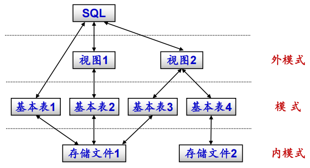
---

## SQL数据定义
   
| 操作对象 | 创建 | 删除 | 修改 |
| :---: | :---: | :---: | :---: |
| 模式 **SCHEMA** | **CREATE** SCHEMA | **DROP** SCHEMA | - |
| 表 **TABLE** | CREATE TABLE | DROP TABLE | **ALTER** TABLE |
| 视图 **VIEW** | CREATE VIEW | DROP VIEW | - |
| 索引 **INDEX** | CREATE INDEX | DROP INDEX | **ALTER** INDEX |
   
### 定义/删除模式（CREATE/DROP SCHEMA）
   
 1.  例：为用户WANG 定义一个学生-课程模式S-T
     ```sql
     CREATE SCHEMA “S_T” AUTHORIZATION WANG;
     ```

2.  模式中定义其他
<br>为用户ZHANG创建了一个模式TEST，并且在其中定义一个表TAB1
```sql
CREATE SCHEMA TEST AUTHORIZATION ZHANG
    CREATE TABLE TAB1 ( 
        COL1 SMALLINT,
        COL2 INT,
        COL3 CHAR(20),
        COL4 NUMERIC(10,3),
        COL5 DECIMAL(5,2) );
```

3. 删除模式
    ```sql
    DROP SCHEMA <模式名> <CASCADE|RESTRICT> 
    ```
    - CASCADE（级联）：删除模式的同时，把里面所有表/数据/对象全部删除；
    - RESTRICT（限制）：模式里有任何东西(表/视图/数据)，就禁止删除
    <br>eg:DROP SCHEMA ZHANG CASCADE;
    删除模式ZHANG，同时该模式中定义的表TAB1也被删除


### 基本表 TABELE

1. 定义基本表 -三大核心完整性约束：
   - **PRIMARY KEY 主键**，唯一标识一行数据，不能重复、不能为空
   - **UNIQUE 唯一**，不能重复，但能为空
  ```sql
  CREATE TABLE Student
      (Sno CHAR(9) PRIMARY KEY,  /* 列级完整性约束条件, Sno是**主码**/
      Sname CHAR(20) UNIQUE,  /* **约束**，Sname的取值具有唯一性*/
      Ssex CHAR(2),
      Sage SMALLINT,
      Sdept CHAR(20)
      );
  ```

  - **FOREIGN KEY...REFERENCES** 外键
    两张表关联起来，SC表里的Cno必须来自Student里的Cno 
```sql
CREATE TABLE SC (
    Sno CHAR(9),
    Cno CHAR(4),
    Grade SMALLINT,
    PRIMARY KEY (Sno,Cno),
    /* 主码由两个属性构成，必须作为表级完整性进行定义*/
    FOREIGN KEY (Sno) REFERENCES Student(Sno),
    /* 表级完整性约束条件，Sno是外码，被参照表是Student */
    FOREIGN KEY (Cno) REFERENCES Course(Cno)
);
```

2. 修改基本表（ALTER TABLE）
    - ADD新增列/完整性约束 
        ```sql
        ALTER TABLE Student 
        ADD COLUMN S_email VARCHAR(50) NOT NULL UNIQUE;  -- 增加邮箱列，要求非空且唯一
        ADD CONSTRAINT chk_sex CHECK (Ssex IN ('男', '女'));  -- 为 Ssex 增加 CHECK 约束（性别只能是男 / 女）
        ```
    - DROP 删除列   
        ```sql
        ALTER TABLE Student 
        DROP COLUMN S_email CASCADE; --删除“邮箱”列，默认RESTRICT
        DROP CONSTRAINT chk_sex; -- 删除性别CHECK约束
        ```
    - 修改列的定义
        ```sql
        ALTER TABLE Student 
        ALTER COLUMN Sage INT;  -- 修改数据类型：年龄从SMALLINT改为INT
        ALTER COLUMN Sname CHAR(30); -- 修改列长度（姓名从 CHAR (20) 改为 CHAR (30)）
        ALTER TABLE Course ADD UNIQUE(Cname); -- 增加课程名称必须取唯一值的约束条件
        ```
3. 删除基本表 DROP TABLE <表名>［RESTRICT| CASCADE］;
### 索引 INDEX
1. 建立索引 CREATE INDEX
```sql
CREATE UNIQUE INDEX Coucno ON Course(Cno); -- Course表按课程号
CREATE UNIQUE INDEX SCno ON SC(Sno ASC,Cno DESC); -- 升序建唯一索引，SC表按学号升序和课程号降序建唯一索引
```
1. 修改索引 ALTER INDEX
```sql
ALTER INDEX SCno RENAME TO SCSno; -- 将SC表的SCno索引名改为SCSno
```
1. 删除索引 DROP INDEX
```sql
 DROP INDEX Stusname; -- 删除Student表的Stusname索引
```
---
### 关系代数 vs SQL语言
1. $$ \pi_{A_1, A_2, ..., A_m} \left( \sigma_F ( R ) \right) $$其中 $A_i \in head(R)$ for $i = 1, 2, \dots, m$
    <br>SQL表示
    ```sql
    SELECT A_1, A_2, ..., A_m
    FROM   R
    WHERE  F
2. 笛卡尔积 $R\times S$
   <br>SQL表示
    ```sql
    SELECT R.A_1,...,R.A_n,s.b_1,...,s.b_m
    FROM   R,S
    ```
3. $\theta-$连接
    $R\underset{F}\bowtie S$
    <br>SQL表示
    ```sql
        SELECT R.A_1,...,R.A_n,s.b_1,...,s.b_m
        FROM R,S
        WHERE F
    ```
4. 自然连接
    $R\bowtie S$
    <br>SQL表示
    ```sql
        SELECT R.A_1,...,R.A_n,s.b_1,...,s.b_m
        FROM R,S
        WHERE R.B_1 = S.B_1 and R.B_2 = S.B_2 and ... and R.B_k = S.B_k
    ```
5. $\pi_{attr\_1, attr\_2, ..., attr\_x} (\sigma_F (R \times S))$
    <br>SQL表示
    ```sql
    SELECT attr_1, attr_2, ..., attr_x
    FROM   R,S
    WHERE  F
    ```

## SQL数据查询（单表）

1. SELECT 目标子句
    - 查所有列：SELECT * FROM Student
    - 查指定列：SELECT Sno, Sname FROM Student;&emsp;查询全体学生的学号与姓名
    - 起别名：SELECT Sname,2026 - Sage AS&emsp;计算(2026-Sage)结果出生年份起名为AS
    - 列去重：SELECT **DISTINCT** Sno FROM SC;&emsp;查询学号
        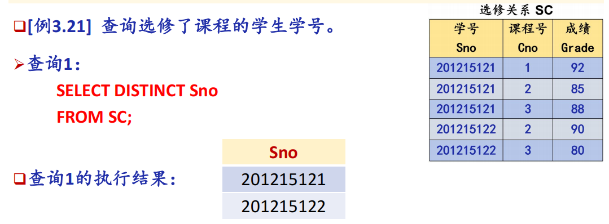 
    - 计算
        ```sql
        SELECT ordno, year(orddate), month(orddate), day(orddate)
        FROM orders;  -- 查询每一份订单的编号、订购的年、月、日；

        SELECT ordno, orddate, datediff(curdate(), orddate)
        FROM orders ;  -- 查询每一份订单的编号、订购日期、距离至今相隔的天数；
        ```
    - 例：查询全体学生的姓名、出生年份和所在的院系，要求用小写字母表示系名。
        ```sql
        SELECT Sname,
        'Year of Birth: '
        , 2014 - Sage, LOWER(Sdept)
        FROM Student;
        ```
<span id="FROM 范围子句"></span>

2. FROM 范围子句
    ```sql
    SELECT S.Sno, S.Sname 
    FROM Student S;  //S是Student的别名
    ```
<span id="WHERE条件子句"></span>

3. WHERE 条件子句
    - 比较
    ```sql
    SELECT Sname
    FROM Student
    WHERE Sdept = ‘CS’ ;
    WHERE Sdept <> ‘CS’;//过滤条件，相当于!=不等于
    ```
    - 确定范围
    ```sql
    SELECT Sname, Sdept, Sage
    FROM Student
    WHERE Sage (NOT) BETWEEN 20 AND 23; -- 查询年龄(不)在[20,23]的学生的姓名、系别和年龄
    ``` 
    - 确定集合
    ```sql
    SELECT Sname, Ssex
    FROM Student
    WHERE Sdept (NOT)IN ( 'CS','MA','IS' );-- 查询(不是)计算机科学系（CS）、数学系（MA）和信息系（IS）学生的姓名和性别。
    ```
    - '字符串常量'加单引号
    ```sql
    SELECT Sname,'Year of Birth: ', 2014 - Sage, LOWER(Sdept)  FROM Student;//系名小写
    ```
    - 字符匹配 **LIKE**/**=**
    ```sql
    SELECT* FROM Student WHERE Sno LIKE'24%'  -- 通配符，查询学号以24开头的学生的详细信息
    SELECT* FROM Student WHERE Sno='24%' -- 查询学号就是'24%'学生的详细信息
    ```
    - 字符串中的通配符
    ```sql
    SELECT Sname, Sno, Ssex
    FROM Student
    WHERE Sname LIKE '刘%';  -- 查询所有姓刘学生的姓名、学号和性别

    SELECT Sname
    FROM Student
    WHERE Sname LIKE '欧阳__'; -- 查询姓"欧阳"且全名为三个汉字的学生的姓名
    
    SELECT Sname, Sno
    FROM Student
    WHERE Sname LIKE '__阳%'; -- 查询名字中第2个字为"阳"字的学生的姓名和学号

    SELECT Sname, Sno, Ssex
    FROM Student
    WHERE Sname NOT LIKE '刘%'; -- 查询所有不姓刘的学生姓名、学号和性别
    ```
    - 转义字符 **\**
    用 ESCAPE '\' 表示字符\为换码字符（转义指示符） 
    ```sql
    查询DB_Design课程的课程号和学分。
    SELECT Cno，Ccredit
    FROM Course
    WHERE Cname LIKE 'DB\_Design' ESCAPE '\' ;
    ```
    - 涉及空值的查询
    ```sql
    SELECT Sno，Cno
    FROM SC
    WHERE Grade IS NOT NULL; -- 查所有有成绩的学生学号和课程号
    ``` 


---
### 聚集函数
1. **COUNT** 统计元组个数
2. **SUM** 计算一列的总和/**AVG** 计算一列的平均值
3. **MIN** 一列值中的最大值/**MIN** 一列值中的最小值
<div style="display: flex; gap: 8px; align-items: center; margin: 4px 0;">
  
  
</div>

---
### 对查询结果的处理
1. 对查询结果**排序** **ORDER BY 属性名 ASC升序/DESC降序**
    查询选修了3号课程的学生的学号及其成绩，查询结果按分数降序排列。
    ```sql
    SELECT Sno, Grade
    FROM SC
    WHERE Cno= '3'
    ORDER BY Grade DESC;
    ```
2. 对查询结果**分组** **GROUP BY**/**HAVING**
   求各个课程号及相应的选课人数。
    ```sql
    SELECT Cno，COUNT(Sno)
    FROM SC
    GROUP BY Cno; // 按照Cno为一行,相同Cno为一行
    ```
    查询选修了3门以上课程的学生学号。
    ```sql
    SELECT Sno
    FROM SC
    GROUP BY Sno
    HAVING COUNT(*) >3;
    ```
   - 辨析 HAVING 与 WHERE
        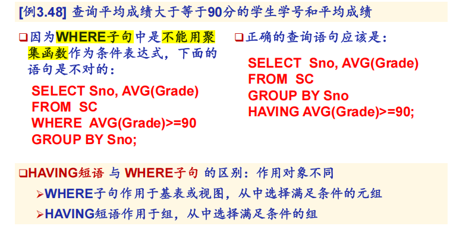
3. 指定结果列的列标题
    ```sql
    SELECT Sname NAME,'Year of Birth:' BIRTH,2014-Sage BIRTHDAY,
    // Sname一列的结果列标题为NAME，'Year of Birth:'常量列的列标题为BIRTH…
    FROM Student;
    ```
4. 查询结果
   <br>WHERE → GROUP → **SELECT** → ORDER &emsp;&emsp;WHERE → GROUP → HAVING → **SELECT** → ORDER
   <div style="display: flex; width: 100%; margin-left: 0;">
      <div style="flex: 1; text-align: center;">
        
      </div>
      <div style="flex: 1; text-align: center;">
        
      </div>
    </div>

    
---
### 连接查询（多表）
1. **等值连接/自然连接查询**=
   <div style="display: flex; width: 100%; margin-left: 0;">
      <div style="flex: 1; text-align: center;">
        
      </div>
    </div>
2. **自身连接**&emsp;起别名 =
   <br>查询每一门课的间接先修课（即先修课的先修课）
    ```sql
    SELECT FIRST.Cno, SECOND.Cpno
    FROM Course FIRST, Course SECOND -- 需要给表起别名
    WHERE FIRST.Cpno = SECOND.Cno;
    ```
    <div style="display: flex; width: 100%; margin-left: 0;">
      <div style="flex: 1; text-align: center;">
        
      </div>
    </div>
3. **外连接**
    ```sql
    SELECT Student.Sno,Sname,Ssex,Sage,Sdept,Cno,Grade
    FROM Student LEFT OUTER JOIN SC ON (Student.Sno=SC.Sno); -- 左外连接：左边为标准，右边不存在的填NULL
    FROM Student RIGHT OUTER JOIN SC ON (Student.Sno=SC.Sno); -- 右外连接：右边为标准，右边不存在的填NULL
    FROM Student FULL OUTER JOIN SC ON S.Sno = SC.Sno; -- 全外连接，全部补NULL
    ```
### 嵌套查询（子查询）
1. IN
   <div style="display: flex; width: 100%; margin-left: 0;">
      <div style="flex: 1; text-align: center;">
        
      </div>
      <div style="flex: 1; text-align: center;">
        
      </div>
      <div style="flex: 1; text-align: center;">
        
      </div>
    </div>
2. 带有比较运算符的子查询
    ```sql
    SELECT Sno,Sname,Sdept
    FROM Student
    WHERE Sdept = (SELECT Sdept FROM Student WHERE Sname = '刘晨');
    -- 在[例3.55]中，由于一个学生只可能在一个系学习，则可以用 = 代替IN 
    SELECT Sno, Cno
    FROM SC x
    WHERE Grade >= ( SELECT AVG(Grade)
    FROM SC y
    WHERE y.Sno = x.Sno ); -- 找出每个学生超过他选修课程平均成绩的课程号。
    ```
3. 限定比较谓词(SOME/ANY/ALL)
    ```sql
    -- 查询非计算机科学系中比计算机科学系任意一个学生年龄小的学生姓名和年龄
    SELECT Sname,Sage
    FROM Student
    WHERE Sage < ANY (
            SELECT Sage
            FROM Student
            WHERE Sdept = 'CS')
        AND Sdept <> 'CS' ;
    -- 聚集函数
    SELECT Sname,Sage
    FROM Student
    WHERE Sage < (
            SELECT MAX（Sage）
            FROM Student
            WHERE Sdept= 'CS ' )
        AND Sdept <> 'CS';
    ```
    < ANY → 小于最大值；
    ```sql
    SELECT * FROM SC
    WHERE Grade < ANY (80,90,70); -- 任意一个，小于最大值。成绩 < 90

    SELECT * FROM SC
    WHERE Grade < ALL (80,90,70); -- 所有，小于最小值。成绩 ＜ 70
    ```
4. EXISTS谓词
   子查询有结果，返回TRUE；子查询无结果，返回FALSE
    ```sql
    SELECT Sname
    FROM Student S
    WHERE EXISTS (
        SELECT *
        FROM SC
        WHERE SC.Sno = S.Sno
        AND Cno = '1' -- 从 Student 表里，找出那些‘存在’选修 1 号课程记录的学生
    ); -- 查询选修了 1 号课程的学生

    SELECT Sname
    FROM Student S
    WHERE NOT EXISTS (
        SELECT *
        FROM SC
        WHERE SC.Sno = S.Sno
        AND Cno = '1'
    ); -- 查询没选1号课程的学生
    ```
    - 查询选修了全部课程的学生
        ```sql
        SELECT Sname
        FROM Student
        WHERE NOT EXISTS (
            SELECT *
            FROM Course
            WHERE NOT EXISTS (
                SELECT *
                FROM SC
                WHERE SC.Sno = Student.Sno
                AND SC.Cno = Course.Cno
            )
        );
        ✅ 理解：不存在一门课是这个学生没选的
        ```
    - 例
    <div style="display: flex; width: 100%; margin-left: 0;">
      <div style="flex: 1; text-align: center;">
        
      </div>
      <div style="flex: 1; text-align: center;">
        
      </div>
    </div>
    <div style="display: flex; width: 100%; margin-left: 0;">
      <div style="flex: 1; text-align: center;">
        
      </div>
      <div style="flex: 1; text-align: center;">
        
      </div>
    </div>
    
### 集合操作
1. **并操作 UNION [ALL]**
   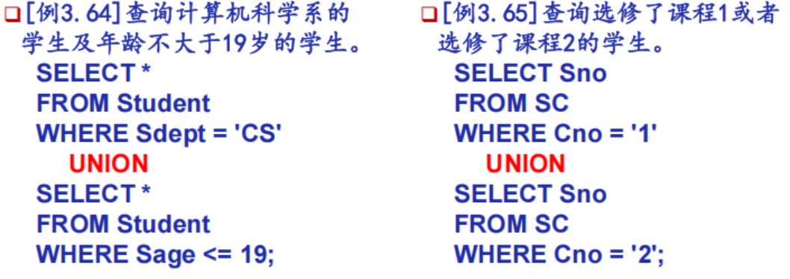
2. **交操作 INTERSECT [ALL]**
3. **差操作 EXCEPT [ALL]**
   <div style="display: flex; width: 100%; margin-left: 0;">
      <div style="flex: 1; text-align: center;">
        
      </div>
      <div style="flex: 1; text-align: center;">
        
      </div>
    </div>
### 基于派生表的查询


---
## 数据更新
1. ### 插入
    1. 格式
        ```sql
        INSERT
        INTO <表名> (属性名1，属性名2,…)
        VALUES (expr1|NULL , expr2|NULL ,…)
        ```
        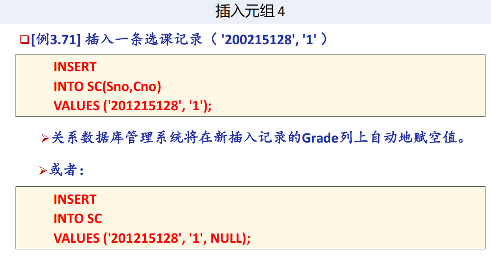
    2. 插入子查询结果
        ```sql
        INSERT
        INTO <表名>(属性1，属性2，…)
        子查询
        ```
        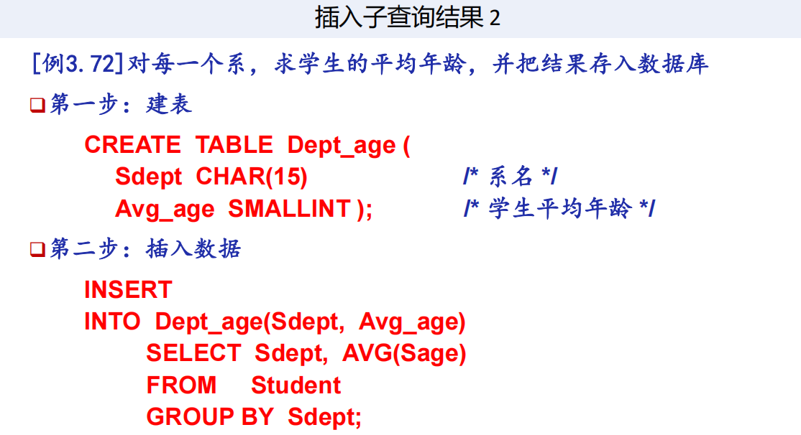
2. ### 修改
   1. 格式
        ```sql
        UPDATE <表名>
        SET <属性1>=<expr1>，<属性2>=<expr2>
        WHERE <条件>
        ```
        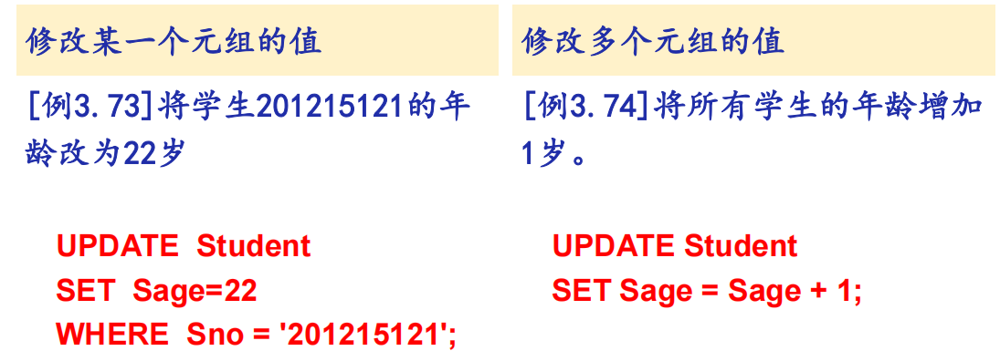  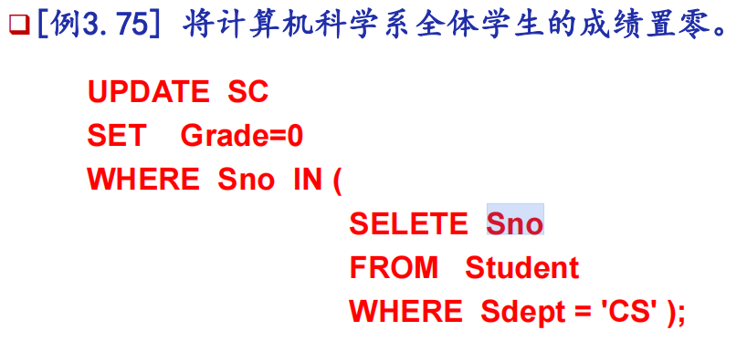
3. ### 删除
   1. 格式
        ```sql
        DELETE
        FROM <表名>
        [WHERE <条件>]
        ```
        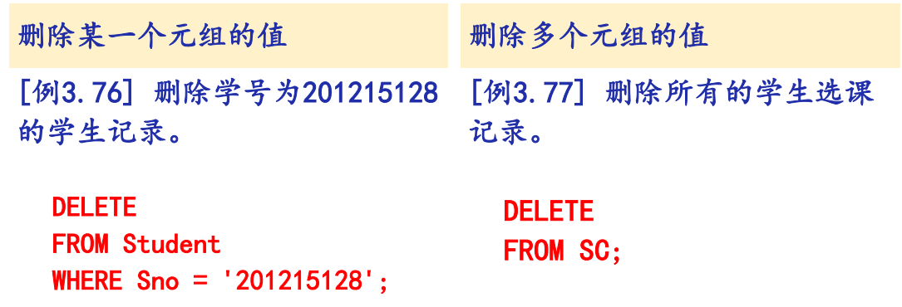


## 事务
1. 定义
   是用户定义的一个数据库操作序列，这些操作要么全做，要么全不做
2. 例
   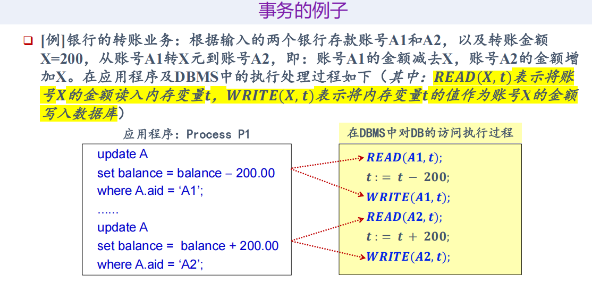
3. 事务的特性（ACID）
   原子性(Atomicity)、一致性(Consistency)、隔离性(Isolation)、持久性(Durability)
4. 定义事务
   - 事物的启动：**隐式**方式（由数据库管理系统来决定，何时为何用户启动一个新的事务）
   - 事物的结束：用户调用commit或rollback命令，**显式**地结束当前事务；由数据库管理系统强行结束一个用户的当前正在运行中的事务
   1. ### 事务启动方式
      - **数据定义命令 DDL**
           <br>只要你执行 CREATE、ALTER 等定义语句，系统自动把这一条语句当成一个独立事务。
           <br>执行前，如果你正在做其他操作，系统会**自动先提交之前**的事务。
       - **将系统设为自动提交方式（打开自动提交标志）**
           <br>这是最常见的默认状态。每一条 SELECT、UPDATE 等操作，做完后**系统自动帮你 COMMIT**，立即生效。
       - **数据操纵命令(DML)**
           <br>如果你没有开启自动提交，当你执行 INSERT/UPDATE/DELETE 时，系统检测到你没有事务，就**自动帮你开启**一个新事务，等着你手动提交或回滚。
   2. ### 事务结束方式
      - **事务提交：COMMIT**
           <br>事务正常结束，确认所有操作生效
      - **事务回滚：ROLLBACK**
           <br>事务异常终止，撤销所有操作。**保存点** savepoint，支持部分回滚。只撤销保存点后的操作
5. 相关的SQL语句
   - 事务结束命令
        事务提交命令：**COMMIT**/事务放弃命令：**ROLLBACK**
    - 事务设置命令
        - 设置事务的自动提交命令：SET AUTOCOMMIT ON | OFF
        - 设置事务的类型：SET TRANSACTION READONLY | READWRITE
    - 在MySQL数据库中，设置事务自动提交功能的SQL命令格式是
        - SET AUTOCOMMIT = 0; /* 关闭事务自动提交功能 */
        - SET AUTOCOMMIT = 1; /* 打开事务自动提交功能 */
    - 只读/读写型事务
        SET TRANSACTION READONLY | READWRITE ;
    - 事隔离级别——解决相互干扰
        1. READ UNCOMMITTED 读未提交
        2. READ COMMITTED 读已提交
        3. REPEATABLE READ 可重复读
        4. SERIALIZABLE 串行化
    - 基于封锁的并发控制（Locking）——具体执行策略
        1. 读锁（共享锁/S锁）
            事务 T 持有读锁时，只允许别人读，不允许写。作用：保证大家看到的是同一时刻的数据。
        2. 写锁（排他锁/X锁）
            事务 T 持有写锁时，别人既不能读，也不能写。作用：保证修改操作不被打断，原子性执行。
        3. 互斥原则
            一个数据对象上，同一时刻只能有一种锁（要么一堆读锁，要么一个写锁），不能混着来。    
## SQL中的空值
注意取值
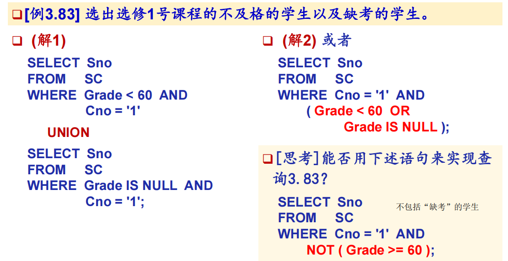
## 视图
1. 格式
    ```sql
    CREATE VIEW <视图名> [(<列名> [,<列名>]…)]
    AS <子查询>
    [WITH CHECK OPTION];
    ```
2. 例-**行列子集视图**
   若一个视图是从单个基本表导出的，并且只是去掉了基本表的某些行和某些列，但保留了**主码**，我们称这类视图为**行列子集视图**。
   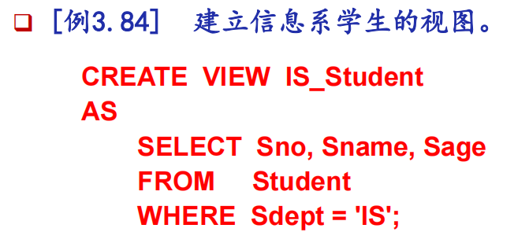   
3. WITH CHECK OPTION
   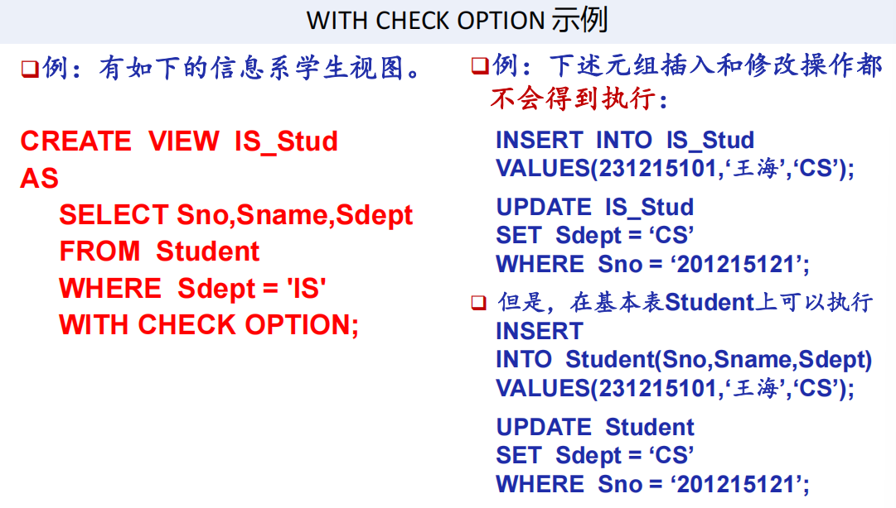
   阻止不符合条件的数据加入/修改成不符合条件的数据…/而基本表没有限制
4. 建立视图
   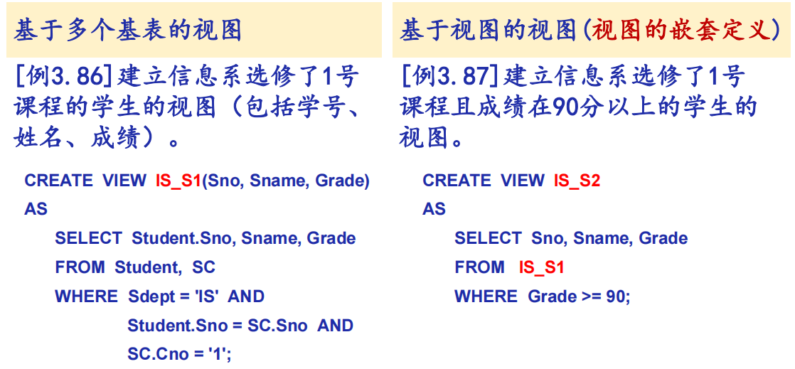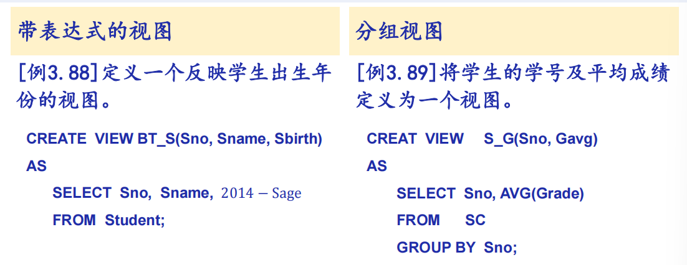
5. 删除视图 
   DROP VIEW <视图名> [CASCADE]
   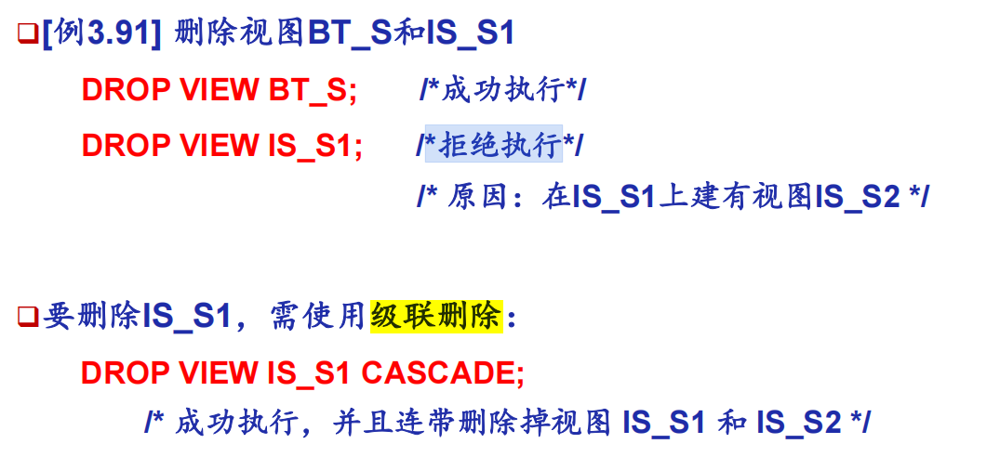
6. 查询视图
7. 更新视图
---
# C4 数据库的安全性
## 数据安全性概述
1. 数据库不安全因素
   非授权用户对数据库的恶意存取和破坏、数据库中重要或敏感的数据被泄露、安全环境的脆弱性
2. 安全标准
   - TCSEC：美国，分为 D、C1、C2、B1、B2、B3、A1 七级，A1 最高。
   - CC：国际通用标准，对应 EAL1~EAL7。
   - 中国标准：GB 17859-1999，5 级，对应 TCSEC C1~B3。
3. 计算机系统的安全模型
  <div style="display: flex; width: 100%; margin-left: 0;">
    <div style="flex: 1; text-align: center;">
      
    </div>
  </div>
4. 数据库管理系统安全性控制模型
  <div style="display: flex; width: 100%; margin-left: 0;">
    <div style="flex: 1; text-align: center;">
      
    </div>
  </div>
  数据库安全性控制的常用方法:用户标识和鉴定、存取控制、视图、审计、数据加密
## 数据库安全性控制
### 用户身份鉴别
   <br>系统提供的最外层安全保护措施。用户标识=用户名+用户标识号（用户标识号在系统整个生命周期内唯一）
    <br>用户身份鉴别的方法：静态口令鉴别、动态口令鉴别、生物特征鉴别(掌纹/虹膜)、智能卡鉴别

### 存取控制
- 组成：定义用户权限，并将用户权限登记到数据字典中 + 合法权限检查(用户发出存取数据库的操作请求后,DBMS根据字典检查权限)
- 存取控制方法:自主存取控制、强制存取控制  
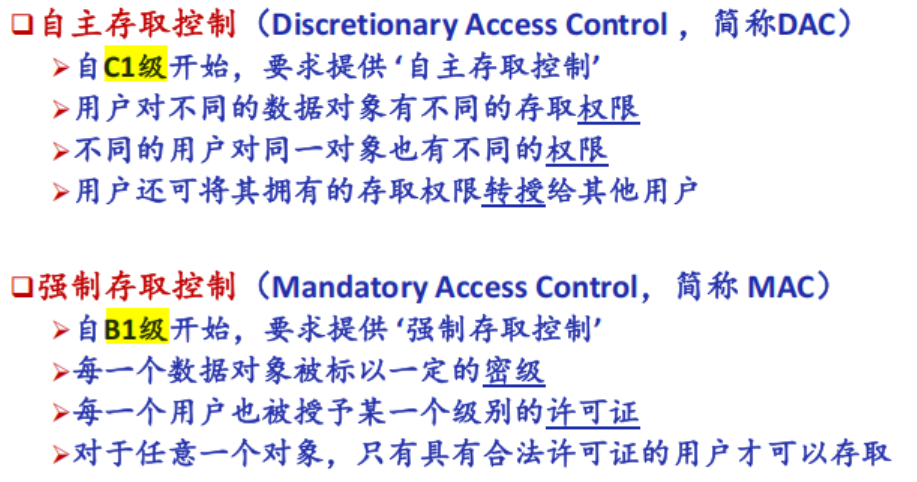
### **自主存取控制 DAC** 
   1. SQL支持：通过 **GRANT语句**、**REVOKE语句** 提供支持
   2. 核心目标：
   3. 用户权限的组成要素：数据库对象 + 操作类型
    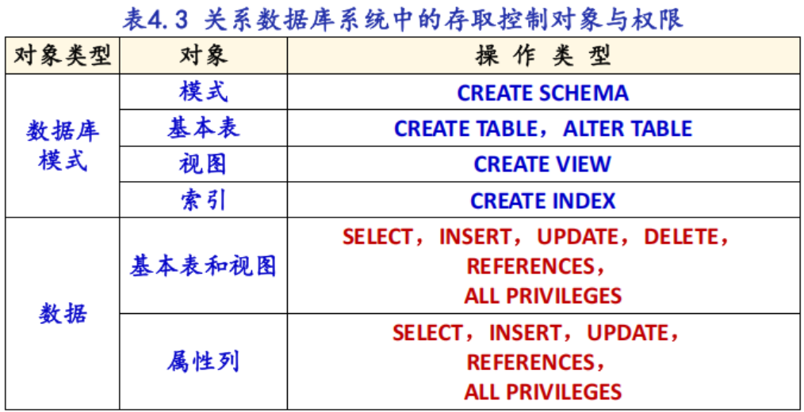
   4. 用户存取权限的方式
        <br>(i) 客体的属主(客体的创建者)自动拥有客体上的所有存取权限
        <br>(ii) 拥有权限的用户可以自主地将他拥有的权限传授给在数据库系统中注册的其他用户
    5. 访问控制检查流程
        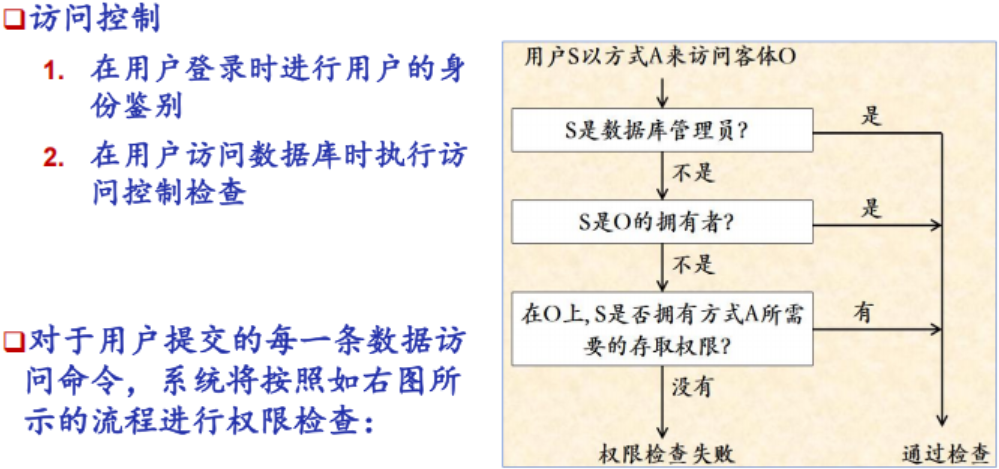
        第一步：是不是管理员？第二步：是不是客体的属主？第三步：有没有被授予对应的权限？(检查用户 S 是否被授予了“以方式A 访问 客体O”的权限)
    6. **授权**：授予GRANT 与 收回REVOKE
    7. 
        <span id="GRANT"></span>
        - 基础GRANT
        ```sql
        GRANT SELECT
        ON TABLE Student
        TO U1 -- 把查询Student表权限授给用户U1
        
        GRANT ALL PRIVILIGES
        ON TABLE Student,Course
        TO U2,U3 -- 把对Student表和Course表的全部权限授予用户U2和U3

        GRANT SELECT
        ON TABLE SC
        TO PUBLIC; -- 把对表SC的查询权限授予所有用户

        GRANT SELECT,UPDATE(Sno)
        ON TABLE Student
        TO U4-- 把查询Student表和修改学生学号的权限授给用户U4
        ```
        - 再授权
        ```sql
        GRANT INSERT ON TABLE SC TO U5 WITH GRANT OPTION -- 把对表SC的INSERT权限授予U5用户，并允许他再将此权限授予其他用户
        -- 用户U5可以执行下述命令，将之前获得的表SC的INSERT权限及传播权限 授予用户U6。
        GRANT INSERT ON TABLE SC TO U6 WITH GRANT OPTION;
        -- 同样，U6还可以将此权限授予U7，但U7不能再传播此权限。
        GRANT INSERT ON TABLE SC TO U7;
        ``` 
        <span id="REVOKE"></span>
        - REVOKE
        ```sql
        REVOKE UPDATE(Sno) ON STUDENT FROM U4 -- 把用户U4修改学生学号的权限收回
        REVOKE SELECT ON SC FROM PUBLIC -- 收回所有用户对表SC的查询权限
        ``` 
        - 创建数据库模式的权限

        | 拥有的权限 | CREATE USER | CREATE SCHEMA | CREATE TABLE | 登录数据库，执行数据查询和操纵 |
        | --- | --- | --- | --- | --- |
        | DBA | 可以 | 可以 | 可以 | 可以 |
        | RESOURCE | 不可以 | 不可以 | 可以 | 可以 |
        | CONNECT | 不可以 | 不可以 | 不可以 | 可以，但必须拥有相应权限 |

    <span id="数据库角色"></span>
    7. 数据库角色 ROLE
     

 

1. **强制存取控制 MAC**


## 视图机制
## 审计（Audit）
## 数据加密
## 其他安全性保护
## 小结


### GRANT语句
1. 一般格式
    ```sql
    GRANT <权限> [ , <权限> ] ... 
    ON <对象类型> <对象名> [ , <对象类型> <对象名> ]…
    TO <用户> [ , <用户> ] ... 
    [ WITH GRANT OPTION ];
    ```
2. 