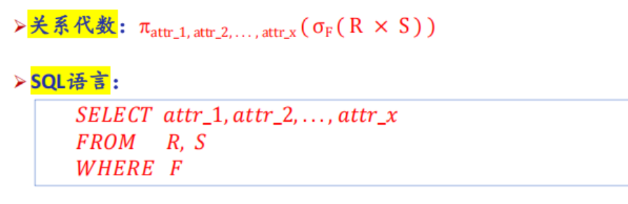
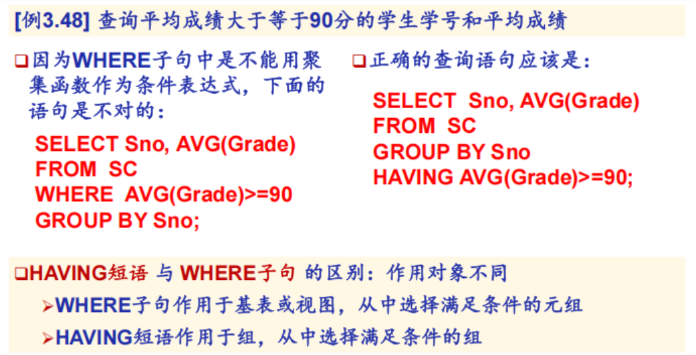

成绩组成 4:6

- [C1 绪论](#c1-绪论)
  - [数据库的基本概念](#数据库的基本概念)
  - [数据模型的组成要素 \& 常用数据模型](#数据模型的组成要素--常用数据模型)
  - [数据库的三级模式 \& 数据库系统的主要组成部分](#数据库的三级模式--数据库系统的主要组成部分)
- [C2 关系数据库](#c2-关系数据库)
  - [关系数据结构](#关系数据结构)
  - [关系操作](#关系操作)
  - [关系的完整性](#关系的完整性)
  - [关系代数](#关系代数)
  - [关系代数的基本运算](#关系代数的基本运算)
  - [关系代数的补充运算](#关系代数的补充运算)
- [C3 SQL](#c3-sql)
  - [SQL数据定义](#sql数据定义)
- [映像语句](#映像语句)
  - [聚集函数](#聚集函数)
- [](#)
  - [对查询结果的处理](#对查询结果的处理)
  - [连接查询](#连接查询)


## C1 绪论

### 数据库的基本概念

1. 数据库系统概述
    1. 数据库的四个基本概念
        1. <u>**_数据_**</u> 是指具有一定的语义(semantic)含义，并且可以被记录下来的已知信息。
        2. <u>**_数据库_**</u> 中的数据的特点：结构化、集成化、集中管理
        3. <u>**_数据库管理系统 DBMS_**</u>
           <br>统一的关系数据子语言：**SQL** (Structured Query Language)
        4. <u>**_数据库系统/数据库应用系统 DBS_**</u>
    2. 数据管理技术的产生和发展
    3. 数据库系统的<u>**_特点_**</u>
        1. **数据结构化**
        2. **数据共享性高，冗余度低、易扩充**
        3. **数据独立性高**
        4. **数据由数据库管理系统 统一管理和控制**

2. <u>**_数据模型_**</u>
    1. 两大类、共三种数据模型：
        1. **概念数据模型**
        2. **逻辑数据模型**
        3. **物理数据模型**
    2. 数据模型的<u>**_组成要素_**</u>
        1. **数据结构**
        2. **数据操作**
        3. **数据约束**
    3. 关系模型
        1. 基本概念
           
           
        2. 规范化
           

3. 数据库系统的结构
    1. 从数据库应用开发人员角度看
       数据库通常采用 <u>**三级模式结构**</u>
       
    2. 从数据库最终用户角度看
       单用户结构、
       主从式结构、
       分布式结构、
       客户-服务器、
       浏览器-应用服务器／数据库服务器多层结构等
    3. 模式 & 实例
        1. 模式
           eg：学生记录的‘型’：（学号，姓名，性别，系别，年龄，籍贯）
           <br>一个学生记录的‘值’：
           (201315130, 李明, 男, 计算机系, 19, 江苏省南京市)
            1. 模式：描述的是数据的全局逻辑结构
            2. 外模式(子模式/用户模式)：描述的是数据的局部逻辑结构
            3. 内模式：

        - 三级模式是对数据的三个抽象级别
        - 二级映象在数据库管理系统内部实现这三个抽象层次的联系和转换
            - 外模式／模式映像
            - 模式／内模式映像

        2.

4. 数据库系统的组成
5. 小结

### 数据模型的组成要素 & 常用数据模型

### 数据库的三级模式 & 数据库系统的主要组成部分

---

## C2 关系数据库

### 关系数据结构

1. 关系
    1. 关系模型只有单一的数据结构：关系；关系模型的逻辑结构：二维表
    2. **关系**：在域 $D_1, D_2, \dots, D_n$ 上的关系 $R$ 也是一个 $n$ 元有序组的集合，
       并且是其笛卡尔积的一个 **子集**：$R \subseteq D_1 \times D_2 \times \dots \times D_n$
        - **属性**：二维表中的 **每一列**，被称为是该关系中的一个‘属性’
        - **元组 tuple**：二维表中的 **每一行**，$(d_1,d_2,…,d_n)$，$t[A_i]$表示元组t在属性 $A_i$上的取值；$t[i]$
          表示元组t在第i列上的取值
        - 关系的表示：在域 $D_1,D_2,…,D_n$ 上的关系R可以被表示为 $R(A_1,A_2,…,A_n)$
          <br>其中 $A_i$ 是属性名&emsp;eg:“专业”
    3. **（候选）码 Key**
       <br>若关系中的某一 **属性组** 的值能唯一地标识一个元组，而其所有的真子集都不能，则称该 **属性组** 为关系的 ‘候选码’
       ，简称 ‘码’
    4. **全码 All-key**关系中的所有属性构成的属性组是这个关系的候选码，称为 ‘全码’（All-key）
    5. **主属性** 与 **非主属性/非码属性**
        - 候选码中的诸属性称为该关系的 ‘主属性’（Prime attribute）
        - 不包含在任何侯选码中的属性称为该关系的 ‘非主属性’/‘非码属性’
2. <mark>关系模式
    1. 关系模式是关系的 ‘型’ ，元组集合是关系的 ‘值’/‘关系实例’
3. 关系数据库：关系的集合
4. 关系模型的存储结构

### 关系操作

### 关系的完整性

1. **实体完整性**
   <br><u>主键唯一、且不能为空(NULL)</u>
   <br>元组的唯一性；如果一个属性是主码（主键）的组成部分，那它绝对不能取空值（NULL）
2. 参照完整性
    1. 关系间的<u>**引用**</u>
       <br>表和表之间的关联，核心是 “引用” 别的表的主键.保证外键引用的都是真实存在的主键，不会出现 “无中生有” 的关联数据
       <br>学生表：学生(学号, 姓名, 性别, 专业号, 年龄);专业表：专业(专业号, 专业名)
       <br>这里的引用关系是：专业表的主键是 专业号（用来唯一标识每个专业）。 学生表里的 专业号 字段，引用了 专业表 的主键
       专业号。
       这个 <u>学生表.专业号</u> 就是外键，它把学生和对应的专业绑定在一起。
    2. <u>**外码**</u>
        - 外码：关系 R 里的一组属性 F，它不是 R 的码，但和另一个关系 S 的主键K_S对应，那 F 就是 R 的外码。
        - 参照关系：R（拿着外码的表，比如学生表）
        - 被参照关系：S（被引用主键的表，比如专业表
    3.
3. 用户定义的完整性

### 关系代数

1. 关系运算
   
2. **象集**

<div style="display: flex; width: 100%; gap: 10px;">
  <div style="flex: 1; text-align: center;">
    
  </div>
  <div style="flex: 1; text-align: center;">
    
  </div>
</div>  

---

### 关系代数的基本运算


1. 并$\cup$、差-、笛卡尔积$\times$
<div style="display: flex; width: 100%; gap: 10px;">
    <div style="flex: 1; text-align: center;">
    
    </div>
    <div style="flex: 1; text-align: center;">
    
    </div>
</div>  

<span id="选择"></span>
2. 选择 $\sigma_{Sub}=_{限定条件}(Obj)$ &emsp;/ &emsp; $Student  where  SC = 'ISE'$
   <br>题干：
    <div style="display: flex; width: 100%; gap: 10px;">
      <div style="flex: 1; text-align: center;">
        
      </div>
      <div style="flex: 1; text-align: center;">
        
      </div>   
      <div style="flex: 1; text-align: center;">
        
      </div>
    </div>
    <div style="display: flex; width: 100%; gap: 10px;">
        <div style="flex: 1; text-align: center;">
            
        </div>
        <div style="flex: 1; text-align: center;">
            
        </div>
    </div>

<span id="投影"></span>
3. 投影 $\pi_{property1,property2}(Domain)$ &emsp;/ &emsp;$Domain[property]$
    <div style="display: flex; width: 100%; gap: 10px;">
      <div style="flex: 1; text-align: center;">
        
      </div>
      <div style="flex: 1; text-align: center;">
        
      </div>
      <div style="flex: 1; text-align: center;">
        
      </div>
    </div>

---

### 关系代数的补充运算

<span id="连接"></span>
1. $\theta-$连接&emsp;$R \underset{C < E}{\bowtie} S$
    <br>等值连接&emsp;$R \underset{C.B = E.B}{\bowtie} S$ 
    <br>自然连接&emsp;$R \bowtie S$：把相同属性全都尽可能拼接到一起
    <br>(左/右)外连接：加上悬浮元组
<div style="display: flex; width:100%; gap: 10px;">
    <div style="flex: 1; text-align: center;">
        
    </div>
    <div style="flex: 1; text-align: center;">
        
    </div>
    <div style="flex: 1; text-align: center;">
        
    </div>
</div>
<div style="display: flex; width:100%; gap: 10px;">
    <div style="flex: 1; text-align: center;">
        
    </div>
    <div style="flex: 1; text-align: center;">
        
    </div>
</div>


- 例
<div style="display: flex; width:100%; gap: 10px;">
    <div style="flex: 1; text-align: center;">
        
    </div>
    <div style="flex: 1; text-align: center;">
        
    </div>
    <div style="flex: 1; text-align: center;">
        
    </div>
</div>


2. 除运算 R ÷ S
<span id="除运算"></span>
    <br>找出R、S中相同的属性列(B、C)，R 剩下的属性列(A) 作为结果。
    <br>$a_i$的所有($b_j$,$c_j$)，S中全都包含的$a_i$作为结果。    
    <div style="display: flex; width:100%; gap: 10px;">
        <div style="flex: 1; text-align: center;">
            
        </div>
        <div style="flex: 1; text-align: center;">
            
        </div>
    </div>
    
- 例
<div style="display: flex; width:0%; gap: 10px;">
    <div style="flex: 1; text-align: center;">
        
    </div>
    <div style="flex: 1; text-align: center;">
        
    </div>
</div>

- 综合例题
<span id="综合例题"></span>
    <div style="display: flex; width:100%; gap: 10px;">
        <div style="flex: 1; text-align: center;">
            
        </div>
        <div style="flex: 1; text-align: center;">
            
        </div>
        <div style="flex: 1; text-align: center;">
            
        </div>
    </div>

<span id="discntMax"></span>
- 在当前的所有顾客中, 查询折扣(discnt)最高的顾客的编号？
  <br>令 $S := C$, “折扣不是最高的顾客的id”  
$R_2 := \pi_{C.cid}(\sigma_{C.discnt < S.discnt}(C \times S))$
  <br>答案是 $\pi_{cid}(C) - \pi_{C.cid}(\sigma_{C.discnt < S.discnt}(C \times S))$
<div style="display: flex; width:100%; gap: 10px;">
    <div style="flex: 1; text-align: center;">
        
    </div>
    <div style="flex: 1; text-align: center;">
        
    </div>
</div>
    
<div style="display: flex; width:100%; gap: 10px;">
    <div style="flex: 1; text-align: center;">
        
    </div>
    <div style="flex: 1; text-align: center;">
        
    </div>
</div>

---

## C3 SQL
1. SQL（Structured Query Language）结构化查询语言，是关系数据库的标准语言
2. 基本语言成分：符号、保留字、标识符、常量（除常量外都不区分大小写）
3. SQL与关系数据库的三级模式
---

### SQL数据定义
   
| 操作对象 | 创建 | 删除 | 修改 |
| :---: | :---: | :---: | :---: |
| 模式SCHEMA | **CREATE** SCHEMA | **DROP** SCHEMA | - |
| 表TABLE | CREATE TABLE | DROP TABLE | **ALTER** TABLE |
| 视图VIEW | CREATE VIEW | DROP VIEW | - |
| 索引INDEX | CREATE INDEX | DROP INDEX | **ALTER** INDEX |
   
 1. 定义功能
    - 模式定义：为**用户**WANG定义一个学生-课程<u>模式</u>S-T（CREATE <u>SCHEMA</u> “S_T” **AUTHORIZATION** WANG;）
    - 表定义：建立“学生”表Student。学号是主码，姓名取值唯一
     ```sql
    CREATE TABLE Student
        (Sno CHAR(9) **PRIMARY KEY**,  /* 列级完整性约束条件, Sno是**主码**/
        Sname CHAR(20) **UNIQUE**,  /* **约束**，Sname的取值具有唯一性*/
        Ssex CHAR(2),
        Sage SMALLINT,
        Sdept CHAR(20)
        );
    ```
    建立一个学生选课表SC
    ```sql
    CREATE TABLE SC (
        Sno CHAR(9),
        Cno CHAR(4),
        Grade SMALLINT,
        PRIMARY KEY (Sno,Cno),
        /* 主码由两个属性构成，必须作为表级完整性进行定义*/
        FOREIGN KEY (Sno) REFERENCES Student(Sno),
        /* 表级完整性约束条件，Sno是外码，被参照表是Student */
        FOREIGN KEY (Cno) REFERENCES Course(Cno)
        /* 表级完整性约束条件， Cno是外码，被参照表是Course*/
    );
    ```

    - 视图和索引的定义：
 2. 修改功能
     - 向Student表增加“入学时间”列，其数据类型为日期型
         ```sql
         ALTER TABLE Student ADD S_entrance DATE;
         ```
     - 将年龄的数据类型由字符型（假设原来的数据类型是字符型）改为整数。
         ```sql
         ALTER TABLE Student ALTER COLUMN Sage INT;
         ```
     - 增加课程名称必须取唯一值的约束条件。
         ```sql
         ALTER TABLE Course ADD UNIQUE(Cname);
         ```
     - 删除基本表 DROP TABLE <表名> [RESTRICT|CASCADE]
         删除该表有没有限制。有限制：若存在依赖该表的对象 此表不能被删除；无限制：删除基本表的同时，相关依赖对象一起删除
 3. 建立索引 CREATE [UNIQUE] [CLUSTER] INDEX <索引名>
---
## 映像语句

1. SELECT 目标子句
    - 查所有列：SELECT *
    - 查指定列SELECT 列1, 列2
    - 起别名名：SELECT Sname,2026 - Sage AS 计算(2026-Sage)结果出生年份起名为AS
    - 列去重：SELECT **DISTINCT** 
2. FROM 范围子句
   ```sql
   SELECT S.Sno, S.Sname 
    FROM Student S;  //S是Student的别名
    ```
3. WHERE 条件子句
    - 筛选单表条件
        ```sql
        SELECT Sname 
        FROM Student 
        WHERE Sdept = 'CS';//只查 计算机系的学生名字
        ```
    - 多表连接条件
        ```sql
        SELECT Student.Sno, Sname, Cno, Grade 
        FROM Student, SC 
        WHERE Student.Sno = SC.Sno;
        ```
    - 组合条件
        ```sql
        SELECT * 
        FROM Student 
        WHERE Sdept = 'CS' AND Sage < 20; //计算机系 且 年龄小于20
        ```

4. WHERE 条件子句
### 关系代数 vs SQL语言
1. $$ \pi_{A_1, A_2, ..., A_m} \left( \sigma_F ( R ) \right) $$其中 $A_i \in head(R)$ for $i = 1, 2, \dots, m$
    <br>SQL表示
    ```sql
    SELECT A_1, A_2, ..., A_m
    FROM   R
    WHERE  F
2. 笛卡尔积 $R\times S$
   <br>SQL表示
    ```sql
    SELECT R.A_1,...,R.A_n,s.b_1,...,s.b_m
    FROM   R,S
    ```
3. $\theta-$连接
    $R\underset{F}\bowtie S$
    <br>SQL表示
    ```sql
        SELECT R.A_1,...,R.A_n,s.b_1,...,s.b_m
        FROM R,S
        WHERE F
    ```
4. 自然连接
    $R\bowtie S$
    <br>SQL表示
    ```sql
        SELECT R.A_1,...,R.A_n,s.b_1,...,s.b_m
        FROM R,S
        WHERE R.B_1 = S.B_1 and R.B_2 = S.B_2 and ... and R.B_k = S.B_k
    ```
    
## 数据查询语句
1. 比较
   查询计算机科学系全体学生的名单。
    ```sql
    SELECT Sname
    FROM Student
    WHERE Sdept = ‘CS’ ;
    WHERE Sdept <> ‘CS’;//过滤条件，相当于!=不等于
    ```
2. 逻辑选择确定范围
    查询年龄在20~23岁（包括20岁和23岁）之间的学生的姓名、系别和年龄
    ```sql
    SELECT Sname, Sdept, Sage
    FROM Student
    WHERE Sage BETWEEN 20 AND 23;
    ```
3. '字符串常量'加单引号
    ```sql
    SELECT Sname,'Year of Birth: ', 2014 - Sage, LOWER(Sdept)  FROM Student;//系名小写
    ```
4. 日期
   查询订单编号、订购的年、月、日,orddate是DATE类型。**year、month**等自动提取
   ```sql
   SELECT ordno, year(orddate), month(orddate), day(orddate)  FROM orders;
   ```
   查询每一份订单的编号、距离至今相隔的天数。**datediff**计算相隔天数
    ```sql
    SELECT ordno, orddate, datediff(curdate(), orddate)  FROM orders ;
    ```
5. 指定结果列的列标题
    ```sql
    SELECT Sname NAME,'Year of Birth:' BIRTH,2014-Sage BIRTHDAY,
    // Sname一列的结果列标题为NAME，'Year of Birth:'常量列的列标题为BIRTH…
    FROM Student;
    ```
6. 消除重复列**DISTINCT**
   ```sql
   SELECT DISTINCT Sno   FROM SC;
   ```
7. 集合范围 **IN/NOT IN**
   ```sql
   SELECT Sname WHERE Sdept IN ('CS','MATH','SIE')//CS、MATH、ISE系学生的名字
   SELECT Sname WHERE Sdept IN ('CS','MATH','SIE')//不是CS、MATH、ISE系学生的名字
   ```
8. 涉及空值的查询 **IS NULL/IS NOT NULL**
   查询缺少成绩的学生的学号和相应的课程号。
    ```sql
    SELECT Sno，Cno
    FROM SC
    WHERE Grade IS NULL
    ```
9.  字符匹配 **LIKE**
   - 基础
        ```sql
            SELECT * FROM Student WHERE Sno LIKE ‘241880543’;//学号为241880543学生的全部信息
            SELECT * FROM Student WHERE Sno = ‘241880543’ //等价于
        ```
   - 含通配符的**字符串**
        查询所有姓刘学生的姓名、学号和性别。
        ```sql
        SELECT Sname, Sno, Ssex
        FROM Student
        WHERE Sname LIKE '刘%';
        ```
        查询姓"欧阳"且全名为三个汉字的学生的姓名。
        ```sql
        SELECT Sname
        FROM Student
        WHERE Sname LIKE '欧阳__’;
        ```
        查询名字中第2个字为"阳"字的学生的姓名和学号。
        ```sql
        SELECT Sname, Sno
        FROM Student
        WHERE Sname LIKE '__阳%';
        ```
    - 转义通配符 **ESCAPE '\'**（\_是'\'）
        查询DB_Design课程的课程号和学分。
        ```sql
        SELECT Cno，Ccredit
        FROM Course
        WHERE Cname LIKE 'DB\_Design' ESCAPE '\' ;
        ```
---
### 聚集函数
1. **COUNT** 统计个数
2. **SUM** 计算一列的总和/**AVG** 计算一列的平均值
3. **MIN** 一列值中的最大值/**MIN** 一列值中的最小值


---
### 对查询结果的处理
1. 对查询结果**排序** **ORDER BY 属性名 ASC升序/DESC降序**
    查询选修了3号课程的学生的学号及其成绩，查询结果按分数降序排列。
    ```sql
    SELECT Sno, Grade
    FROM SC
    WHERE Cno= '3'
    ORDER BY Grade DESC;
    ```
2. 对查询结果**分组** **GROUP BY/HAVING**
   求各个课程号及相应的选课人数。
    ```sql
    SELECT Cno，COUNT(Sno)
    FROM SC
    GROUP BY Cno; // 按照Cno为一行,相同Cno为一行
    ```
    查询选修了3门以上课程的学生学号。
    ```sql
    SELECT Sno
    FROM SC
    GROUP BY Sno
    HAVING COUNT(*) >3;
    ```
    - 辨析 HAVING 与 WHERE
        
3. 查询结果
    <div style="display: flex; width: 100%; margin-left: 0;">
      <div style="flex: 1; text-align: center;">
        
      </div>
      <div style="flex: 1; text-align: center;">
        
      </div>
    </div>
---
### 连接查询
1. **等值连接/自然连接查询**
    
2. **自身连接**
   查询每一门课的间接先修课（即先修课的先修课）
    ```sql
    SELECT FIRST.Cno, SECOND.Cpno
    FROM Course FIRST, Course SECOND
    WHERE FIRST.Cpno = SECOND.Cno;
    ```
    
3. **外连接**
     jiang'wan

讲完exits
