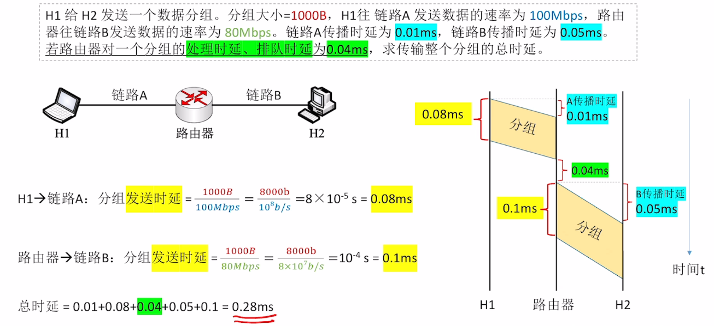
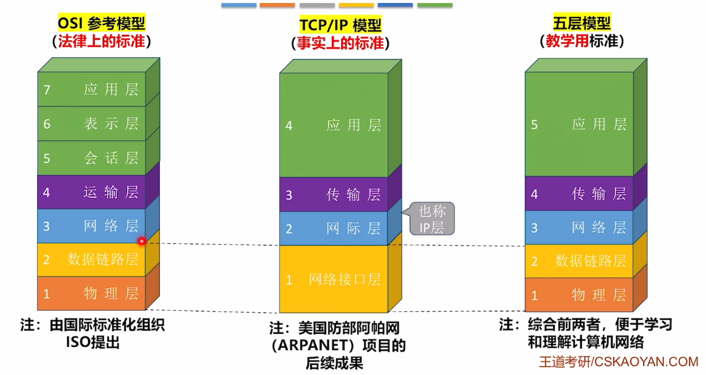
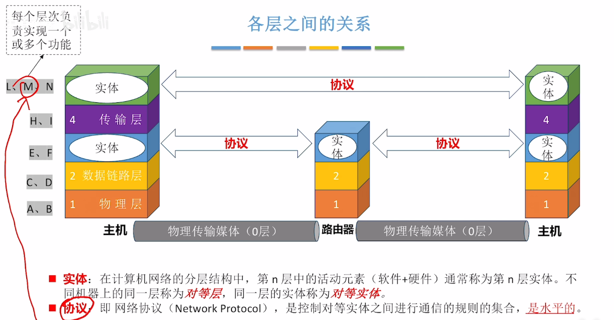
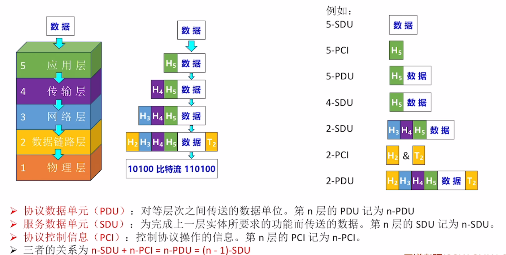
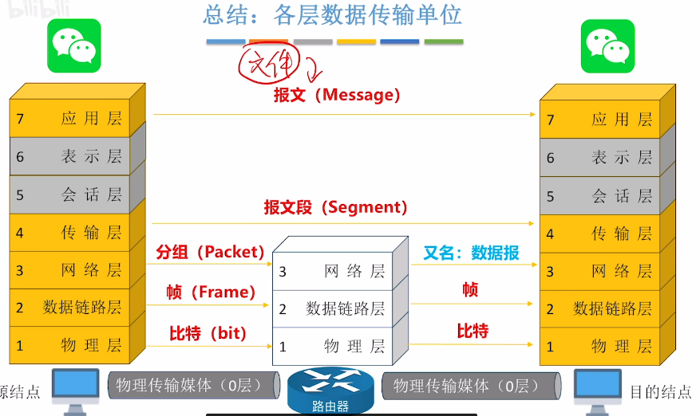
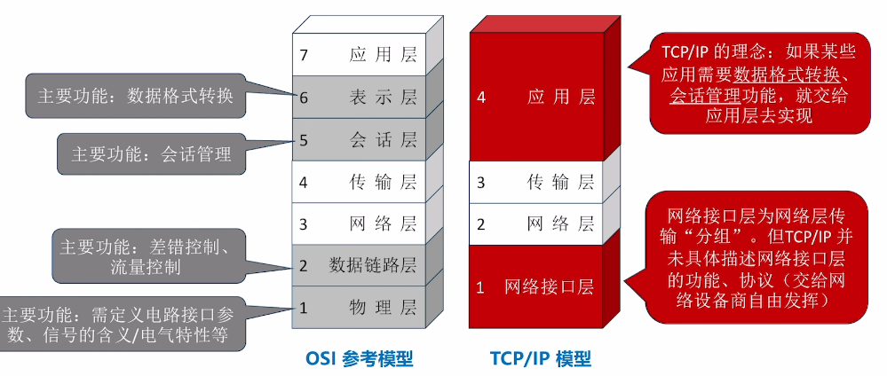

- [基本概念](#基本概念)
- [计算机网络的组成](#计算机网络的组成)
    - 从组成部分看
    - 从工作方式看
    - 从逻辑功能看
- [计算机网络的功能](#计算机网络的功能)
- [三种交换技术](#三种交换技术)
    - 电路交换
    - 报文交换
    - 分组交换
    - 性能对比
- [计算机网络的分类](#计算机网络的分类)
- [计算机网络的性能指标](#计算机网络的性能指标)
  - [速率](#速率)
  - [带宽](#带宽)
  - [吞吐量](#吞吐量)
  - [时延](#时延)
  - [时延带宽积](#时延带宽积)
  - [往返时延](#时延带宽积)
  - [信道利用率](#时延带宽积)
- [计算机网络的分层结构](#计算机网络分层结构)
  - [水平/垂直角度理解](#两个角度)
  - [协议数据单元PDU = PCI + SDU](#PDU)
  - [协议](#协议)
  - [OSI参考模型](#TCP/IP模型)
  - [TCP/IP模型](#TCP/IP模型)
  

## 基本概念

1. <u>**_计算机网络_**</u>：由若干结点(node)和连接这些结点的链路(link)组成
    通过集线器、交换机构建计算机网络，通过路由器连接不同计算机网络
2. <u>**_互联网（因特网）_**</u>：各大ISP(Internet Service Provider)和国际机构组建成的、覆盖全球的互连网，
    必须使用 TCP/IP协议 通信；
3. <u>**_互连网_**</u>：路由器连接的大规模计算机网络，可以使用任意协议通信。
4. <u>**_交换机_**</u>：把多个节点链接起来，组成一个计算机网络
    <u>**_路由器_**</u>：把两个或多个计算机网络连接起来，形成规模更大的计算机网络。也称为“**互连网**”
5. 总结
    

      

        
      

    

---

## 计算机网络的组成

  

    
  

### 从组成部分看

  

    
  

1. **硬件**：
    主机/端系统(电脑、手机、物联网设备)
    通信设备(集线器、路由器、交换机)
    通信链路(光纤、网线、同轴电缆)
2. **软件**
3. **协议**：硬件、软件共同实现(如：网络适配器,也称网卡+固件)

### 从工作方式看

  

    
  

1. **核心部分**：为边缘部分的设备服务
2. **边缘部分**：主机和安装在主机上的软件，为人服务
   核心部分 为 边缘部分 提供连通性、交换服务

### 从逻辑功能看

  

    
  

1. **资源子网**:主要由连接到互连网上的**_主机_**组成
2. **通信子网**：负责计算机间**信息传输**的部分，即 所有**通信设备**和**通信介质**
    <u>**网络适配器**</u>、<u>**底层协议**</u> 属于通信子网

---

## 计算机网络的功能

  

    
  

---

## 三种交换技术

1. ### <u>**电路交换**</u> Circuit switching
    1. 定义：通信前从主叫端到被叫端建立一条专用的 **物理通路**，在通信的全部时间内，两个用户始终占用端到端的线路资源。
    2. 优缺点：
        - 优点：数据直送，传输速率高；
        - 缺点：建立/释放连接，需要额外的时间开销；
           &emsp;线路被通信双方独占，利用率低；线路分配的灵活性差；
           &emsp;交换节点不支持“差错控制”(无法发现传输过程中的发生的数据错误)
    3. 更适用于：低频次、大量传输数据（电话网）

2. ### <u>**报文交换**</u>
    1. 定义：把传送的数据单元先**存储在中间节点**，再转发给下一地址
        &emsp;&emsp;&emsp;massage报文包括：控制信息 + 用户数据（发送方/接收方 + 传送的数据内容）
    2. 优缺点
        - 优点：通信前无需建立连接
           &emsp;数据以“报文”为单位被交换节点间“存储转发”，通信**线路**可以**灵活分配**
           &emsp;在通信时间内，两个用户无需独占一整条物理线路。相比于电路交换，线路利用率高
           &emsp;交换节点支持“差错控制”(**通过校验技术**)
        - 缺点：报文**不定长**，不方便存储转发管理
           &emsp;**长报文**的存储转发时间开销大、缓存开销大
           &emsp;长报文**容易出错**，重传代价高

3. ### <u>**分组交换**</u> Packet switching
    1. 基本概念：长报文的数据分为若干个小的定长数据， 每部分的定长数据增加 **控制信息(首部 Header)**
       （包含：源地址、目的地址、分组号）； 定长数据+控制信息 = 分组（packet）  路由器是一种典型的分组交换机
    2. 过程：数据被分成定长小数据，可以通过不同路径传输，最后在终端按照分组号进行排列
    3. 优缺点
        - 优点：相比于报文交换
           &emsp;分组定长，方便存储转发管理
           &emsp; 分组的存储转发时间开销小、缓存开销小
           &emsp; 分组不易出错，重传代价低
        - 缺点:
           &emsp;相比于报文交换，控制信息占比增加
           &emsp;相比于电路交换，需要在中间存储，依然存在存储转发时延
           &emsp;报文被拆分为多个分组，传输过程中可能出现失序、丢失等问题，增加处理的复杂度
4. ### <u>**虚电路交换**</u> Virtual Circuit
    1. 过程：将源地址、目的地址建立联系(虚拟电路)，交换机处理，在传输过程中一直按序传输，最后释放连接
    2. 现代计算机采用 **分组交换**，用网络边缘终端强大的算力进行排序，而非用网络的核心部分
5. 性能分析
    1. [电路交换](https://www.bilibili.com/video/BV19E411D78Q?t=65.1&p=5)
    2. [报文交换](https://www.bilibili.com/video/BV19E411D78Q?t=597.0&p=5)
    3. [分组交换](https://www.bilibili.com/video/BV19E411D78Q?t=780.5&p=5)

---

## 计算机网络的分类

1. 按**传输技术**分类
    广播式网络：当一台计算机发送数据分组时，光比范围内所有设备都收到该分组，并通过检查分组的目的地址决定是否接收该分组。
    点对点网络：
2. 按**使用者**分类
    公用网、私用网
3. 按**传输介质**分类
    无线网络、有线网络
4. 按**分布范围**分类
   | 网络类型  | 覆盖范围         | 应用场景         |
   |-------|------------------|------------------|
   | 广域网 WAN  | 几十~几千公里    | 跨省/跨国/跨洲   |
   | 城域网 MAN  | 几千米~几十千米  | 一个/几个城市    |
   | 局域网 LAN  | 几十~几千米      | 学校/企业/家庭   |
   | 个域网 PAN  | 几十米以内       | 家庭/个人        |
    局域网采用“**以太网**”通信技术
    个域网：通过无线技术将个人设备连接起来的网络，也称为无线个域网(WPAN)
5. 按**拓扑结构**分类
    

      

        
      

      

        
      

    

	前3种常用于局域网，网状结构用于广域网。

  ---

## 计算机网络的性能指标

1. <u>**速率**</u> ：连接到网络上的接待你在信道上传输数据的速率。也称为 数据率/比特率/数据传输速率
    1. **信道**：向某一方向传送信息的通道（一条通信线路逻辑上对应 <u>发送信道</u>、<u>接收信道</u>）
    2. 速率**单位**：bit/s（b/s、bps）
    3. 数量前缀：k → M → G → T（$10^3$）

2. <u>**带宽**</u>：信道能传送的<u>最高数据率</u>
    1. 最高数据传输速率（下行宽带）/最低数据传输速率（上行宽带）
    2. 信道在《通信原理》中：表示某信道允许通过信号频带<u>（Hz）大小</u>
    3. 香农定理、奈氏准则

3. **吞吐量**：单位时间内通过某个网络/信道/接口的<u>数据传输总量</u>
  - 学以致用：结点间实际能达到的最高速率，由宽带、节点性能共同限制（<u>短板效应</u>）
     &emsp;家用为例：光纤 → 光猫(调制解调器) → 网线 → 家用路由器WAN → 设备

4. **时延**：从网络/链路的一端传送到另一端所需要的时间
    - 总时延 = 发送时延 + 传播时延（+ 处理时延 + 排队时延）
     &emsp;&emsp;&emsp;= 将数据推向信道所花的时间 + 在信道传播所花的时间 = $\frac{数据长度}{发送速率}+\frac{信道长度}{传播速率}$
    - 例 

5. **时延带宽积** = 传播时延s × 带宽bit/s = bit
    - 已发送但未被接收的最大比特数
6. **往返时延 RTT**（Round-Trip Time）
    - 从发送方<u>发送完数据</u>，到发送方收到来自接收方的<u>确认</u>总共经历的时间
7. **信道利用率** = $\frac{信道中有数据的时间}{总时间}$
---
## 计算机网络分层结构
1. 计算机网络的3种分层/**体系结构**
     网络体系结构：计算机网络的各层及其协议的集合
    

2. 水平方向的关系
3. 垂直方向的关系
     对于相邻两层实体，上一层请求下一层的**服务**，需要访问下一层提供的**接口**（服务访问点Service Access Point，SAP）

4. 每层的数据：**协议数据单元（PDU）**：对等层次之间传送的包含首部/尾部的数据单元。第n层的记作 n-PDU
    - **协议控制信息（PCI）**：控制协议操作的信息，即首部+尾部。第n层记作 n-PCI
    - **服务数据单元（SDU）**：除去本层协议控制信息的数据。
    

5. **协议 Protocol**
    - 协议三要素：**语法**（数据/控制信息的格式）、**语义**（需要完成什么动作/做出什么应答）、**同步/时序**（动作发生的顺序）

6. OSI参考模型
     各层名称：（物联网叔会使用）
      - **应用层**：实现特定网络应用（eg：两个应用传一个文件，文件就是一个<u>**报文**</u>Message）
      - **表示层**：数据格式转化
      - **会话层**：会话管理（检查点机制，通信失效时 从检查点恢复通信）
      - **传输层**：以<u>**报文段**</u>Segment为单位，实现进程(端口)到进程(端口)的通信。
         复用/分用、_差错控制、流量控制、连接管理、可靠传输管理_
      - **网络层**：转成<u>**分组/数据报**</u>Packet。路由选择(选择传输路径)、分组转发、拥塞控制、(异构网络)网际互联、_差错控制、流量控制、连接管理、可靠传输管理_
      - **数据链路层**：(用校验编码技术检查每<u>**帧**</u>frame的信息)差错控制、流量控制(协调结点间的速率)
      - **物理层**：定义电路接口参数、传输信号的含义等
      
7. TCP/IP模型
     各层名称：（接网叔用）
    - **应用层**：包括之前的应用层+表示层+会话层。如果有些应用需要相应功能，用特定**协议**实现
    - **传输层**：报文 → 报文段。复用/分用、_差错控制、流量控制、连接管理、可靠传输管理_
    - **网络层**：路由选择、分组转发、拥塞控制、网际互连（_少了些功能_，传输可能出错的**分组**）
    - **网络接口层**：实现相邻节点间的数据传输，未规定死接口层（交给网络设备商发挥）。具有更强的灵活性、创造性
8. 对比
     TCP/IP模型简化网络层功能，降低网络核心部分-路由器 的负载。（只包含到网络层）
 
