- [U1 计算机网络体系结构](#u1-计算机网络体系结构)
  - [基本概念](#基本概念)
  - [计算机网络的组成](#计算机网络的组成)
    - [从组成部分看](#从组成部分看)
    - [从工作方式看](#从工作方式看)
    - [从逻辑功能看](#从逻辑功能看)
  - [计算机网络的功能](#计算机网络的功能)
  - [三种交换技术](#三种交换技术)
  - [计算机网络的分类](#计算机网络的分类)
  - 
  - [计算机网络的性能指标](#计算机网络的性能指标)
  - [计算机网络分层结构](#计算机网络分层结构)
    - [OSI参考模型](#osi参考模型)
    - [TCP/IP模型](#tcpip模型)
    - [对比](#对比)
- [U2 物理层](#u2-物理层)
    - [基础概念](#基础概念)
    - [信道的极限容量](#信道的极限容量)
    - [编码和调制](#编码和调制)
    - [传输介质](#传输介质)
    - [物理层设备](#物理层设备)
- [U3 数据链路层](#u3-数据链路层)
    - [组帧](#组帧)
    - [差错控制](#差错控制)
      - [循环冗余校验码（CRC码）](#循环冗余校验码crc码)
    - [可靠传输/流量控制 与 滑动窗口](#可靠传输流量控制-与-滑动窗口)
    - [停止等待协议 S-W](#停止等待协议-s-w)
    - [后退N帧协议 GBN](#后退n帧协议-gbn)
    - [选择重传协议 SR](#选择重传协议-sr)
    - [3个机制的信道利用率分析](#3个机制的信道利用率分析)
  - [介质访问控制](#介质访问控制)
    - [信道划分](#信道划分)
    - [随机访问](#随机访问)
    - [轮询访问](#轮询访问)
  - [局域网](#局域网)

  

# U1 计算机网络体系结构

## 基本概念

1. <u>**_计算机网络_**</u>：由若干结点(node)和连接这些结点的链路(link)组成
    通过集线器、交换机构建计算机网络，通过路由器连接不同计算机网络
2. <u>**_互联网（因特网）_**</u>：各大ISP(Internet Service Provider)和国际机构组建成的、覆盖全球的互连网，
    必须使用 TCP/IP协议 通信；
3. <u>**_互连网_**</u>：路由器连接的大规模计算机网络，可以使用任意协议通信。
4. <u>**_交换机_**</u>：把多个节点链接起来，组成一个计算机网络
    <u>**_路由器_**</u>：把两个或多个计算机网络连接起来，形成规模更大的计算机网络。也称为“**互连网**”
5. 总结
    

      

        
      

    

---

## 计算机网络的组成

  

    
  

### 从组成部分看

  

    
  

### 从工作方式看

  

    
  

### 从逻辑功能看

  

    
  

1. **资源子网**:主要由连接到互连网上的**_主机_**组成
2. **通信子网**：负责计算机间**信息传输**的部分，即 所有**通信设备**和**通信介质**
    <u>**网络适配器**</u>、<u>**底层协议**</u> 属于通信子网
## 计算机网络的功能

  

    
  

## 三种交换技术

1. <u>**电路交换**</u> Circuit switching
    1. 定义：通信前从主叫端到被叫端建立一条专用的 **物理通路**，在通信的全部时间内，两个用户始终占用端到端的线路资源。
    2. 优缺点：
        - 优点：数据直送，传输速率高；
        - 缺点：建立/释放连接，需要额外的时间开销；
           &emsp;线路被通信双方独占，利用率低；线路分配的灵活性差；
           &emsp;交换节点不支持“差错控制”(无法发现传输过程中的发生的数据错误)
    3. 更适用于：低频次、大量传输数据（电话网）

2. <u>**报文交换**</u>
    1. 定义：把传送的数据单元先**存储在中间节点**，再转发给下一地址
        &emsp;&emsp;&emsp;massage报文包括：控制信息 + 用户数据（发送方/接收方 + 传送的数据内容）
    2. 优缺点
        - 优点：通信前无需建立连接
           &emsp;数据以“报文”为单位被交换节点间“存储转发”，通信**线路**可以**灵活分配**
           &emsp;在通信时间内，两个用户无需独占一整条物理线路。相比于电路交换，线路利用率高
           &emsp;交换节点支持“差错控制”(**通过校验技术**)
        - 缺点：报文**不定长**，不方便存储转发管理
           &emsp;**长报文**的存储转发时间开销大、缓存开销大
           &emsp;长报文**容易出错**，重传代价高

3. <u>**分组交换**</u> Packet switching
    1. 基本概念：长报文的数据分为若干个小的定长数据， 每部分的定长数据增加 **控制信息(首部 Header)**
       （包含：源地址、目的地址、分组号）； 定长数据+控制信息 = 分组（packet）  路由器是一种典型的分组交换机
    2. 过程：数据被分成定长小数据，可以通过不同路径传输，最后在终端按照分组号进行排列
    3. 优缺点
        - 优点：相比于报文交换
           &emsp;分组定长，方便存储转发管理
           &emsp; 分组的存储转发时间开销小、缓存开销小
           &emsp; 分组不易出错，重传代价低
        - 缺点:
           &emsp;相比于报文交换，控制信息占比增加
           &emsp;相比于电路交换，需要在中间存储，依然存在存储转发时延
           &emsp;报文被拆分为多个分组，传输过程中可能出现失序、丢失等问题，增加处理的复杂度
4. ### <u>**虚电路交换**</u> Virtual Circuit
    1. 过程：将源地址、目的地址建立联系(虚拟电路)，交换机处理，在传输过程中一直按序传输，最后释放连接
    2. 现代计算机采用 **分组交换**，用网络边缘终端强大的算力进行排序，而非用网络的核心部分
5. 性能分析
    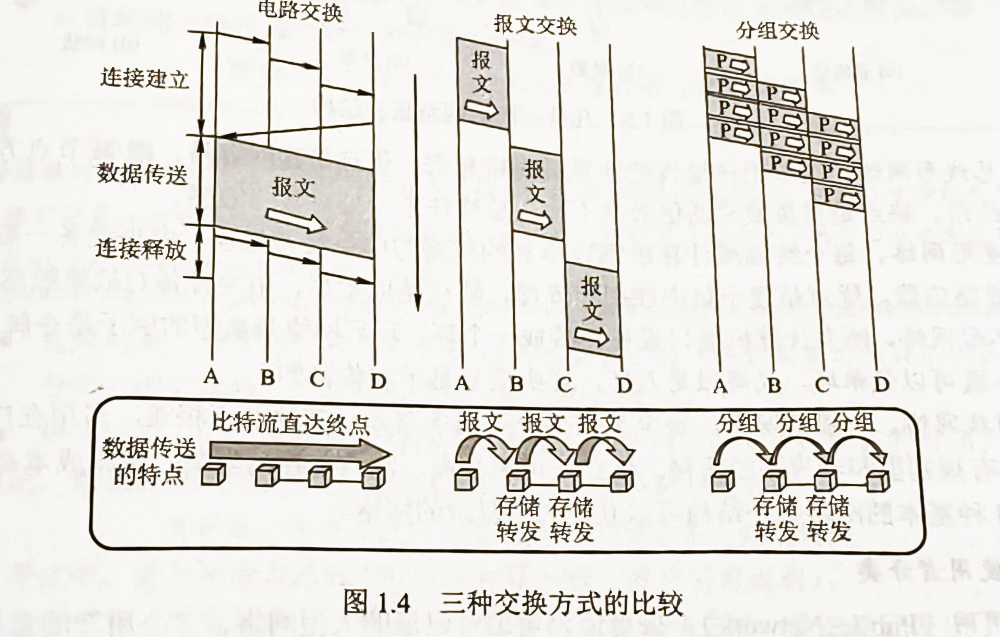
    1. <a href="https://www.bilibili.com/video/BV19E411D78Q?t=65.1&p=5" target ="_blank">电路交换</a>&emsp;<a href="https://www.bilibili.com/video/BV19E411D78Q?t=597.0&p=5" target="_blank">报文交换</a>&emsp;<a href="https://www.bilibili.com/video/BV19E411D78Q?t=780.5&p=5" target="_blank">分组交换</a>

---

## 计算机网络的分类
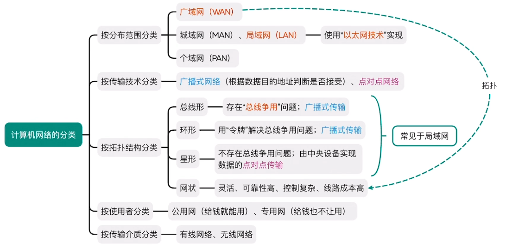
  ---

## 计算机网络的性能指标

1. <u>**速率**</u> ：连接到网络上的节点在信道上传输数据的速率。也称为 数据率/比特率/数据传输速率
    1. **信道**：向某一方向传送信息的通道（一条通信线路逻辑上对应 <u>发送信道</u>、<u>接收信道</u>）
    2. 速率**单位**：bit/s（b/s、bps）
    3. 数量前缀：k → M → G → T（$10^3$）

2. <u>**带宽**</u>：信道能传送的<u>最高数据率</u>
    1. 信道语序通过的信号频率范围（Hz）
    2. 通信线路通过的信号最高数据传输速率
     [香农定理](#香农定理)、[奈氏准则](#内奎斯特定理奈氏准则)

3. **吞吐量**：单位时间内通过某个网络/信道/接口的<u>数据传输总量</u>
     - 学以致用：结点间实际能达到的最高速率，由带宽、节点性能共同限制（<u>短板效应</u>）
     家用为例：光纤 → 光猫(调制解调器) → 网线 → 家用路由器WAN → 设备

4. **时延**：从网络/链路的一端传送到另一端所需要的时间
    - 总时延 = 发送时延 + 传播时延（+ 处理时延 + 排队时延）
     &emsp;&emsp;&emsp;= 将数据推向信道所花的时间 + 在信道传播所花的时间 = $\frac{数据长度}{发送速率/链路带宽}+\frac{信道长度}{传播速率}$
    - 

        例：
        
      

5. **时延带宽积** = 传播时延s × 带宽bit/s = bit
    - 已发送但未被接收的最大比特数
      

        例：
        
      
 
    
6. **往返时延 RTT**（Round-Trip Time）
    - 从发送方<u>发送完数据</u>，到发送方收到来自接收方的<u>确认</u>总共经历的时间
7. **信道利用率** = $\frac{信道中有数据的时间}{总时间}$
---
## 计算机网络分层结构
1. 计算机网络的3种分层/**体系结构**
     网络体系结构：计算机网络的各层及其协议的集合
    

1. 水平方向的传输过程
2. 垂直方向的传输过程
     对于相邻两层实体，上一层请求下一层的**服务**，需要访问下一层提供的**接口**（服务访问点Service Access Point，SAP）
3. 每层的数据：**协议数据单元（PDU）**：对等层次之间传送的包含首部/尾部的数据单元。第n层的记作 n-PDU
    - **协议控制信息（PCI）**：控制协议操作的信息，即首部+尾部。第n层记作 n-PCI
    - **服务数据单元（SDU）**：除去本层协议控制信息的数据。
    

1. **协议 Protocol**
    - 协议三要素：**语法**（数据/控制信息的格式）、**语义**（需要完成什么动作/做出什么应答）、**同步/时序**（动作发生的顺序）

### OSI参考模型
 <a href="https://www.bilibili.com/video/BV19E411D78Q?t=326.8&p=11"  target ="_blank">各层</a>名称：（物联网叔会使用）
  - **应用层**：实现特定网络应用（eg：两个应用传一个文件，文件就是一个<u>**报文**</u>Message）
  - **表示层**：数据格式转化
  - **会话层**：会话管理（检查点机制，通信失效时 从检查点恢复通信）
  - **传输层**：以 <u>**报文段**</u>Segment为单位，实现进程(端口)到进程(端口)的通信。
     _差错控制、流量控制、连接管理、可靠传输管理_
  - **网络层**：向上层提供***虚电路服务***，转成 <u>**分组/数据报**</u>Packet。实现主机到主机的通信。
     &emsp;&emsp;路由选择(选择传输路径)、分组转发、拥塞控制、(异构网络)网际互联、_差错控制、流量控制、连接管理、可靠传输管理_
  - **数据链路层**：(用校验编码技术检查每 <u>**帧**</u>frame的信息)差错控制、流量控制(协调结点间的速率)
  - **物理层**：定义电路接口参数、传输信号的含义等
  

### TCP/IP模型
各层名称：（接网叔用）
- **应用层**：包括之前的应用层+表示层+会话层。如果有些应用需要相应功能，用特定**协议**实现
- **传输层**：报文 → **报文段**。复用/分用、_差错控制、流量控制、连接管理、可靠传输管理_
 &emsp;&emsp;向上层提供 有连接可靠的服务***TCP服务***；提供无连接不可靠的服务***UDP服务***
- **网络层**：路由选择、分组转发、拥塞控制、网际互连、~~差错控制、流量控制、连接管理、可靠传输管理~~（会传输可能出错的**分组**，只在传输层进行处理）  
- **网络接口层**：实现相邻节点间的数据传输，未规定死接口层（交给网络设备商发挥）。具有更强的灵活性、创造性

### 对比
TCP/IP模型简化网络层功能，降低网络核心部分-路由器 的负载。（网络核心部分只包含到网络层）
 

---
# U2 物理层

### 基础概念
1. **信源**(数据发送方) → **信宿**(数据接收方)  ，通过**信道**进行传输（一条物理线路通常包括 <u>发送信道、接收信道</u>）
   **信号**(数据的载体)：数字信号(离散)、模拟信号(连续)
2. **码元**：每一个信号就是一个码元；**码元宽度**：几bit代表一个信号（8**进制**码元携带3bit数据）
 &emsp;&emsp;eg:一个信号周期最多可以表示4种信号，0V→00/1V→01/3V→11是一个四进制码元，码元宽度是2

3. **波特率**：每秒传输几个码元（信号）。码元/秒，波特 Baud
 **比特率**：每秒传输几个比特。bit/s，b/s，bps

### 信道的极限容量
1. #### 内奎斯特定理(奈氏准则)
    对于一个理想低通信道（没有噪声、带宽有限）
     <u>极限**波特**率</u> $= 2W波特(W是信道的频率带宽Hz) =$ <u>比特率</u> $ 2Wlog_2K$（一个信号周期出现K种信号）
2. #### 香农定理
    对于一个有噪声、带宽有限的信道
     <u>极限**比特**率</u> $= Wlog_2(1+\frac{S}{N})）= 频率带宽log_2(1+信噪比)$（要使用无单位的信噪比）
     信噪比会很大，无单位的换成 **分贝dB** 表示法：$信噪比 = 10log_{10}\frac{S}{N}dB$
---
### 编码和调制
1. **编码**：二进制数据 → 数字信号；**解码**：二进制数据 ← 数字信号（有线网络适配器：编码-解码器）
    **调制**：二进制数据 → 模拟信号；**解调**：二进制数据 ← 模拟信号（光猫：调制-解调器）
2. **编码方式**

  

    
  

  

    
  

**以太网**默认用**曼彻斯特编码**    
**自同步能力**：连续传输相同的0/1信号，能够区分比特边界/信源和信宿可以根据信号完成节奏同步，无需时钟信号。只有非归零编码无，NRZI可以增加冗余位(8+1bit)支持自同步。
 **浪费带宽**：信号是否全都用来传输数据。NRZI有1bit冗余位，会浪费一点

3. **调制**
    

      

        
      

    

**正交幅度调制 QAM**：AM/QM的结合.若有m种幅值+n种相位,可调制出mn种信号,1码元$=log_2mn bit$数据
 QAM-16，调制1种信号，1码元携带$log_216 = 4bit$数据

- 例
  - 1. 某无噪声理想信道带宽为 4MHz，采用 QAM 调制，若该信道的最大数据传输速率是 48Mbps，则该信道采用的 QAM 调制方案是（ ）。
   A. QAM-16&emsp;B. QAM-32&emsp;C. QAM-64&emsp;D. QAM-128
  - 2. 在一条带宽为 200 kHz 的无噪声信道上，若采用 4 个幅值的 ASK 调制，则该信道的最大数据传输速率是（ ）。
   A. 200 kbps&emsp;  B. 400 kbps&emsp; C. 800 kbps&emsp; D. 1600 kbps
  - C\C

### 传输介质
1. 常见的传输介质
   - **导向型**（有线）
      1. <u>双绞线</u> Twisted Pair：由两根导线绞合而成。有屏蔽层(STP)；无屏蔽层(UTP)
           提升速率&抗电磁干扰能力：提升绞合度+增加屏蔽层。
           早期局域网、早期有线电话
      2. <u>同轴电缆</u>:内导体（传输信号）+绝缘层+外导体屏蔽层（抗电磁干扰）+绝缘保护层
       信号传输损耗小，长距离传输中继器少，很细很省布线空间。
      3. <u>光纤</u>:纤芯(高折射率)+包层(低折射率) 全反射
         多模光纤：纤芯更粗，可传输多条光线，信号传输损耗更高，适合近距离传输
         单模光纤：纤芯更细，只能传输一条光线，信号传输损耗更低，适合远距离传输
   - **非导向型**（无线）
      1. <u>无线电波</u>：穿透能力强，传输距离强，信号指向性弱
         如：手机信号、WIFI
      2. <u>微波通信</u>：频率带宽高，信号指向性强
         如：卫星通信
   - 以太网对有线传输介质的命名规则：速度+Base+介质信息
     **数字**：同轴电缆的最远传输举例，**F** 光纤optical Fiber，**T** 双绞线Twisted pair
     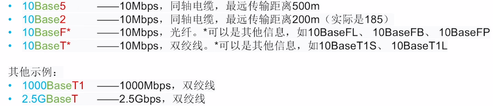

### 物理层设备
1. **中继器** Pepeater
   一个端口接收信号，将失真信号整形再生，并转发到另一端口。两个端口对应两个 <u>网段</u>
   支持<u>半双工 通信</u>： 支持双向传播，但不同方向不能同时进行

2. **集线器** Hub
   本质上是多端口中继器。
   将一个端口收到的信号整形再生后，转发到所有其他端口。
   N个端口对应N个网段，所有网段属于同一个 <u>冲突域</u>
   各端口不能同时发送数据，会导致冲突。两台主机同时发送数据会导致冲突，则两台主机处于同一个冲突域。
3. 特征
  - 集线器、中继器不能无限串联（5-4-3原则）
  - 集线器连接的网络物理上是星形拓扑，逻辑上是总线型拓扑。各网段共享带宽
    

    

    
    

    

    
    

    

---
# U3 数据链路层
- 所处地位
  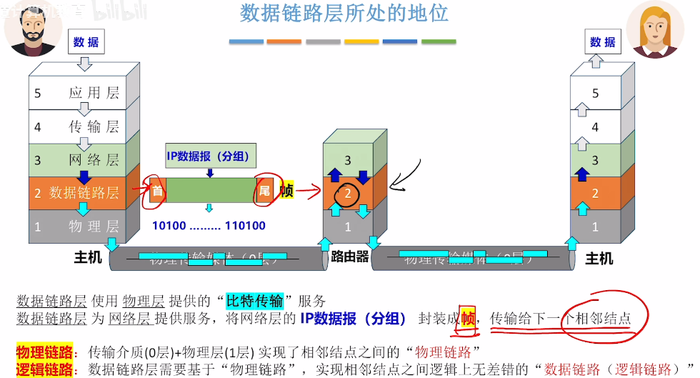
- 功能
  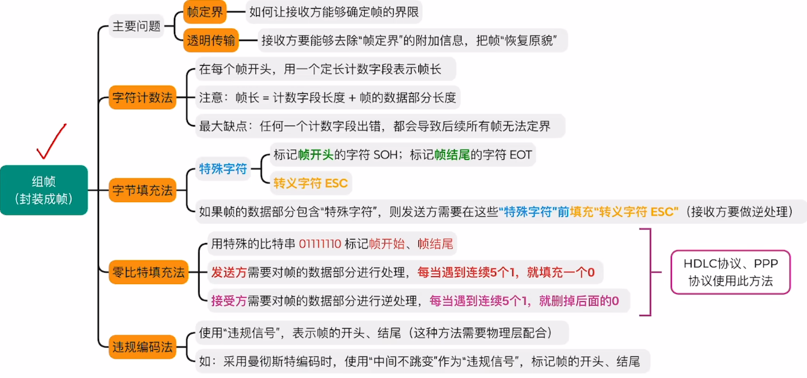
### 组帧
1. 定义
   数据链路层 把 网络层的数据打包成帧的过程叫做**组帧**
  
2. #### 四种组帧方法
    

    

    1. **字符计数法**
       缺点：任何一个计数字段出错，都会导致后续所有帧无法定界
      

    

    

    2. **字节填充法**
       在帧的起始/结束位置加上控制字符**SOH**/**EOT**(Start Of Header/Ending Of Transmission)
       在数据部分防止歧义，SOH、EOT、ESC前加上**ESC**(Escape Character)
      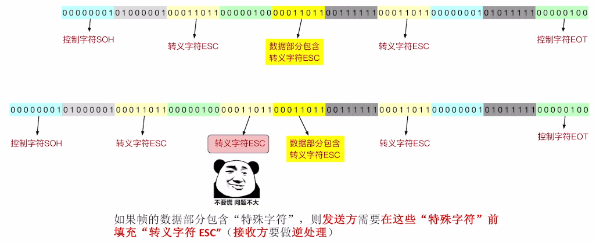

    

    

    

    

    3. **零比特传输法**
       特殊比特串设为 0111 1110。对于连续5个1的数据部分进行“填充0”处理
      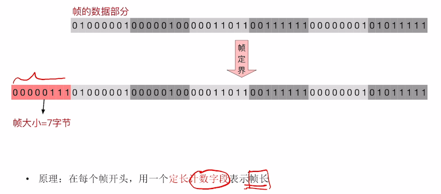

    

    

    4. **违规编码法**
       曼彻斯特编码中时钟周期必跳变，加入“不变”的违规编码作为帧的分界
      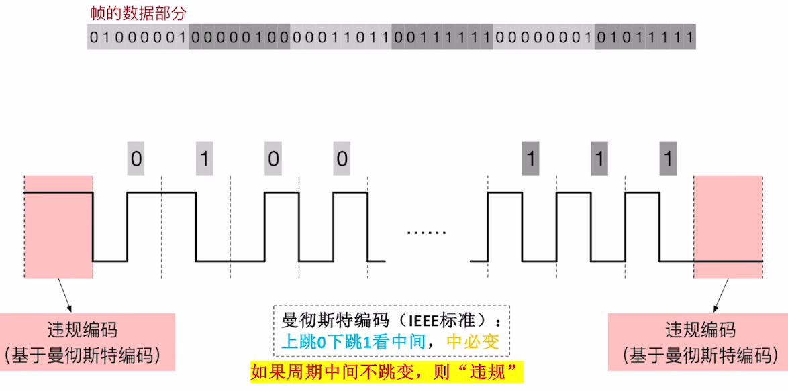

    

    

### 差错控制
1. 定义
    发现并解决一个帧内部的“错位”
2. #### 奇/偶校验码
   - 整个校验码中 **1的个数** 是奇/偶数个，接收方的数据链路层检查1的个数是否还是奇/偶数。只能检测**奇数位**错误。
   - 求偶校验位：异或运算$\oplus$信息位
       进行偶校验：所有位$\oplus$ ，结果应为0
3. #### 循环冗余校验码（CRC码）
   #### 循环冗余校验码（CRC码）
      - K位信息位+R个校验位 作为被除数，保证除法的余数为0

      

        

          
        

        

          
        

      

      - 能够纠错的长度 
         K个信息位，R个校验位，若 $2^R \ge K + R + 1$ CRC校验位能表示的个数 $\ge$ 信息位的位数
          

          

          
          

          

          
          

          

4. #### 海明校验码
    - 总体思路
       K位检验码能纠错$2^k$位，要 $\ge$ R+K 中任何一位可能出现错误 + 1种正确状态  
    

      <!-- 左侧 60%：两张图完全无缝堆叠 -->
      

      
      
      

      

      
      

    

    - <a href="https://www.bilibili.com/video/BV19E411D78Q?t=97.8&p=23" target="_blank" rel="noopener noreferrer">具体</a>

### 可靠传输/流量控制 与 滑动窗口
1. 可靠传输：解决帧之间的“帧错”：帧丢失、帧重复、帧失序
    流量控制：控制发送方发送帧的速率别太快，要让接收方来得及接收
2. #### 3种机制
    实现这两个功能需要多种机制配合：
      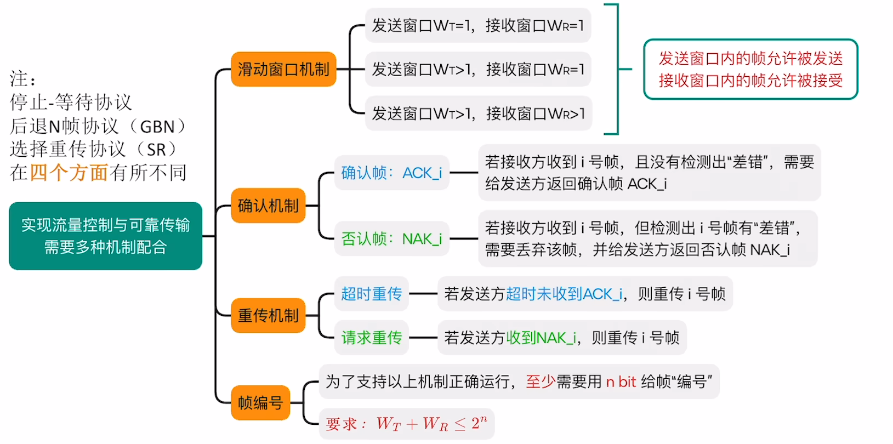
      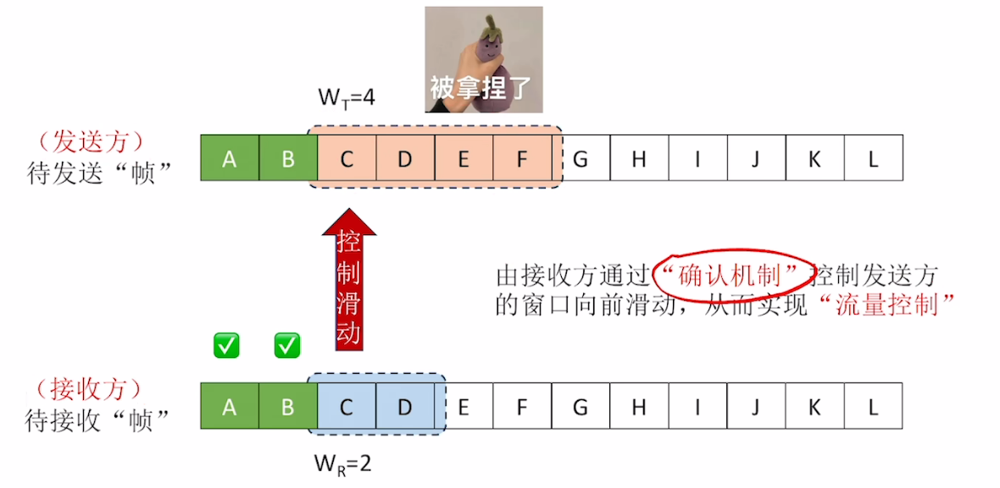
3. #### 本质是滑动窗口的3种协议
      1. **停止-等待协议 S-W**：发送窗口 = 1，接收窗口 = 1
      2. **后退N帧协议 GBN**：发送窗口 ＞ 1，接收窗口 = 1
      3. **选择重传协议SR**：发送窗口 ＞ 1，接收窗口 ＞ 1

---

### 停止等待协议 S-W
stop-wait
1. #### 滑动窗口机制
   发送窗口 = 1，接收窗口 = 1
2. #### 确认机制
   **确认帧** $ACK_i$：接收方收到i号帧，且没有检测出“差错”，需要给发送方返回确认帧 $ACK_i$ Acknowledge
3. #### 重传机制
   **超时重传**：若发送方超时未收到$ACK_i$，则重传i号帧
4. #### 帧编号
    仅需 **1 bit** 给帧编号
- 数据帧的组成：首 数据部分(可长可短) 尾
   确认帧的数据部分很短/为空
   首尾主要是：帧定界星系，校验码、*<u>帧类型</u>*(确认帧/反向传输的数据)、<u>*帧序号*</u>(0/1)
- #### 正常情况
  发送方 发送给 接收方；接收方 对数据进行“差错控制” 没有问题发送ACK给发送方，同时接收窗口右移；发送方接收到ACK也右移 继续发送数据。
  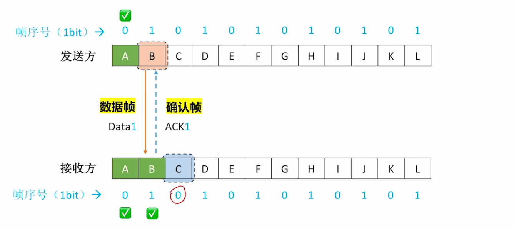
- #### 异常情况
  **数据帧/确认帧丢失**：超时重传机制；
   **重复数据帧**：接收方通过**帧序号**判断收到重复数据帧→**丢弃重复帧**、**返回重复帧的ACK**
   **数据帧有差错**：接收方检测到差错→接收方将此帧“丢弃”，且不会返回ACK。导致超时重传

### 后退N帧协议 GBN
go back N
1. #### 滑动窗口机制
   发送窗口 ＞ 1，接收窗口 = 1
2. #### 确认机制
   **确认帧**：“<u>累积确认</u>”，连续收到多个数据帧返回<u>最后一个帧</u>的ACK，表示收到i号帧及之前的所有帧
3. #### 重传机制
   **超时重传**：若发送方超时未收到$ACK_i$，则重传i号帧 及其之后的所有帧
4. #### 帧编号
    $W_T + W_R \leq n$
- #### <a href="https://www.bilibili.com/video/BV19E411D78Q?t=152.7&p=26" target ="_blank">正常情况</a>
- #### 异常情况
  <a href="https://www.bilibili.com/video/BV19E411D78Q?t=260.0&p=26" target ="_blank">数据帧丢失</a>&emsp;<a href="https://www.bilibili.com/video/BV19E411D78Q?t=579.7&p=26" target ="_blank">确认帧丢失</a>

### 选择重传协议 SR
Selective Repeat
1. #### 滑动窗口机制
    发送窗口 ＞ 1，接收窗口 ＞ 1。$W_R \leq W_T$
2. #### 确认机制
   **确认帧**：每一帧返回$ACK_i$
3. **重传机制：<u>超时重传 + 请求重传</u>**
    超时重传：超过时间，发送方重新传Data
    请求重传：**NAK 否认帧**：若接收方检测到$Data_i$有“差错” → 则丢弃该帧，返回发送方$NAK_i$，请求重传
4. #### 帧编号
    $W_T + W_R \leq n,W_R \leq W_T$（**接收窗口**小于发送窗口）
- #### <a href="https://www.bilibili.com/video/BV19E411D78Q?t=409.5&p=27" target ="_blank">正常情况</a>
- #### 异常情况
  <a href="https://www.bilibili.com/video/BV19E411D78Q?t=493.2&p=27" target="_blank">数据帧丢失</a>
&emsp;
<a href="https://www.bilibili.com/video/BV19E411D78Q?t=615.7&p=27" target="_blank">数据帧检测出差错而被丢弃</a>
&emsp;
<a href="https://www.bilibili.com/video/BV19E411D78Q?t=820.6&p=27" target="_blank">确认帧丢失</a>

---

### 3个机制的信道利用率分析
发送信道的信道利用率：发送完当前数据到发送下一次数据（发送数据的占比）
 滑动窗口协议/连续ARQ协议：GBN协议、SR协议（后两个）
 ARQ 自动重传请求协议：包括这3个协议

1. #### S-R协议
    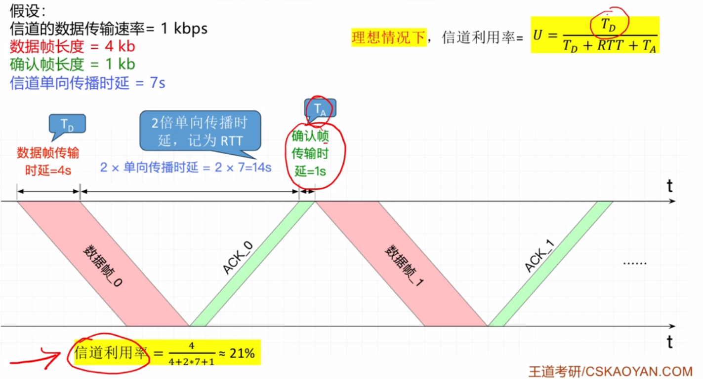
2. #### GBN协议、SR协议
   利用率不会大于1。若N=5，信道一直有发送的数据填充，$\alpha=1$
   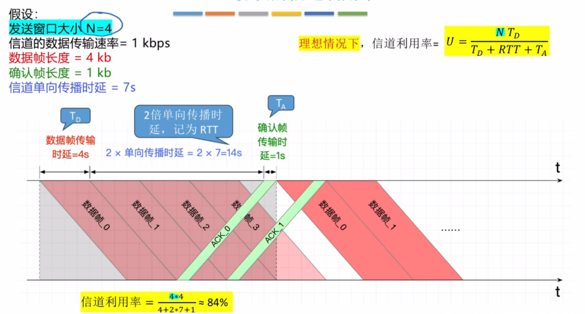
- <a href="https://www.bilibili.com/video/BV19E411D78Q?t=1003.7&p=28">例1</a>&emsp;<a href="https://www.bilibili.com/video/BV19E411D78Q?t=1431.9&p=28">例2</a>
  

  

  
  

  

  
  

  

## 介质访问控制
广播通信时，多个节点争抢物理传输介质。怎么解决争抢问题，实现有序传输
### 信道划分
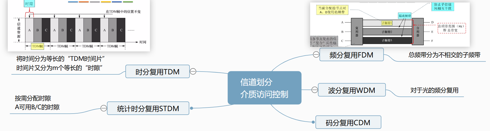
- **码分复用**
   码片序列包含**m个码片**，看作m维向量、各节点的m维向量必须相互**正交**、 信号值与码片序列相同为1 相反为0、“规格化内积”叠加信号×码片序列=±1（1/0）
  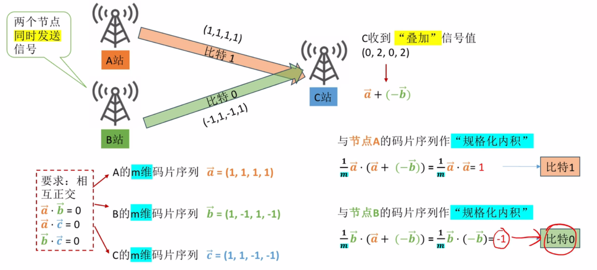

### 随机访问
1. **ALOHA协议**
    - **纯ALOHA**：准备好数据帧，就立即发送；
    - **时隙ALOHA协议**：准备好的数据要等到一个时隙的开始才发送；若发生冲突，分别随机等一段时间后发送
    

    

    
    

    

    
    

    

2. **CSMA协议**：发送数据之前，先**监听**信道是否**空闲**，只有空闲时才发送数据（网络适配器要安装“载波监听装置”）
   - **1-坚持CSMA协议**
      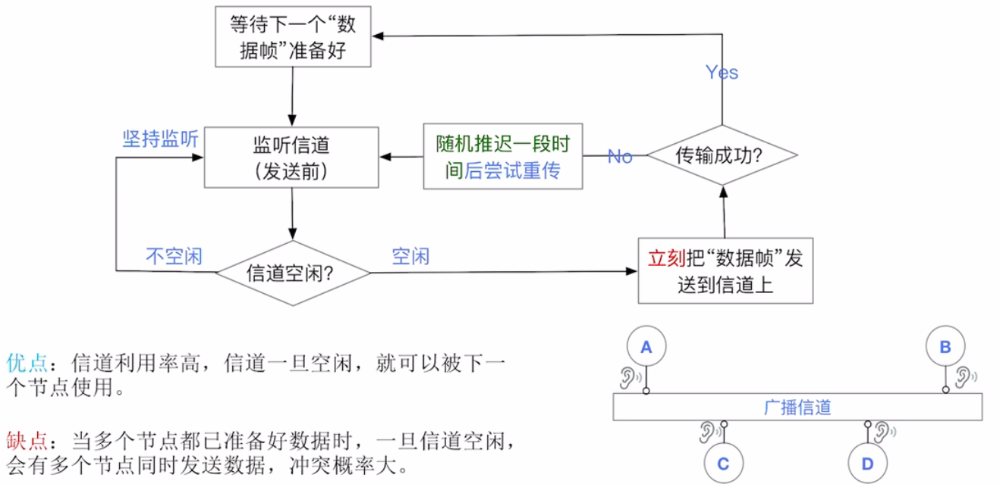
   - **非坚持CSMA协议**
       优点：使各节点错开发送数据，降低冲突概率；
       缺点：信道空闲时，可能不会被立即里哟个，导致信道利用率降低
      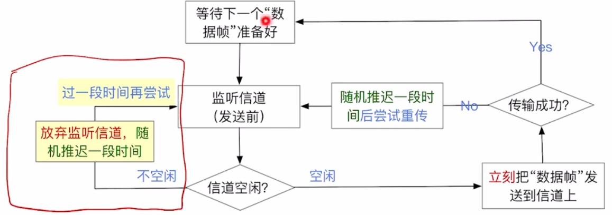
   - **p-坚持CSMA协议**
       折中方法，降低冲突概率、提高信道利用率
      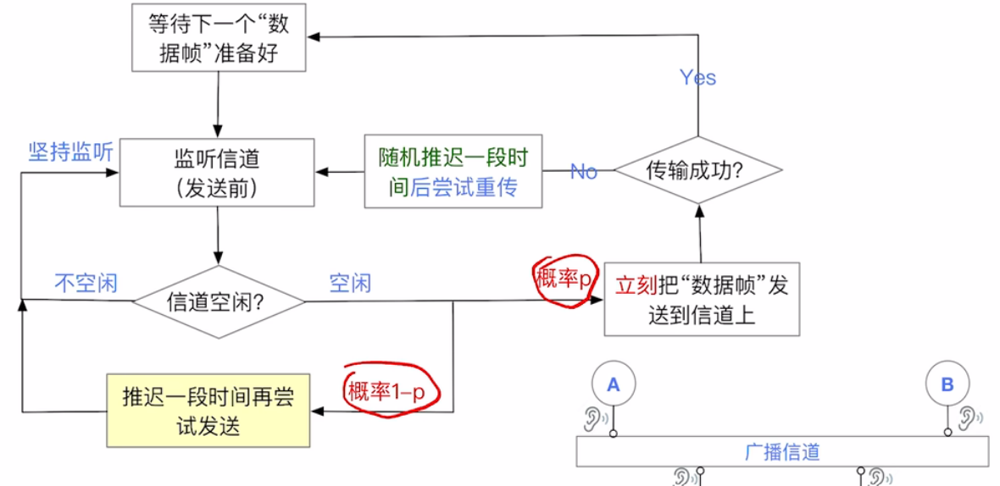 
3. **CSMA/CD协议**：用于早期有线以太网（总线型）Collusion Detection
    

    

    
    

    

    
    

    

    - 接收方：依次检查检查若 帧小于最短帧长、不是发给自己的、CRC检错 帧有差错 → 丢弃帧
4. **CSMA/CA协议**：用于IEEE 802.11 无线局域网（WIFI）

### 轮询访问
**令牌传递协议**
  - 获得令牌的节点会持有**令牌帧**，想要发送数据时，把令牌帧转换为**数据帧**
   &emsp;**数据帧** = 令牌号 + 源地址&目的地址 + 数据部分 + 是否已接收(false/true)

- 按固定方向遍历每个节点
     &emsp;是目的地址：复制数据部分，已接收=true
     &emsp;回到源地址：检查已接受。true：发送成功；false：发送失败，尝试重传  
  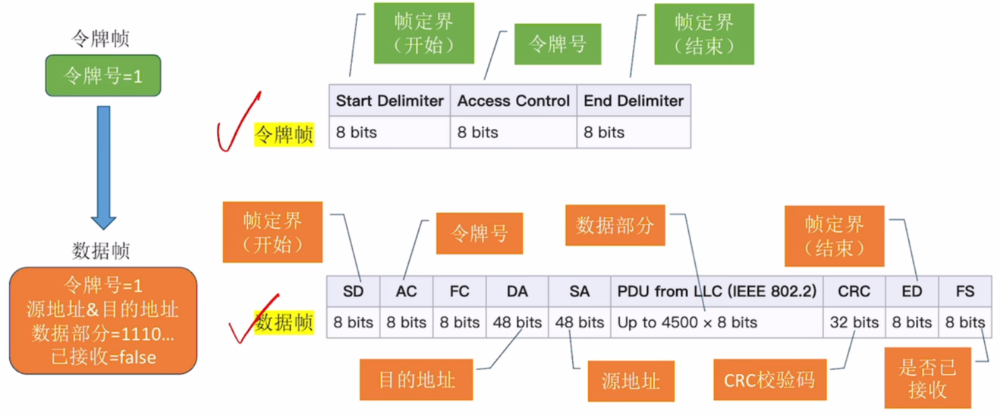
  

    

    
    

    

## 局域网

