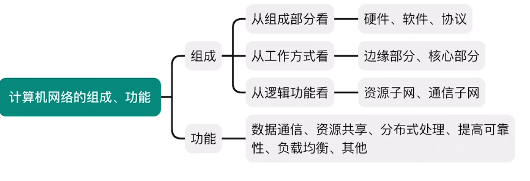
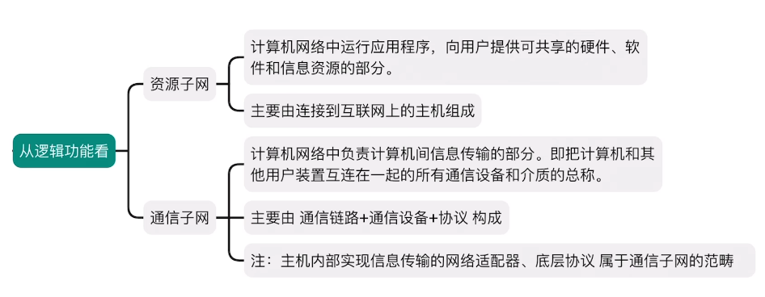
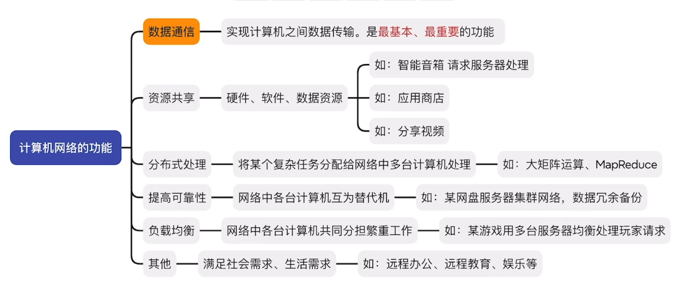

- [基本概念](#基本概念)
- [计算机网络的组成](#计算机网络的组成)
    - 从组成部分看
    - 从工作方式看
    - 从逻辑功能看
- [计算机网络的功能](#计算机网络的功能)
- [三种交换技术](#三种交换技术)
    - 电路交换
    - 报文交换
    - 分组交换
    

## 基本概念

1. <u>**_计算机网络_**</u>：由若干结点(node)和连接这些结点的链路(link)组成
     通过集线器、交换机构建计算机网络，通过路由器连接不同计算机网络
2. <u>**_互联网（因特网）_**</u>：各大ISP(Internet Service Provider)和国际机构组建成的、覆盖全球的互连网，
     必须使用 TCP/IP协议 通信；
3. <u>**_互连网_**</u>：路由器连接的大规模计算机网络，可以使用任意协议通信。
4. <u>**_路由器_**</u>：把两个或多个计算机网络连接起来，形成规模更大的计算机网络。也称为“**互连网**”
    <u>**_交换机_**</u>：把多个节点链接起来，组成一个计算机网络
---
## 计算机网络的组成

### 从组成部分看

1. **硬件**：
     主机/端系统(电脑、手机、物联网设备)
     通信设备(集线器、路由器、交换机)
    通信链路(光纤、网线、同轴电缆)
2. **软件**
3. **协议**硬件、软件共同实现(如：网络适配器,也称网卡+固件)
### 从工作方式看

1. **核心部分**：为边缘部分的设备服务
2. **边缘部分**：主机和安装在主机上的软件，为人服务
核心部分 为 边缘部分 提供连通性、交换服务
### 从逻辑功能看

1. **资源子网**:主要由连接到互连网上的**_主机_**组成
2. **通信子网**：负责计算机间**信息传输**的部分，即 所有**通信设备**和**通信介质**
     <u>**网络适配器**</u>、<u>**底层协议**</u> 属于通信子网
---
## 计算机网络的功能

1. **数据通信**
2. **资源共享**：硬件、软件)、数据资源的共享
3. **分布式处理**
4. **提高可靠性**网络中各个计算机互为替代机
5. **负载均衡**
6. **其他**
---
## 三种交换技术