15% Lab : 35% pro : 50% final

- [U3 软件架构设计](#u3-软件架构设计)
  - [第一部分：软件设计基础与体系结构概念 (PPT 03-01)](#第一部分软件设计基础与体系结构概念-ppt-03-01)
    - [1. 软件设计的本质](#1-软件设计的本质)
    - [2. 软件设计的核心思想](#2-软件设计的核心思想)
    - [3. 软件体系结构 (Software Architecture)](#3-软件体系结构-software-architecture)
    - [4. 架构气味](#4-架构气味)
    - [5. 架构决策记录 (ADR)](#5-架构决策记录-adr)
  - [第二部分：体系结构风格与设计过程 (PPT 03-02)](#第二部分体系结构风格与设计过程-ppt-03-02)
    - [1. 体系结构风格 (Architectural Style)概览](#1-体系结构风格-architectural-style概览)
    - [2. 核心风格详解](#2-核心风格详解)
    - [3. 体系结构设计过程](#3-体系结构设计过程)
  - [第三部分：体系结构设计实践与验证 (PPT 03-03)](#第三部分体系结构设计实践与验证-ppt-03-03)
    - [1. 逻辑视角设计](#1-逻辑视角设计)
    - [2. 包设计原则 (包级 SOLID)](#2-包设计原则-包级-solid)
    - [3. 多视角建模：Kruchten 4+1 视图](#3-多视角建模kruchten-41-视图)
    - [4. 接口设计与依赖倒置](#4-接口设计与依赖倒置)
    - [5. 体系结构构建](#5-体系结构构建)
    - [6. 集成策略与验证](#6-集成策略与验证)
  - [](#)
  - [第四部分：AI 增强架构 (AI for SE)](#第四部分ai-增强架构-ai-for-se)


需求分析、设计、编程的关系
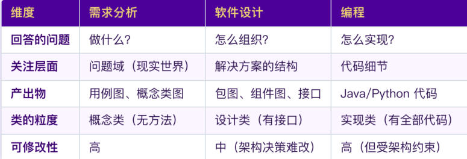
透露的考题
1. 软件工程的定义
    <br>软件⼯程是将系统化的、规范化的、可量化的⽅法应⽤于软件的开发、运⾏和维护的过程;
    <br>即将⼯程化的⽅法应⽤于软件。


# U3 软件架构设计
## 第一部分：软件设计基础与体系结构概念 (PPT 03-01)
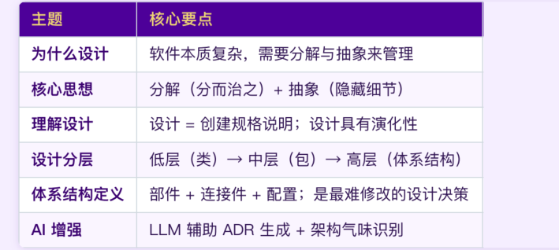
### 1. 软件设计的本质
* 为什么需要软件设计？ 软件的本质：**复杂性**
* **应对策略**：
    |策略|含义|设计中的体现|
    |----|----|----|
    |**关注点分离**|每次只关注⼀个维度 |分层、模块化|
    |**分解**|⼤问题拆成⼩问题 |⼦系统、包 |
    |**抽象**|隐藏细节，暴露接⼝ |接⼝、抽象类| 
* **设计复杂度公式** = 事物复杂度 + 适配复杂度 
  <br>&emsp;&emsp;&emsp;&emsp;&emsp;&emsp;&emsp; = 问题本身的复杂性 + 软件实现带来的额外复杂性
  <br>$\Rightarrow$ 最小化适配复杂度

### 2. 软件设计的核心思想
1. 控制复杂度数的武器：**分解**、**抽象**
   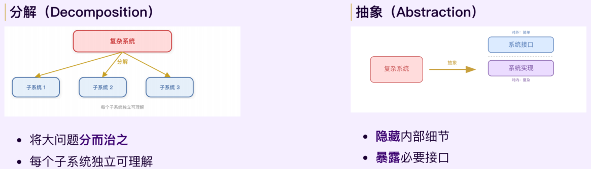
2. **软件设计的分层**
    |层次|关注点|产出物|案例|
    |---|---|---|---|
    |高层设计（体系结构）|系统整体结构、层次、部署|组件图、部署图|三层架构：展示层、业务层、数据层|
    |中层设计|包/模块划分、类的协作|包图、交互图|包结构划分 com.bookstore.service.order|
    |低层设计|单个类的属性、方法、算法|设计类图|具体的计算逻辑 Order.calculateTotal()|

### 3. 软件体系结构 (Software Architecture)
* **经典定义 (Perry & Wolf)**：$体系结构 = \{元素Elements, 形式/结构Forms, 理由Rationale\}$
* **部件—连接件—配置模型 (Shaw)**：
    * **部件 (Component)**：承载主要功能的基本组成单位（如 包、类集合）
    * **连接件 (Connector)**：定义部件间交互的抽象表示（如接口、事件）
    * **配置 (Configuration)**：定义部件与连接件的关联方式（如 依赖注入、工厂模式）
* 例
  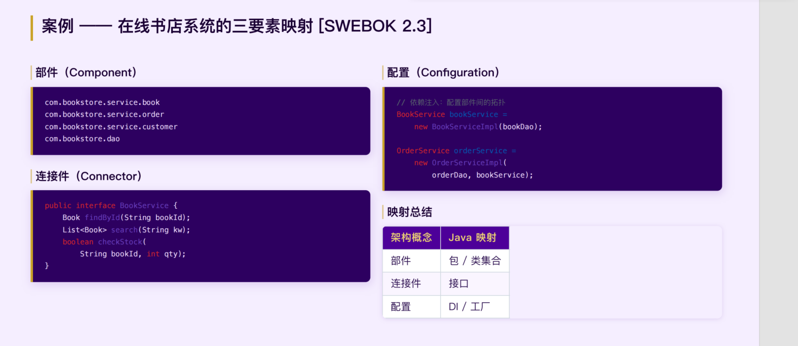 
* 体系结构为什么重要？
    <br>相互沟通：架构图是利益相关⼈之间的"共同语⾔"
    <br>早期设计决策：架构决定了系统的质量属性（性能、安全、可维护性）
    <br>可转移的抽象：好的架构可以在类似项⽬中复⽤
* **Conway 定律**：组织结构决定架构边界
  <br>**Concern**：不同利益相关人对于一个系统有不同的”什么是最重要的“

### 4. 架构气味
- 定义：系统体系结构中可能导致**维护困难**、**性能下降**或**演化受阻**的结构性问题。
     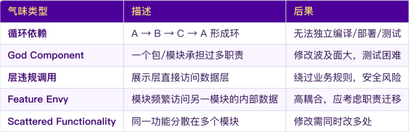
### 5. 架构决策记录 (ADR)
- 记录 Rationale（理由）：不仅记录决策，还要记下为什么拒绝其他方案 
    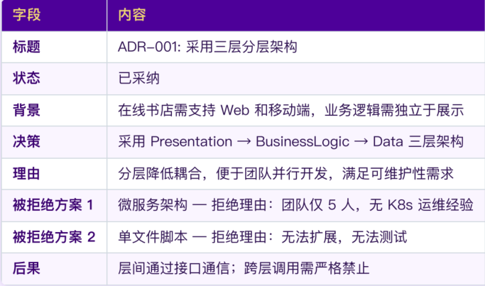

---

## 第二部分：体系结构风格与设计过程 (PPT 03-02)

### 1. 体系结构风格 (Architectural Style)概览
* **概念**：一组设计决策的集合（前人总结好的，可复用的软件设计模板）。它规定了：
    <br>**组件类型**（过滤器、层、服务）
    <br>组件之间的**连接⽅式**（如管道、调⽤、事件）
    <br>组件交互的**约束规则**（如分层只能调⽤相邻层）
* 风格 = 组件词汇 + 连接器词汇 + 拓扑约束（零件+零件之间的连接方式+拼搭规则）
* **SWEBOK体系结构风格六大分类**

    | # | 类别                     | 解决的核心问题                                       | 包含的风格                                       |
    |---|--------------------------|----------------------------------------------------|--------------------------------------------------|
    | 1 | General Structures 通用结构      | 所有系统都要解决的**怎么搭骨架**                     | 分层、管道-过滤器、黑板                           |
    | 2 | Distributed Systems  分布式系统    | 多机器 / 多服务怎么分工协作                         | 客户端-服务器、n-tier、发布-订阅、REST、微服务   |
    | 3 | Method-Driven      方法驱动      | 按特定编程范式组织代码                               | 面向对象、事件驱动、数据流                       |
    | 4 | User-Computer Interaction人机交互| 界面和逻辑怎么配合                                   | MVC、PAC (Presentation-Abstraction-Control)     |
    | 5 | Adaptive Systems     自适应系统    | 系统怎么动态变化 / 扩展                             | 微内核、反射、元级架构                           |
    | 6 | Virtual Machines    虚拟机类     | 怎么模拟 / 解释执行自定义指令                       | 解释器、规则引擎、进程控制                       |
* **体系结构风格分类**：

    | 风格  | 组件  | 连接器 | 拓扑约束  | 典型应用 |
    | ---- | ---- | ---- | ---- |---- | 
    | 分层 | 层（展示层 / 业务层 / 数据层）| 过程调用 | 只能上层调用相邻下层，不能跨层  | 企业管理系统 |
    | 管道-过滤器 | 过滤器（数据处理单元）| 管道（数据流）| 数据单向流动，过滤器之间无状态依赖 | 编译器、数据清洗 |
    | 客户端-服务器 (C/S) | 客户端、服务器| 请求 / 响应 | 客户端主动发起请求，服务器被动响应 | Web 应用、数据库 |
    | 事件驱动| 事件源、事件监听器 | 事件总线 | 源发布事件，监听器订阅响应，不直接依赖 | GUI 界面、消息推送 |
    | 微服务 | 独立服务（每个服务只做一件事）| REST / 消息队列| 服务之间松耦合，通过 API 或消息通信 | 电商平台、互联网大厂系统 |
    | 主程序-子程序| 主程序、子程序| 过程调用 | 主程序调用子程序，子程序无独立执行权| 传统结构化程序（如 C 语言小工具）|

* **风格 vs 模式**
    
    |维度|体系结构风格|体系结构模式|
    |---|---|---|
    |作用范围	|系统**全局**的组织方式	|解决**局部**的、重复出现的问题|
    |粒度	|粗粒度，定义整个系统大部分的结构|	细粒度，可应用于系统中的单个模块/元素|
    |典型例子	|分层、微服务、管道 - 过滤器	|观察者模式、MVC、代理模式、工厂模式|
    |共存性	|通常以**一种**主风格贯穿整个系统	|可以在系统中同时使用**多个**模式|
    - 例：在线书店中⻛格与模式共存
        <br>⻛格：三层分层架构（全局组织）
        <br>模式：MVC（展示层内部）、Observer（模型通知视图）、DAO（数据访问层）
### 2. 核心风格详解
1. **主程序-子程序风格**
   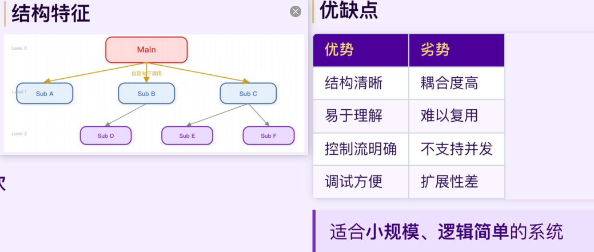
2. **面向对象风格OO**
   <br>基本组件：对象，连接器：过程调用，拓扑约束：只能用公开的方法
   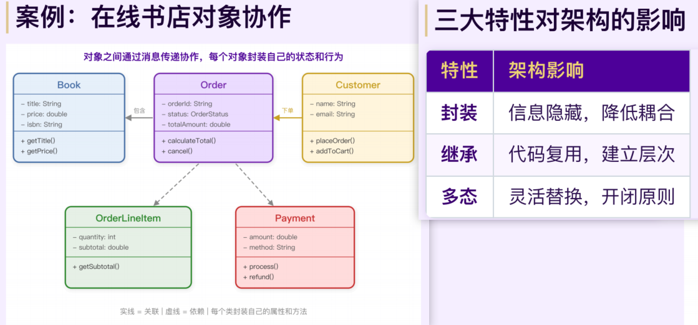
3. 核心风格-分层风格
    <div style="display: flex; width: 100%; margin-left: 0;">
    <div style="flex: 1; text-align: center;">
        
    </div>
    </div>

   - 分类
       * **严格分层**：每层只能调用直接下层。 
       * **松散分层**：允许跨层调用（提高运行效率，降低复杂度）。 
   - 三层架构
      |层次|核心职责|典型技术|
      |----|---------|----------|
      |**展示层**Controller|接收请求、渲染视图、⽤户交互 |JSP, Thymeleaf, Vue, React|
      |**业务逻辑层**Service|实现业务规则、协调⼯作流| Spring Service, EJB|
      |**数据访问层**Dao|CRUD 操作、数据映射、事务管理 |MyBatis, JPA, Hibernate|
      
      - 优势：封装性、关注点分离（开发者只需关注本层逻辑）、可替换性（不影响其他层替换，如 UI 替换）、可测试性（各层可独立单元测试，Mock 数据层测试业务逻辑）
4. 核心风格-MVC风格
    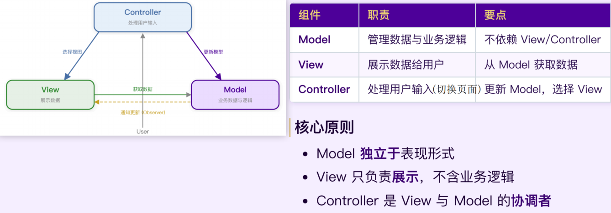
    - View相当于业务逻辑层+数据访问层；View相当于展示层；Controller相当于展示层（切换页面）
    - 通常使用**观察者模式**实现，当 Model 数据变化时通知所有注册的 View自动刷新，实现松耦合（相互之间不依赖/不需要知道对方的实现）
    - 例：在线书店
        ```java
        // 分层风格
        // === 展示层 Controller ===
        @RestController
        public class BookController {
            @Autowired private BookService bookService;

            @GetMapping("/books/{id}")
            public Book getBook(@PathVariable Long id) {
                // 只做两件事：接收请求、调用业务层
                return bookService.findById(id);
            }
        }
        // === 业务逻辑层 Service ===
        @Service
        public class BookService {
            @Autowired private BookDao bookDao;

            public Book findById(Long id) {
                // 处理业务逻辑（比如校验、组合数据），然后调用数据层
                return bookDao.selectById(id);
            }
        }
        // === 数据访问层 Dao ===
        @Mapper
        public interface BookDao {
            @Select("SELECT * FROM book WHERE id = #{id}")
            Book selectById(Long id);
        }
        ```
        ```java
        // === Controller 层 ===
        @Controller
        public class BookController {
            @Autowired private BookService bookService;

            @GetMapping("/books")
            public String listBooks(Model model) {
                // 1. 调用 Service 获取数据（和分层架构一样）
                List<Book> books = bookService.findAll();
                // 2. 把数据传给 View（这是 MVC 特有的）
                model.addAttribute("books", books);
                // 3. 选择要渲染的 View 模板
                return "bookList";
            }
        }
        // === Service 层（Model 的一部分） ===
        @Service
        public class BookService {
            @Autowired private BookDao bookDao;

            public List<Book> findAll() {
                return bookDao.selectAll();
            }
        }
        ```

5. 管道-过滤器风格
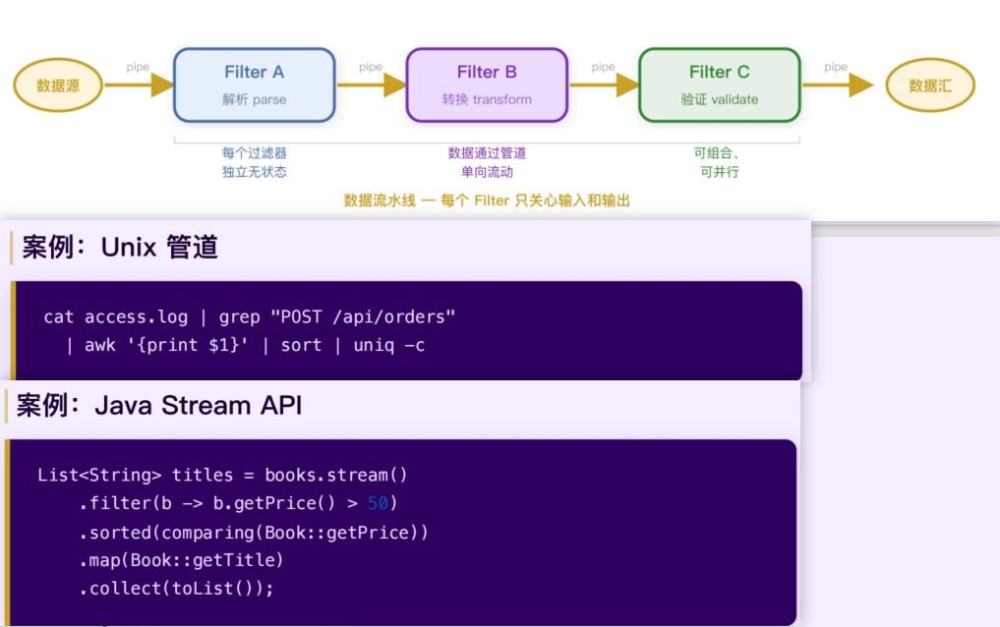
6. 客户端-服务器 + REST 风格
    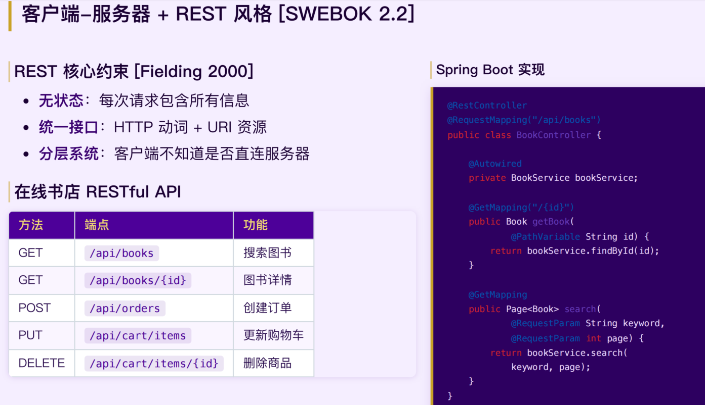
7. 微服务风格
   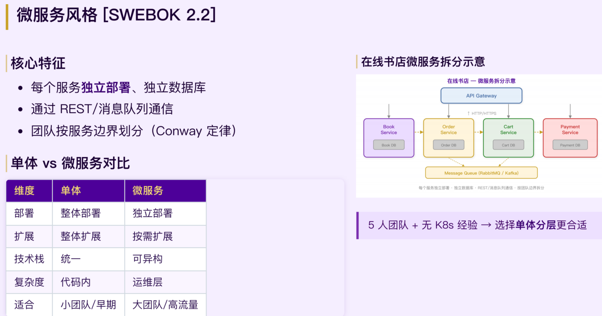

### 3. 体系结构设计过程
- 七步法流程
  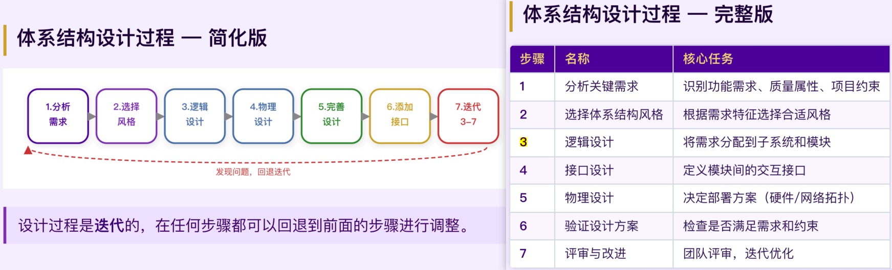
1. 分析关键需求和项目约束
   - 体系结构需求分类：**功能需求**（10个用例）**<  非功能需求**（质量/性能/接口）、**项目约束**（团队/进度/预算/技术）
    -  **ASR (架构重要需求)**：影响软件体系结构/直接驱动架构决策的需求（如高并发、安全性、技术选型约束）。Architecturally Significant Requirement
    <div style="display: flex; width: 100%; margin-left: 0;">
    <div style="flex: 1; text-align: center;">
    
    </div>
    </div>

   - **设计三阶段循环**：设计架构是一个 **分析 (Analysis)** $\rightarrow$ **综合 (Synthesis)** $\rightarrow$ **评估 (Evaluation)** 的循环迭代过程。

    | 阶段       | 活动                                       | 产出                         |
    | ---------- | ------------------------------------------ | ---------------------------- |
    | Analysis   | 收集 ASR，理解利益相关人关注点             | ASR 列表、系统约束           |
    | Synthesis  | 构建候选架构方案，做权衡                   | 候选架构、设计决策           |
    | Evaluation | 验证方案是否满足 ASR                       | 评审结果、改进建议           | 
2. 选择体系结构⻛格
   <br>大多数企业系统首选**分层架构**，在此基础上根据需要引⼊其他⻛格。
3. 逻辑设计 — 需求到模块的映射
    <br>核⼼任务：将功能需求分配到各⼦系统和模块中。
    <br>识别功能域，为每个功能域创建三层模块(UI、BL、Data)
    <div style="display: flex; width: 100%; margin-left: 0;">
    <div style="flex: 1; text-align: center;">
    
    </div>
    </div>
---

## 第三部分：体系结构设计实践与验证 (PPT 03-03)

### 1. 逻辑视角设计
* **从用例到包的4 步映射法**：
    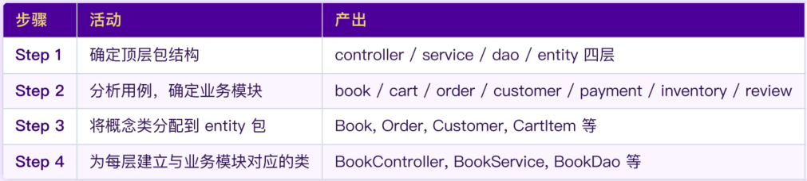
    <div style="display: flex; width: 100%; margin-left: 0;">
    <div style="flex: 6.5; text-align: center;">
    
    </div>
    <div style="flex: 3.5; text-align: center;">
    
    </div>
    </div>
        
* **关键约束**：依赖方向单向向下，禁止反向依赖。

### 2. 包设计原则 (包级 SOLID)
* **内聚原则**：决定哪些类放在⼀起
    * **REP (重用-发布等价)**：重用的粒度 = 发布的粒度。  
    * **CRP (共同重用)**：总是一起使用的类放在一起；不用包内所有类的包不应被依赖。  
    * **CCP (共同封闭)**：因同一原因变更的类放在一起。 
* **耦合原则**：决定包之间如何依赖
    * **ADP (无环依赖)**：依赖关系严禁形成环路。 
    * **SDP (稳定依赖)**：依赖方向应朝着更稳定的包（越容易变的包，要依赖越不容易变的包，不能反过来）。
        <br>**稳定性** $I= \frac{Ce}{Ca+Ce}$ 
        <br>Ca：传入依赖(有多少包依赖我) Ce：传出依赖（我依赖多少包） I：不稳定度，0 最稳定，1 最不稳定
    * **SAP (稳定抽象)**：包越稳定，应越抽象（接口多）；越不稳定，应越具体。

### 3. 多视角建模：Kruchten 4+1 视图
4 个基础视图 + 1 个贯穿所有视图的 “场景视图”

| 视图       | 核心问题                    | 对应 UML 图       | 面向角色         | 在线书店案例要点|
|------------|----------------------------|-------------------|------------------|----------------------------|
| 逻辑视图   | 功能怎么划分？  | 包图、类图        | 架构师、开发者   |controller / service / dao / entity 四层包|
| 开发视图   | 代码怎么组织和构建？       | 组件图            | 开发者           |4 个 Maven 模块，entity 是公共依赖|
| 进程视图   | 运⾏时线程/并发如何？      | 活动图、序列图    | 系统集成者       |200 worker + 20 DB连接 + 定时器 + 异步池|
| 物理视图   | 部署在哪里？         | 部署图            | 运维工程师       |Browser → Tomcat → MySQL（单体）|
| 场景视图   | 用例驱动、验证其他视图     | 用例图            | 所有利益相关者   |购买图书穿透 4 层 + 库存锁 + ⽀付幂等|
- 例：在线书店

### 4. 接口设计与依赖倒置
* **DIP (依赖倒置原则)**：要想设计一个灵活的系统，在源代码层次的依赖关系中就应该多引用**抽象类型**，而非具体实现。
  <br>传统依赖：高层Service → 低层Dao；依赖倒置后：高层 → **抽象接口** ← 低层模块
* **对象区分**：
    * **PO (Persistent Object)**：持久化对象，每个字段都和数据库中表的列一一对应（entity/dao）。 
    * **VO (Value Object)**：视图对象，面向前端数据传输，隔离数据库细节（controller/service）。
* **无状态设计**：Service 不持有请求状态，确保单例模式下的线程安全。
  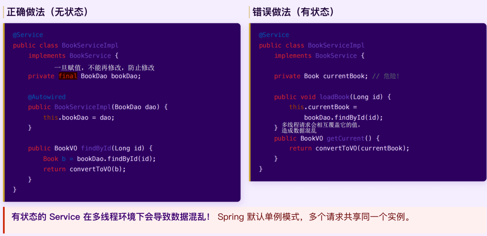
* 例
    <div style="display: flex; width: 100%; margin-left: 0;">
    <div style="flex: 6.5; text-align: center;">
    
    </div>
    <div style="flex: 3.5; text-align: center;">
    
    </div>
    <div style="flex: 6.5; text-align: center;">
    
    </div>
    </div>

### 5. 体系结构构建
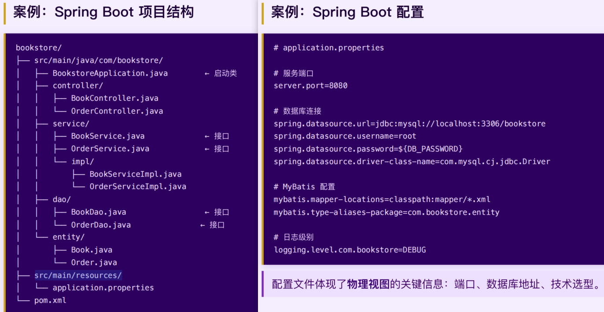

### 6. 集成策略与验证
* **集成策略**：大爆炸（所有模块一次集成）、自顶向下（需大量 Stub）、自底向上（需大量 Driver）、三明治（顶层+底层同时，中间最后）、持续集成 。 
- **Stub桩** 和 **Driver驱动**
  <br>Stub桩：实现了 BookDao 接口的假实现类，和真实的 BookDaoImpl 接口签名完全一致，但不做任何实际的数据库操作，只是直接返回固定的假数据
  <br>Driver驱动：动发起调用的 “假上层模块”，用来替代还没开发好的上层代码（如 Service/Controller）
  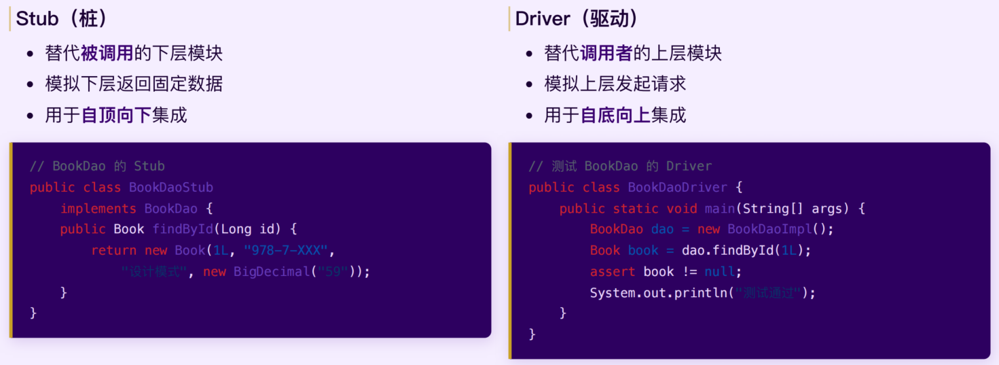
---

## 第四部分：AI 增强架构 (AI for SE)

* **核心理念**：人负责架构决策 (Ownership)，AI 负责验证和生成 (Validation & Generation)。 [cite: 266, 1728]
* **应用案例**：
    * **气味识别**：利用 AI 自动检测包结构中的循环依赖或层违规调用。 [cite: 302]
    * **ADR 辅助**：利用 LLM 快速生成决策记录初稿，人工进行权衡审查。 [cite: 279, 291]
    * **结构生成**：通过 Prompt 快速搭建符合分层规范的项目骨架。 [cite: 1735, 1743]